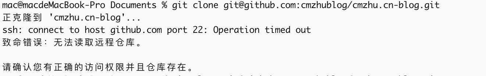

## `ssh`实验

### 背景

日常在使用网络时, 需要有时候去访问远端服务器的某一个服务端口(例子:`8080`),但是因为一些原因, 你所访问的机器之间只开通了`ssh`, 不能直接访问相应的`8080`端口

或者在访问时需要代理两台不同的机器给访问权限; 既如此, 就需要使用到`ssh `的端口映射技术

### `ssh` 本地端口转发

ssh 正向端口转发的含义是, 本机访问不了远端机器的某一端口(例子:	`9090`) , 就通过访问一个跳板机这样来转发, 这样来访问指定端口

1、例子: A 需要访问`cmzhu.cn` 的9090 端口, 但是现在直接使用`telnet`,发现该端口不通, 这个时候就需要走一层跳板机来转发

```bash
### 实现方案
ssh -p 11022 -L 9090:127.0.0.1:9090 cmzhu@cmzhu.cn 
### telnet
➜  ~ telnet 127.0.0.1 9090
Trying 127.0.0.1...
Connected to localhost.
Escape character is '^]'.
```

 通过`127.0.0.1:9090` 就可以访问到 cmzhu.cn:9090 的服务

>  如果本机上出现多个IP, 但上面的方法有一个弊端, 就是这样执行后,就只有本机能够访问到端口;


通过如下方法, 其他节点可以通过访问本机的其他IP 来访问到9090 这个服务:

```bash
ssh -p 11022 -L 10.24.100.230:9090:127.0.0.1:9090 cmzhu@cmzhu.cn 
```

也可以通过 匹配, 实现能通过本机上所有的IP 访问;

```bash
ssh -p 11022 -L :9090:127.0.0.1:9090 cmzhu@cmzhu.cn 
或者
ssh -p 11022 -L *:9090:127.0.0.1:9090 cmzhu@cmzhu.cn 
或者
ssh -p 11022 -L 0.0.0.0:9090:127.0.0.1:9090 cmzhu@cmzhu.cn 
```

> [本机的IP]:通过本机访问的`port`:远端`IP`:需要跳转到的`port`
>
> 远端`IP` 可以是 `localhost` , 并不是指我使用ssh 的主机本机, 而是指被登录的机器的` localhost`(这里指的cmzhu.cn 这台机器)

```bash
ssh -p 11022 -L 0.0.0.0:9090:192.168.101.77:32400 cmzhu@cmzhu.cn 
```

这个表示通过访问本机的9090 端口, 可以直接访问到远端 `192.168.101.77` 的`32400` 端口

### `ssh`远端端口转发

与本地端口转发的流动方向相反，远程端口转发是将对于远程主机B指定端口Y的访问请求转发给主机A，交由主机A对另一指定主机C的指定端口Z发起访问。

> 远程转发是指把登录主机所在网络中某个端口通过本地主机端口转发到远程主机上。

```bash
ssh -R [登录主机:]登录主机端口:本地网络主机:本地网络主机端口 username@hostname
```

例子:将本地网络 `10.24.2.1:9090` 端口 , 转发到远程机器`cmzhu.cn: 10090`上访问

```bash
ssh -R 0.0.0.0:10090:10.24.2.1:9090 cmzhu@cmzhu.cn
```

执行上述命令后, 就可以通过访问`cmzhu.cn:10090` 来访问`10.24.2.1:9090` 端口

### ssh 配置文件

ssh 可以从以下三处获取配置文件

- 命令行选项
- 用户配置文件 (~/.ssh/config)
- 系统配置文件 (/etc/ssh/ssh_config)

```bash
$ cat ~/.ssh/config
Host *
    User root
    Port 22

Host cmzhu
    HostName 192.168.101.70
    User cmzhu
    Port 22
    IdentityFile ~/.ssh/id_rsa

Host gitlab
    HostName 192.168.101.71
    User root
    Port 22
    IdentityFile ~/.ssh/id_rsa
    
```

如果github 访问异常， 也可以修改配置



```bash
Host github.com
    Hostname ssh.github.com
    PreferredAuthentications publickey
    IdentityFile ~/.ssh/id_rsa
    Port 443

Host gitlab.com
    Hostname altssh.gitlab.com
    Port 443
    PreferredAuthentications publickey
    IdentityFile ~/.ssh/id_rsa
```

### 常用ssh配置模版
```
# ============================================
# SSH 服务器配置文件模板
# 路径: /etc/ssh/sshd_config
# 修改后需执行: systemctl restart sshd
# ============================================

# ---------- 网络与端口 ----------
# 监听的端口号（建议改为高端口，如 2222，但需确保防火墙放行）
Port 11022

# 监听的网络地址（0.0.0.0 表示所有 IPv4 地址，:: 表示所有 IPv6 地址）
# ListenAddress 0.0.0.0
# ListenAddress ::

# ---------- 主机密钥 ----------
# 服务器身份验证使用的私钥（建议保留所有支持的算法以保证兼容性）
HostKey /etc/ssh/ssh_host_rsa_key
HostKey /etc/ssh/ssh_host_ecdsa_key
HostKey /etc/ssh/ssh_host_ed25519_key

# ---------- 加密与安全 ----------
# 禁用不安全的协议版本（只使用 SSH2，SSH1 已弃用且不安全）
Protocol 2

# 日志级别（DEBUG 会产生大量日志，生产环境建议 INFO 或 VERBOSE）
LogLevel INFO

# 登录超时时间（秒，0 表示无限制）
LoginGraceTime 2m

# 最大并发未认证连接数（防止 DoS 攻击）
MaxStartups 10:30:100

# 每个连接最大认证尝试次数
MaxAuthTries 6

# 最大会话数（每个网络连接）
MaxSessions 10

# ---------- 认证方式 ----------
# 是否允许 root 登录（安全加固建议设置为 prohibit-password 或 no）
# prohibit-password: 禁止密码登录，但允许密钥登录
# yes: 允许（不推荐）
# no: 完全禁止
PermitRootLogin yes

# 是否允许公钥认证（推荐开启）
PubkeyAuthentication yes

# 是否允许密码认证（如果使用密钥认证，可关闭以增强安全性）
PasswordAuthentication no

# 是否允许空密码账户登录（强烈建议设为 no）
PermitEmptyPasswords no

# 是否允许键盘交互认证（通常与密码认证类似）
ChallengeResponseAuthentication no

# 是否允许 Kerberos 认证
KerberosAuthentication no

# 是否允许 GSSAPI 认证（通常用于 Kerberos）
GSSAPIAuthentication no

# 是否允许 RSA 密钥认证（兼容旧客户端）
RSAAuthentication no

# ---------- 访问控制 ----------
# 允许登录的用户（白名单，多个用户用空格分隔）
# AllowUsers user1 user2

# 允许登录的用户组
# AllowGroups wheel admin

# 拒绝登录的用户（黑名单）
# DenyUsers baduser

# 拒绝登录的用户组
# DenyGroups badgroup

# ---------- 会话与交互 ----------
# 是否打印 /etc/motd（登录后显示的消息）
PrintMotd no

# 是否打印最后登录时间
PrintLastLog yes

# 是否启用 X11 转发（图形界面转发，如无需要建议关闭）
X11Forwarding no

# 是否允许 TCP 转发（端口转发）
AllowTcpForwarding yes

# 是否允许代理转发
AllowAgentForwarding yes

# 是否允许 SFTP 子系统
#Subsystem sftp /usr/lib/openssh/sftp-server

# ---------- 连接保活 ----------
# 客户端保活间隔（秒），0 表示不发送保活消息
ClientAliveInterval 60

# 客户端无响应最大次数（超时后断开连接）
ClientAliveCountMax 3

# ---------- 性能与限制 ----------
# 是否使用 PAM（可插拔认证模块，通常建议启用）
UsePAM yes

# 是否压缩传输（已过时，现代网络建议关闭）
Compression no

# ---------- 高级安全选项 ----------
# 禁用不安全的 MAC（消息认证码）和加密算法
# 取消注释可强制使用现代安全算法（高安全性环境）
# Ciphers aes256-gcm@openssh.com,chacha20-poly1305@openssh.com
# MACs hmac-sha2-512-etm@openssh.com,hmac-sha2-256-etm@openssh.com
# KexAlgorithms curve25519-sha256,curve25519-sha256@libssh.org

# ---------- 其他可选 ----------
# 设置自定义横幅（连接时显示，非登录后）
# Banner /etc/issue.net

# 设置 chroot 环境目录（限制用户访问）
# ChrootDirectory /home/%u
```


