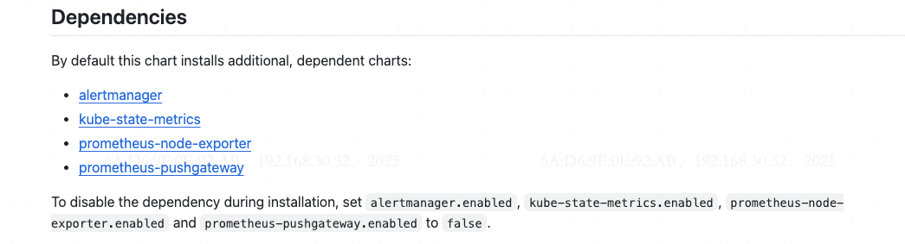
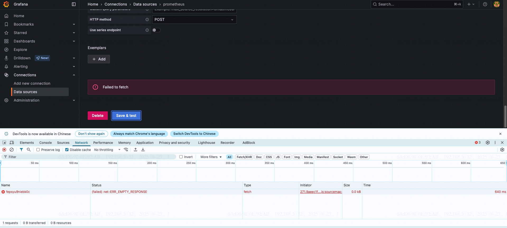

## Kubernetes 安装Prometheus

### 背景

- [仓库地址](https://github.com/prometheus-community/helm-charts/tree/main)

### 部署过程

##### 前置

1、 害怕集群资源不够，可使用ResourceQuota对集群的资源进行限制

```yaml
apiVersion: v1
kind: ResourceQuota
metadata:
  name: devops-resources
  namespace: devops
spec:
  hard:
    requests.cpu: "4"
    requests.memory: 8Gi
    limits.cpu: "8"
    limits.memory: 16Gi
```


1、 根据文档描述，本次需要部署 prometheus 服务，从官方[文档](https://github.com/prometheus-community/helm-charts/tree/main/charts/prometheus)中可以看到，Prometheus 需要依赖于如下四个服务；



2、下面开始使用helm 对服务进行部署

```bash
## 将prometheus chart 加入到本地helm 仓库
$ helm repo add prometheus-community https://prometheus-community.github.io/helm-charts
```

3、拉取helm-charts 并根据实际情况修改charts

```bash
## 查询所有的helm 插件
$ helm search repo prometheus-community
```

4、 开始拉取Prometheus 的helm-charts ，[参考文档](helm repo add prometheus-community https://prometheus-community.github.io/helm-charts)

```bash
$ helm repo add prometheus-community https://prometheus-community.github.io/helm-charts
$ helm repo update
```

5、将Prometheus 拉取下来，并对服务进行修改

```bash
$ helm pull --untar prometheus-community/prometheus
```

6、修改配置，不部署certmanager

7、使用helm 命令对服务进行部署，部署完成如下

```bash
$ helm upgrade --install -n monitor --create-namespace prometheus prometheus-community/prometheus -f ./values.yaml
```

执行完成后有如下配置：

```bash
Release "prometheus" does not exist. Installing it now.
NAME: promethesu
LAST DEPLOYED: Mon Jun 23 10:56:58 2025
NAMESPACE: monitor
STATUS: deployed
REVISION: 1
TEST SUITE: None
NOTES:
The Prometheus server can be accessed via port 80 on the following DNS name from within your cluster:
promethesu-prometheus-server.monitor.svc.cluster.local


Get the Prometheus server URL by running these commands in the same shell:
  export POD_NAME=$(kubectl get pods --namespace monitor -l "app.kubernetes.io/name=prometheus,app.kubernetes.io/instance=promethesu" -o jsonpath="{.items[0].metadata.name}")
  kubectl --namespace monitor port-forward $POD_NAME 9090


#################################################################################
######   WARNING: Pod Security Policy has been disabled by default since    #####
######            it deprecated after k8s 1.25+. use                        #####
######            (index .Values "prometheus-node-exporter" "rbac"          #####
###### .          "pspEnabled") with (index .Values                         #####
######            "prometheus-node-exporter" "rbac" "pspAnnotations")       #####
######            in case you still need it.                                #####
#################################################################################


The Prometheus PushGateway can be accessed via port 9091 on the following DNS name from within your cluster:
promethesu-prometheus-pushgateway.monitor.svc.cluster.local


Get the PushGateway URL by running these commands in the same shell:
  export POD_NAME=$(kubectl get pods --namespace monitor -l "app=prometheus-pushgateway,component=pushgateway" -o jsonpath="{.items[0].metadata.name}")
  kubectl --namespace monitor port-forward $POD_NAME 9091

For more information on running Prometheus, visit:
https://prometheus.io/
```

部署完成后进行检查,全部正常运行后表示没问题； 

```bash
$ k get pod -n monitor
NAME                                                 READY   STATUS    RESTARTS   AGE
promethesu-kube-state-metrics-7f8996fcbd-mlbnf       1/1     Running   0          7m43s
promethesu-prometheus-node-exporter-78mzz            1/1     Running   0          7m43s
promethesu-prometheus-pushgateway-674bc4555c-cqrrk   1/1     Running   0          7m43s
promethesu-prometheus-server-6fdf6d65bc-drlr4        2/2     Running   0          7m43s
```

### 部署Grafana 

[参考文档](https://github.com/grafana/helm-charts)

1、将 Grafana 的helm-charts 仓库加入到本地

```bash
$ helm repo add grafana https://grafana.github.io/helm-charts
```

2、 参考此[文档](https://github.com/grafana/helm-charts/tree/main/charts/grafana)，对Grafana 进行部署

```bash
## 添加仓库
$ helm repo add grafana https://grafana.github.io/helm-charts
$ helm repo update
```

3、 将helm-charts 的values 拉下来到本地环境中，并开始手动修改配置

```bash
$ helm show values grafana/grafana > values.yaml
```

4、 根据实际情况修改values.yaml

```bash
$ cat > values.yaml << EOF
grafana.ini:
  server:
    domain: monitoring.example.com
    root_url: "%(protocol)://%(domain)s/grafana"
    serve_from_sub_path: true
ingress:
  enabled: true
  ingressClassName: nginx
  hosts:
    - "monitoring.example.com"
  path: "/grafana"
  
persistence:
  enabled: true
  storageClassName: csi-disk
EOF
```

5、部署 Grafana

```bash
$ helm upgrade --install -n monitor --create-namespace grafana grafana/grafana -f values.yaml
```

6、部署完成之后会有如下显示：

```bash
Release "grafana" does not exist. Installing it now.
NAME: grafana
LAST DEPLOYED: Mon Jun 23 11:40:44 2025
NAMESPACE: monitor
STATUS: deployed
REVISION: 1
NOTES:
1. Get your 'admin' user password by running:

   kubectl get secret --namespace monitor grafana -o jsonpath="{.data.admin-password}" | base64 --decode ; echo


2. The Grafana server can be accessed via port 80 on the following DNS name from within your cluster:

   grafana.monitor.svc.cluster.local

   If you bind grafana to 80, please update values in values.yaml and reinstall:
   securityContext:
     runAsUser: 0
     runAsGroup: 0
     fsGroup: 0

   command:

   - "setcap"
   - "'cap_net_bind_service=+ep'"
   - "/usr/sbin/grafana-server &&"
   - "sh"
   - "/run.sh"
   
   Details refer to https://grafana.com/docs/installation/configuration/#http-port.
   Or grafana would always crash.

   From outside the cluster, the server URL(s) are:
     http://monitoring.downloadcenter.site

3. Login with the password from step 1 and the username: admin
```
### 部署 Cadvisor

[参考文档](helm repo add ckotzbauer https://ckotzbauer.github.io/helm-charts)

1、将[cadvisor](https://github.com/ckotzbauer/helm-charts/tree/main/charts/cadvisor) 仓库加入到本地helm 配置

```bash
$ helm repo add ckotzbauer https://ckotzbauer.github.io/helm-charts
$ helm repo update

```


问题处理：

1、添加datasource时报错



解决： 

手动添加数据源

```bash
$ curl -X POST http://grafana.monitor/api/datasources -u admin:edlB9W4smvP7voyudBX2ROoV4r279K8IEleS4mRl \
-H "Content-Type: application/json" \
-d @- <<EOF
{
    "name": "Prometheus",
    "type": "prometheus",
    "url": "http://prometheus-server.monitor",
    "access": "proxy",
    "isDefault": true,
    "jsonData": {},
    "readOnly": false
}
EOF

```

