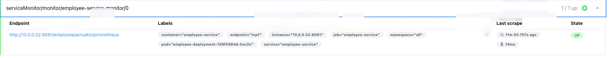

## Prometheus 添加自定义监控面板

### 执行步骤

1、创建ServiceMonitor 用于采集service 的metrics,如下文件所示：employee-service-monitor.yaml

```yaml
apiVersion: monitoring.coreos.com/v1
kind: ServiceMonitor
metadata:
  annotations:
    meta.helm.sh/release-name: kube-prometheus-stack
    meta.helm.sh/release-namespace: monitor
  creationTimestamp: "2025-07-01T06:29:57Z"
  generation: 1
  labels:
    release: kube-prometheus-stack
  name: employee-service-monitor
  namespace: monitor
spec:
  endpoints:
  - path: /employee/actuator/prometheus # metrics 的借口uri
    interval: 30s # 采集时间
    port: tcp1 # service 的端口名称
  namespaceSelector:
    matchNames:
    - all # 该service 所在的namespace
  selector:
    matchLabels:
      app: employee-service-lb # 匹配service的地址
```

2、执行完成后，可以在prometheus 的Target 中查看是否在线

