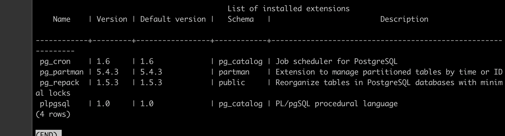

## 部署步骤

### 中间件部署

#### RocketMQ 部署

- 版本 5.4.0 
- 配置 ：1broker 1nameserv 1 proxy 1 dashboard

| 组件       | 配置     | 端口                                |
| ---------- | -------- | ----------------------------------- |
| rmqbroker  | 0.5C2G   | 172.27.0.12:10911,172.27.0.12:10909 |
| rmqnamesrv | 0.5C1G   | 172.27.0.12:9876                    |
| rmqproxy   | 0.5C0.5G | 172.27.0.12:8080,172.27.0.12:8081   |
|            |          |                                     |

部署方式： docker-compose 部署

```yaml
version: '3.8'
services:
  namesrv:
    image: apache/rocketmq:5.4.0
    container_name: rmqnamesrv
    ports:
      - 9876:9876
    networks:
      - rocketmq
    command:  sh mqnamesrv
    volumes:
      - ${PWD}/broker/broker.conf:/home/rocketmq/rocketmq-5.4.0/conf/broker.conf
      - ${PWD}/namesrv/logs:/home/rocketmq/logs
      - ${PWD}/namesrv/store:/home/rocketmq/store
    security_opt:
      - seccomp=unconfined
    deploy:
      resources:
        limits:
          cpus: '0.5'
          memory: 1024M
        reservations:
          cpus: '0.25'
          memory: 256M
  broker:
    image: apache/rocketmq:5.4.0
    container_name: rmqbroker
    volumes:
      - ${PWD}/broker/broker.conf:/home/rocketmq/rocketmq-5.4.0/conf/broker.conf
      - ${PWD}/broker/logs:/home/rocketmq/logs
      - ${PWD}/broker/store:/home/rocketmq/store
    ports:
      - 10911:10911
      - 10909:10909
    environment:
      - NAMESRV_ADDR=namesrv:9876
      - JAVA_OPT_EXT=-Xms128m -Xmx1g
    depends_on:
      - namesrv
    networks:
      - rocketmq
    command: sh mqbroker -c /home/rocketmq/rocketmq-5.4.0/conf/broker.conf
    security_opt:
      - seccomp=unconfined
    deploy:
      resources:
        limits:
          cpus: '0.5'
          memory: 2048M
        reservations:
          cpus: '0.25'
          memory: 256M
  proxy:
    image: apache/rocketmq:5.4.0
    container_name: rmqproxy
    networks:
      - rocketmq
    depends_on:
      - broker
      - namesrv
    ports:
      - 8080:8080
      - 8081:8081
    restart: on-failure
    environment:
      - NAMESRV_ADDR=namesrv:9876
    command: sh mqproxy
    security_opt:
      - seccomp=unconfined
    deploy:
      resources:
        limits:
          cpus: '0.5'
          memory: 512M
        reservations:
          cpus: '0.25'
          memory: 256M

networks:
  rocketmq:
    driver: bridge
```

broker/broker.conf 文件内容如下

```
brokerClusterName = DefaultCluster
brokerName = broker-a
brokerId = 0
deleteWhen = 04
fileReservedTime = 48
brokerRole = ASYNC_MASTER
flushDiskType = ASYNC_FLUSH
# add
maxMessageSize = 65536
autoCreateSubscriptionGroup = true
autoCreateTopicEnable = true
namesrvAddr = 172.27.0.12:9876
brokerIP1 = 172.27.0.12
listenPort = 10911
fastListenPort = 10909
haListenPort = 10912
# 1. 消息保留时间（小时），默认48小时（即2天）
fileReservedTime=30
# 2. 删除文件的时间点，默认为"04"，表示凌晨4点
deleteWhen=04
# 3. 磁盘使用率达到多少时强制清理（4.8.0版本为70，5.x版本为75）
# 当磁盘使用率达到85%时，无论是否过期都会清理
diskMaxUsedSpaceRatio=85
```

rocketmq Dashboard 使用docker build 编译

```dockerfile
FROM maven:3.6.3-openjdk-17 as base

RUN mkdir -p /workspace

WORKDIR /workspace

RUN git clone https://github.com/apache/rocketmq-dashboard.git

WORKDIR /workspace/rocketmq-dashboard


RUN mvn clean package -Dmaven.test.skip=true

FROM openjdk:27-ea-17-jdk

COPY --from=base /workspace/rocketmq-dashboard/target/rocketmq-dashboard-2.1.1-SNAPSHOT.jar /opt/rocketmq-dashboard-2.1.1-SNAPSHOT.jar

WORKDIR /opt
CMD ["bash","-c","java ${JVM_OPTS} -jar /opt/rocketmq-dashboard-2.1.1-SNAPSHOT.jar ${JAVA_OPTS}"]
```


#### Redis 部署

- 版本： redis7.0

| Redis组件 | 规格  | 连接             |
| --------- | ----- | ---------------- |
| redis     | 1C/2G | 172.27.0.12:6379 |

docker-compose文件如下

```yaml
version: '3.8'
services:
  redis:
    image: redis:7.0
    container_name: redis-server
    restart: unless-stopped
    deploy:
      resources:
        limits:
          cpus: '1.0'
          memory: 2048M
        reservations:
          cpus: '0.5'
          memory: 256M
    ports:
      - "6379:6379"
    volumes:
      - ${PWD}/redis-data:/data
      - ${PWD}/conf/redis.conf:/usr/local/etc/redis/redis.conf:ro
      - ${PWD}/logs:/var/log/redis
    command: redis-server /usr/local/etc/redis/redis.conf
    networks:
      - redis-network
    healthcheck:
      test: ["CMD", "redis-cli", "ping"]
      interval: 30s
      timeout: 10s
      retries: 3
      start_period: 10s
    logging:
      driver: "json-file"
      options:
        max-size: "10m"
        max-file: "3"
networks:
  redis-network:
    driver: bridge
```

conf/redis.conf文件如下

```
# 持久化配置
appendonly yes
appendfsync everysec

# RDB 快照配置
save 900 1
save 300 10
save 60 10000

# 内存管理
maxmemory 256mb
maxmemory-policy allkeys-lru

requirepass SDB7WyKNS3dIZF

# 其他优化配置
tcp-backlog 511
timeout 0
tcp-keepalive 300
daemonize no
pidfile /var/run/redis_6379.pid
loglevel notice
logfile /var/log/redis/redis.log
databases 16
stop-writes-on-bgsave-error yes
rdbcompression yes
rdbchecksum yes
dbfilename dump.rdb
dir /data
```

#### nacos 部署

- 版本： nacos-server 3.2.1

| Nacos组件 | 规格  | 连接                              |      |
| --------- | ----- | --------------------------------- | ---- |
| Mysql     | 1C2G  | 172.27.0.12:3306                  |      |
| Nacos     | 1C/2G | 172.27.0.12:8848,172.27.0.12:9848 |      |
|           |       |                                   |      |

Docker-compose 配置如下

```yaml
version: "3.8"
services:
  nacos:
    image: nacos/nacos-server:v3.2.1
    container_name: nacos-standalone-mysql
    environment:
      - PREFER_HOST_MODE=hostname
      - MODE=standalone
      - SPRING_DATASOURCE_PLATFORM=mysql
      - MYSQL_SERVICE_HOST=mysql
      - MYSQL_SERVICE_DB_NAME=nacos
      - MYSQL_SERVICE_PORT=3306
      - MYSQL_SERVICE_USER=nacos
      - MYSQL_SERVICE_PASSWORD=18HvQxGQv3417y
      - MYSQL_SERVICE_DB_PARAM=characterEncoding=utf8&connectTimeout=1000&socketTimeout=3000&autoReconnect=true&useUnicode=true&useSSL=false&serverTimezone=Asia/Shanghai&allowPublicKeyRetrieval=true
      - NACOS_AUTH_IDENTITY_KEY=5X2hUYv2nPb3ln
      - NACOS_AUTH_IDENTITY_VALUE=5X2hUYv2nPb3ln
      - NACOS_AUTH_TOKEN=VGhpc0lzTXlDdXN0b21TZWNyZXRLZXkwMTIzNDU2Nzg=
    volumes:
      - ./standalone-logs/:/home/nacos/logs
    ports:
      - "18080:8080"
      - "8848:8848"
      - "9848:9848"
    depends_on:
      mysql:
        condition: service_healthy
    restart: always
    deploy:
      resources:
        limits:
          cpus: '1'
          memory: 2048M
        reservations:
          cpus: '0.25'
          memory: 256M
  mysql:
    container_name: mysql
    image: mysql:8.0-bookworm
    environment:
      - MYSQL_ROOT_PASSWORD=root
      - MYSQL_DATABASE=nacos
      - MYSQL_USER=nacos
      - MYSQL_PASSWORD=18HvQxGQv3417y
      - LANG=C.UTF-8
    volumes:
      - ${PWD}/mysql:/var/lib/mysql
    command:
      --character-set-server=utf8mb4
      --collation-server=utf8mb4_unicode_ci
    ports:
      - "3306:3306"
    healthcheck:
      test: [ "CMD", "mysqladmin" ,"ping", "-h", "localhost" ]
      interval: 5s
      timeout: 10s
      retries: 10
    deploy:
      resources:
        limits:
          cpus: '1'
          memory: 2048M
        reservations:
          cpus: '0.25'
          memory: 256M
```

数据库初始化脚本 nacos：3.2.1

```sql
/*
 * Copyright 1999-2018 Alibaba Group Holding Ltd.
 *
 * Licensed under the Apache License, Version 2.0 (the "License");
 * you may not use this file except in compliance with the License.
 * You may obtain a copy of the License at
 *
 *      http://www.apache.org/licenses/LICENSE-2.0
 *
 * Unless required by applicable law or agreed to in writing, software
 * distributed under the License is distributed on an "AS IS" BASIS,
 * WITHOUT WARRANTIES OR CONDITIONS OF ANY KIND, either express or implied.
 * See the License for the specific language governing permissions and
 * limitations under the License.
 */

/******************************************/
/*   表名称 = config_info                  */
/******************************************/
CREATE TABLE `config_info` (
                               `id` bigint(20) NOT NULL AUTO_INCREMENT COMMENT 'id',
                               `data_id` varchar(255) NOT NULL COMMENT 'data_id',
                               `group_id` varchar(128) DEFAULT NULL COMMENT 'group_id',
                               `content` longtext NOT NULL COMMENT 'content',
                               `md5` varchar(32) DEFAULT NULL COMMENT 'md5',
                               `gmt_create` datetime NOT NULL DEFAULT CURRENT_TIMESTAMP COMMENT '创建时间',
                               `gmt_modified` datetime NOT NULL DEFAULT CURRENT_TIMESTAMP COMMENT '修改时间',
                               `src_user` text COMMENT 'source user',
                               `src_ip` varchar(50) DEFAULT NULL COMMENT 'source ip',
                               `app_name` varchar(128) DEFAULT NULL COMMENT 'app_name',
                               `tenant_id` varchar(128) DEFAULT '' COMMENT '租户字段',
                               `c_desc` varchar(256) DEFAULT NULL COMMENT 'configuration description',
                               `c_use` varchar(64) DEFAULT NULL COMMENT 'configuration usage',
                               `effect` varchar(64) DEFAULT NULL COMMENT '配置生效的描述',
                               `type` varchar(64) DEFAULT NULL COMMENT '配置的类型',
                               `c_schema` text COMMENT '配置的模式',
                               `encrypted_data_key` varchar(1024) NOT NULL DEFAULT '' COMMENT '密钥',
                               PRIMARY KEY (`id`),
                               UNIQUE KEY `uk_configinfo_datagrouptenant` (`data_id`,`group_id`,`tenant_id`)
) ENGINE=InnoDB DEFAULT CHARSET=utf8 COLLATE=utf8_bin COMMENT='config_info';

/******************************************/
/*   表名称 = config_info  since 2.5.0                */
/******************************************/
CREATE TABLE `config_info_gray` (
                                    `id` bigint unsigned NOT NULL AUTO_INCREMENT COMMENT 'id',
                                    `data_id` varchar(255) NOT NULL COMMENT 'data_id',
                                    `group_id` varchar(128) NOT NULL COMMENT 'group_id',
                                    `content` longtext NOT NULL COMMENT 'content',
                                    `md5` varchar(32) DEFAULT NULL COMMENT 'md5',
                                    `src_user` text COMMENT 'src_user',
                                    `src_ip` varchar(100) DEFAULT NULL COMMENT 'src_ip',
                                    `gmt_create` datetime(3) NOT NULL DEFAULT CURRENT_TIMESTAMP(3) COMMENT 'gmt_create',
                                    `gmt_modified` datetime(3) NOT NULL DEFAULT CURRENT_TIMESTAMP(3) COMMENT 'gmt_modified',
                                    `app_name` varchar(128) DEFAULT NULL COMMENT 'app_name',
                                    `tenant_id` varchar(128) DEFAULT '' COMMENT 'tenant_id',
                                    `gray_name` varchar(128) NOT NULL COMMENT 'gray_name',
                                    `gray_rule` text NOT NULL COMMENT 'gray_rule',
                                    `encrypted_data_key` varchar(256) NOT NULL DEFAULT '' COMMENT 'encrypted_data_key',
                                    PRIMARY KEY (`id`),
                                    UNIQUE KEY `uk_configinfogray_datagrouptenantgray` (`data_id`,`group_id`,`tenant_id`,`gray_name`),
                                    KEY `idx_dataid_gmt_modified` (`data_id`,`gmt_modified`),
                                    KEY `idx_gmt_modified` (`gmt_modified`)
) ENGINE=InnoDB AUTO_INCREMENT=1 DEFAULT CHARSET=utf8 COMMENT='config_info_gray';

/******************************************/
/*   表名称 = config_tags_relation         */
/******************************************/
CREATE TABLE `config_tags_relation` (
                                        `id` bigint(20) NOT NULL COMMENT 'id',
                                        `tag_name` varchar(128) NOT NULL COMMENT 'tag_name',
                                        `tag_type` varchar(64) DEFAULT NULL COMMENT 'tag_type',
                                        `data_id` varchar(255) NOT NULL COMMENT 'data_id',
                                        `group_id` varchar(128) NOT NULL COMMENT 'group_id',
                                        `tenant_id` varchar(128) DEFAULT '' COMMENT 'tenant_id',
                                        `nid` bigint(20) NOT NULL AUTO_INCREMENT COMMENT 'nid, 自增长标识',
                                        PRIMARY KEY (`nid`),
                                        UNIQUE KEY `uk_configtagrelation_configidtag` (`id`,`tag_name`,`tag_type`),
                                        KEY `idx_tenant_id` (`tenant_id`)
) ENGINE=InnoDB DEFAULT CHARSET=utf8 COLLATE=utf8_bin COMMENT='config_tag_relation';

/******************************************/
/*   表名称 = group_capacity               */
/******************************************/
CREATE TABLE `group_capacity` (
                                  `id` bigint(20) unsigned NOT NULL AUTO_INCREMENT COMMENT '主键ID',
                                  `group_id` varchar(128) NOT NULL DEFAULT '' COMMENT 'Group ID，空字符表示整个集群',
                                  `quota` int(10) unsigned NOT NULL DEFAULT '0' COMMENT '配额，0表示使用默认值',
                                  `usage` int(10) unsigned NOT NULL DEFAULT '0' COMMENT '使用量',
                                  `max_size` int(10) unsigned NOT NULL DEFAULT '0' COMMENT '单个配置大小上限，单位为字节，0表示使用默认值',
                                  `max_aggr_count` int(10) unsigned NOT NULL DEFAULT '0' COMMENT '聚合子配置最大个数，，0表示使用默认值',
                                  `max_aggr_size` int(10) unsigned NOT NULL DEFAULT '0' COMMENT '单个聚合数据的子配置大小上限，单位为字节，0表示使用默认值',
                                  `max_history_count` int(10) unsigned NOT NULL DEFAULT '0' COMMENT '最大变更历史数量',
                                  `gmt_create` datetime NOT NULL DEFAULT CURRENT_TIMESTAMP COMMENT '创建时间',
                                  `gmt_modified` datetime NOT NULL DEFAULT CURRENT_TIMESTAMP COMMENT '修改时间',
                                  PRIMARY KEY (`id`),
                                  UNIQUE KEY `uk_group_id` (`group_id`)
) ENGINE=InnoDB DEFAULT CHARSET=utf8 COLLATE=utf8_bin COMMENT='集群、各Group容量信息表';

/******************************************/
/*   表名称 = his_config_info              */
/******************************************/
CREATE TABLE `his_config_info` (
                                   `id` bigint(20) unsigned NOT NULL COMMENT 'id',
                                   `nid` bigint(20) unsigned NOT NULL AUTO_INCREMENT COMMENT 'nid, 自增标识',
                                   `data_id` varchar(255) NOT NULL COMMENT 'data_id',
                                   `group_id` varchar(128) NOT NULL COMMENT 'group_id',
                                   `app_name` varchar(128) DEFAULT NULL COMMENT 'app_name',
                                   `content` longtext NOT NULL COMMENT 'content',
                                   `md5` varchar(32) DEFAULT NULL COMMENT 'md5',
                                   `gmt_create` datetime NOT NULL DEFAULT CURRENT_TIMESTAMP COMMENT '创建时间',
                                   `gmt_modified` datetime NOT NULL DEFAULT CURRENT_TIMESTAMP COMMENT '修改时间',
                                   `src_user` text COMMENT 'source user',
                                   `src_ip` varchar(50) DEFAULT NULL COMMENT 'source ip',
                                   `op_type` char(10) DEFAULT NULL COMMENT 'operation type',
                                   `tenant_id` varchar(128) DEFAULT '' COMMENT '租户字段',
                                   `encrypted_data_key` varchar(1024) NOT NULL DEFAULT '' COMMENT '密钥',
                                   `publish_type` varchar(50)  DEFAULT 'formal' COMMENT 'publish type gray or formal',
                                   `gray_name` varchar(50)  DEFAULT NULL COMMENT 'gray name',
                                   `ext_info`  longtext DEFAULT NULL COMMENT 'ext info',
                                   PRIMARY KEY (`nid`),
                                   KEY `idx_gmt_create` (`gmt_create`),
                                   KEY `idx_gmt_modified` (`gmt_modified`),
                                   KEY `idx_did` (`data_id`)
) ENGINE=InnoDB DEFAULT CHARSET=utf8 COLLATE=utf8_bin COMMENT='多租户改造';


/******************************************/
/*   表名称 = tenant_capacity              */
/******************************************/
CREATE TABLE `tenant_capacity` (
                                   `id` bigint(20) unsigned NOT NULL AUTO_INCREMENT COMMENT '主键ID',
                                   `tenant_id` varchar(128) NOT NULL DEFAULT '' COMMENT 'Tenant ID',
                                   `quota` int(10) unsigned NOT NULL DEFAULT '0' COMMENT '配额，0表示使用默认值',
                                   `usage` int(10) unsigned NOT NULL DEFAULT '0' COMMENT '使用量',
                                   `max_size` int(10) unsigned NOT NULL DEFAULT '0' COMMENT '单个配置大小上限，单位为字节，0表示使用默认值',
                                   `max_aggr_count` int(10) unsigned NOT NULL DEFAULT '0' COMMENT '聚合子配置最大个数',
                                   `max_aggr_size` int(10) unsigned NOT NULL DEFAULT '0' COMMENT '单个聚合数据的子配置大小上限，单位为字节，0表示使用默认值',
                                   `max_history_count` int(10) unsigned NOT NULL DEFAULT '0' COMMENT '最大变更历史数量',
                                   `gmt_create` datetime NOT NULL DEFAULT CURRENT_TIMESTAMP COMMENT '创建时间',
                                   `gmt_modified` datetime NOT NULL DEFAULT CURRENT_TIMESTAMP COMMENT '修改时间',
                                   PRIMARY KEY (`id`),
                                   UNIQUE KEY `uk_tenant_id` (`tenant_id`)
) ENGINE=InnoDB DEFAULT CHARSET=utf8 COLLATE=utf8_bin COMMENT='租户容量信息表';


CREATE TABLE `tenant_info` (
                               `id` bigint(20) NOT NULL AUTO_INCREMENT COMMENT 'id',
                               `kp` varchar(128) NOT NULL COMMENT 'kp',
                               `tenant_id` varchar(128) default '' COMMENT 'tenant_id',
                               `tenant_name` varchar(128) default '' COMMENT 'tenant_name',
                               `tenant_desc` varchar(256) DEFAULT NULL COMMENT 'tenant_desc',
                               `create_source` varchar(32) DEFAULT NULL COMMENT 'create_source',
                               `gmt_create` bigint(20) NOT NULL COMMENT '创建时间',
                               `gmt_modified` bigint(20) NOT NULL COMMENT '修改时间',
                               PRIMARY KEY (`id`),
                               UNIQUE KEY `uk_tenant_info_kptenantid` (`kp`,`tenant_id`),
                               KEY `idx_tenant_id` (`tenant_id`)
) ENGINE=InnoDB DEFAULT CHARSET=utf8 COLLATE=utf8_bin COMMENT='tenant_info';

CREATE TABLE `users` (
                         `username` varchar(50) NOT NULL PRIMARY KEY COMMENT 'username',
                         `password` varchar(500) NOT NULL COMMENT 'password',
                         `enabled` boolean NOT NULL COMMENT 'enabled'
);

CREATE TABLE `roles` (
                         `username` varchar(50) NOT NULL COMMENT 'username',
                         `role` varchar(50) NOT NULL COMMENT 'role',
                         UNIQUE INDEX `idx_user_role` (`username` ASC, `role` ASC) USING BTREE
);

CREATE TABLE `permissions` (
                               `role` varchar(50) NOT NULL COMMENT 'role',
                               `resource` varchar(128) NOT NULL COMMENT 'resource',
                               `action` varchar(8) NOT NULL COMMENT 'action',
                               UNIQUE INDEX `uk_role_permission` (`role`,`resource`,`action`) USING BTREE
);

```

#### xxl-job-admin 部署

- 版本： xxl-job-admin:2.4.2


Docker-compose 配置文件如下

```yaml
version: '3.8'

services:
  xxl-job-admin:
    image: xuxueli/xxl-job-admin:2.4.2  # 请替换为你需要的版本
    container_name: xxl-job-admin
    restart: unless-stopped
    ports:
      - "18080:8080"
    environment:
      - PARAMS=--spring.datasource.url=jdbc:mysql://172.27.0.12:3306/xxl-job?useUnicode=true&characterEncoding=UTF-8&autoReconnect=true&serverTimezone=Asia/Shanghai \
               --spring.datasource.username=xxl-job \
               --spring.datasource.password=mlsg1WARiG7yHK \
               --xxl.job.accessToken=goQ0R4akkRxzjj
    volumes:
      - ${PWD}/xxl-job-data:/data/applogs
    networks:
      - xxl-job-network
    deploy:
      resources:
        limits:
          cpus: '0.5'
          memory: 2048M
        reservations:
          cpus: '0.25'
          memory: 256M

networks:
  xxl-job-network:
    driver: bridge
```

创建数据库

```sql
CREATE DATABASE IF NOT EXISTS `xxl-job` DEFAULT CHARACTER SET utf8mb4 COLLATE utf8mb4_unicode_ci;
CREATE USER 'xxl-job'@'%' IDENTIFIED BY 'mlsg1WARiG7yHK';
GRANT ALL PRIVILEGES ON `xxl-job`.`*` TO 'xxl-job'@'%' WITH GRANT OPTION;

```

```sql
#
# XXL-JOB
# Copyright (c) 2015-present, xuxueli.

CREATE database if NOT EXISTS `xxl_job` default character set utf8mb4 collate utf8mb4_unicode_ci;
use `xxl_job`;

SET NAMES utf8mb4;

## —————————————————————— job group and registry ——————————————————

CREATE TABLE `xxl_job_group`
(
    `id`           int(11)     NOT NULL AUTO_INCREMENT,
    `app_name`     varchar(64) NOT NULL COMMENT '执行器AppName',
    `title`        varchar(64) NOT NULL COMMENT '执行器名称',
    `address_type` tinyint(4)  NOT NULL DEFAULT '0' COMMENT '执行器地址类型：0=自动注册、1=手动录入',
    `address_list` text COMMENT '执行器地址列表，多地址逗号分隔',
    `update_time`  datetime             DEFAULT NULL,
    PRIMARY KEY (`id`)
) ENGINE = InnoDB
  DEFAULT CHARSET = utf8mb4;

CREATE TABLE `xxl_job_registry`
(
    `id`                bigint(20)   NOT NULL AUTO_INCREMENT,
    `registry_group`    varchar(50)  NOT NULL,
    `registry_key`      varchar(255) NOT NULL,
    `registry_value`    varchar(255) NOT NULL,
    `update_time`       datetime DEFAULT NULL,
    PRIMARY KEY (`id`),
    UNIQUE KEY `i_g_k_v` (`registry_group`, `registry_key`, `registry_value`) USING BTREE
) ENGINE = InnoDB
  DEFAULT CHARSET = utf8mb4;

## —————————————————————— job info ——————————————————

CREATE TABLE `xxl_job_info`
(
    `id`                        int(11)      NOT NULL AUTO_INCREMENT,
    `job_group`                 int(11)      NOT NULL COMMENT '执行器主键ID',
    `job_desc`                  varchar(255) NOT NULL,
    `add_time`                  datetime              DEFAULT NULL,
    `update_time`               datetime              DEFAULT NULL,
    `author`                    varchar(64)           DEFAULT NULL COMMENT '作者',
    `alarm_email`               varchar(255)          DEFAULT NULL COMMENT '报警邮件',
    `schedule_type`             varchar(50)  NOT NULL DEFAULT 'NONE' COMMENT '调度类型',
    `schedule_conf`             varchar(128)          DEFAULT NULL COMMENT '调度配置，值含义取决于调度类型',
    `misfire_strategy`          varchar(50)  NOT NULL DEFAULT 'DO_NOTHING' COMMENT '调度过期策略',
    `executor_route_strategy`   varchar(50)           DEFAULT NULL COMMENT '执行器路由策略',
    `executor_handler`          varchar(255)          DEFAULT NULL COMMENT '任务handler',
    `executor_param`            text                  DEFAULT NULL COMMENT '任务参数',
    `executor_block_strategy`   varchar(50)           DEFAULT NULL COMMENT '阻塞处理策略',
    `executor_timeout`          int(11)      NOT NULL DEFAULT '0' COMMENT '任务执行超时时间，单位秒',
    `executor_fail_retry_count` int(11)      NOT NULL DEFAULT '0' COMMENT '失败重试次数',
    `glue_type`                 varchar(50)  NOT NULL COMMENT 'GLUE类型',
    `glue_source`               mediumtext COMMENT 'GLUE源代码',
    `glue_remark`               varchar(128)          DEFAULT NULL COMMENT 'GLUE备注',
    `glue_updatetime`           datetime              DEFAULT NULL COMMENT 'GLUE更新时间',
    `child_jobid`               varchar(255)          DEFAULT NULL COMMENT '子任务ID，多个逗号分隔',
    `trigger_status`            tinyint(4)   NOT NULL DEFAULT '0' COMMENT '调度状态：0-停止，1-运行',
    `trigger_last_time`         bigint(13)   NOT NULL DEFAULT '0' COMMENT '上次调度时间',
    `trigger_next_time`         bigint(13)   NOT NULL DEFAULT '0' COMMENT '下次调度时间',
    PRIMARY KEY (`id`)
) ENGINE = InnoDB
  DEFAULT CHARSET = utf8mb4;

CREATE TABLE `xxl_job_logglue`
(
    `id`          int(11)      NOT NULL AUTO_INCREMENT,
    `job_id`      int(11)      NOT NULL COMMENT '任务，主键ID',
    `glue_type`   varchar(50) DEFAULT NULL COMMENT 'GLUE类型',
    `glue_source` mediumtext COMMENT 'GLUE源代码',
    `glue_remark` varchar(128) NOT NULL COMMENT 'GLUE备注',
    `add_time`    datetime    DEFAULT NULL,
    `update_time` datetime    DEFAULT NULL,
    PRIMARY KEY (`id`)
) ENGINE = InnoDB
  DEFAULT CHARSET = utf8mb4;

## —————————————————————— job log and report ——————————————————

CREATE TABLE `xxl_job_log`
(
    `id`                        bigint(20)          NOT NULL AUTO_INCREMENT,
    `job_group`                 int(11)             NOT NULL COMMENT '执行器主键ID',
    `job_id`                    int(11)             NOT NULL COMMENT '任务，主键ID',
    `executor_address`          varchar(255)        DEFAULT NULL COMMENT '执行器地址，本次执行的地址',
    `executor_handler`          varchar(255)        DEFAULT NULL COMMENT '任务handler',
    `executor_param`            text                DEFAULT NULL COMMENT '任务参数',
    `executor_sharding_param`   varchar(20)         DEFAULT NULL COMMENT '任务分片参数，格式如 1/2',
    `executor_fail_retry_count` int(11)             NOT NULL DEFAULT '0' COMMENT '失败重试次数',
    `trigger_time`              datetime            DEFAULT NULL COMMENT '调度-时间',
    `trigger_code`              int(11)             NOT NULL COMMENT '调度-结果',
    `trigger_msg`               text                COMMENT '调度-日志',
    `handle_time`               datetime            DEFAULT NULL COMMENT '执行-时间',
    `handle_code`               int(11)             NOT NULL COMMENT '执行-状态',
    `handle_msg`                text                COMMENT '执行-日志',
    `alarm_status`              tinyint(4)          NOT NULL DEFAULT '0' COMMENT '告警状态：0-默认、1-无需告警、2-告警成功、3-告警失败',
    PRIMARY KEY (`id`),
    KEY `I_trigger_time` (`trigger_time`),
    KEY `I_handle_code` (`handle_code`),
    KEY `I_jobgroup` (`job_group`),
    KEY `I_jobid` (`job_id`)
) ENGINE = InnoDB
  DEFAULT CHARSET = utf8mb4;

CREATE TABLE `xxl_job_log_report`
(
    `id`            int(11) NOT NULL AUTO_INCREMENT,
    `trigger_day`   datetime         DEFAULT NULL COMMENT '调度-时间',
    `running_count` int(11) NOT NULL DEFAULT '0' COMMENT '运行中-日志数量',
    `suc_count`     int(11) NOT NULL DEFAULT '0' COMMENT '执行成功-日志数量',
    `fail_count`    int(11) NOT NULL DEFAULT '0' COMMENT '执行失败-日志数量',
    `update_time`   datetime         DEFAULT NULL,
    PRIMARY KEY (`id`),
    UNIQUE KEY `i_trigger_day` (`trigger_day`) USING BTREE
) ENGINE = InnoDB
  DEFAULT CHARSET = utf8mb4;

## —————————————————————— lock ——————————————————

CREATE TABLE `xxl_job_lock`
(
    `lock_name` varchar(50) NOT NULL COMMENT '锁名称',
    PRIMARY KEY (`lock_name`)
) ENGINE = InnoDB
  DEFAULT CHARSET = utf8mb4;

## —————————————————————— user ——————————————————

CREATE TABLE `xxl_job_user`
(
    `id`         int(11)     NOT NULL AUTO_INCREMENT,
    `username`   varchar(50) NOT NULL COMMENT '账号',
    `password`   varchar(100) NOT NULL COMMENT '密码加密信息',
    `token`      varchar(100) DEFAULT NULL COMMENT '登录token',
    `role`       tinyint(4)  NOT NULL COMMENT '角色：0-普通用户、1-管理员',
    `permission` varchar(255) DEFAULT NULL COMMENT '权限：执行器ID列表，多个逗号分割',
    PRIMARY KEY (`id`),
    UNIQUE KEY `i_username` (`username`) USING BTREE
) ENGINE = InnoDB
  DEFAULT CHARSET = utf8mb4;


## —————————————————————— for default data ——————————————————

INSERT INTO `xxl_job_group`(`id`, `app_name`, `title`, `address_type`, `address_list`, `update_time`)
    VALUES (1, 'xxl-job-executor-sample', '通用执行器Sample', 0, NULL, now()),
           (2, 'xxl-job-executor-sample-ai', 'AI执行器Sample', 0, NULL, now());

INSERT INTO `xxl_job_info`(`id`, `job_group`, `job_desc`, `add_time`, `update_time`, `author`, `alarm_email`,
                           `schedule_type`, `schedule_conf`, `misfire_strategy`, `executor_route_strategy`,
                           `executor_handler`, `executor_param`, `executor_block_strategy`, `executor_timeout`,
                           `executor_fail_retry_count`, `glue_type`, `glue_source`, `glue_remark`, `glue_updatetime`,
                           `child_jobid`)
VALUES (1, 1, '示例任务01', now(), now(), 'XXL', '', 'CRON', '0 0 0 * * ? *',
        'DO_NOTHING', 'FIRST', 'demoJobHandler', '', 'SERIAL_EXECUTION', 0, 0, 'BEAN', '', 'GLUE代码初始化',
        now(), ''),
       (2, 2, 'Ollama示例任务', now(), now(), 'XXL', '', 'NONE', '',
        'DO_NOTHING', 'FIRST', 'ollamaJobHandler', '{
    "input": "Java实现二叉树层序遍历",
    "prompt": "你是一个研发工程师，擅长解决技术类问题。",
    "model": "qwen3.5:2b"
}', 'SERIAL_EXECUTION', 0, 0, 'BEAN', '', 'GLUE代码初始化',
        now(), ''),
       (3, 2, 'Dify示例任务', now(), now(), 'XXL', '', 'NONE', '',
        'DO_NOTHING', 'FIRST', 'difyWorkflowJobHandler', '{
    "inputs":{
        "input":"查询班级各学科前三名"
    },
    "user": "xxl-job",
    "baseUrl": "http://localhost/v1",
    "apiKey": "app-OUVgNUOQRIMokfmuJvBJoUTN"
}', 'SERIAL_EXECUTION', 0, 0, 'BEAN', '', 'GLUE代码初始化',
        now(), ''),
       (4, 2, 'OpenClaw示例任务', now(), now(), 'XXL', '', 'NONE', '',
        'DO_NOTHING', 'FIRST', 'openClawJobHandler', '{
    "input": "查看下上海今天得天气，给出出游建议",
    "prompt": "你是一个出游助手，擅长做旅游规划"
}', 'SERIAL_EXECUTION', 0, 0, 'BEAN', '', 'GLUE代码初始化',
        now(), '');

INSERT INTO `xxl_job_user`(`id`, `username`, `password`, `role`, `permission`)
VALUES (1, 'admin', 'e10adc3949ba59abbe56e057f20f883e', 1, NULL);

INSERT INTO `xxl_job_lock` (`lock_name`)
VALUES ('schedule_lock');

commit;
```

#### Postgres

docker-compose 配置文件

```yaml
version: '3.8'

services:
  postgres:
    image: postgres:18.3
    container_name: postgres-18.3
    restart: unless-stopped
    environment:
      POSTGRES_USER: admin
      POSTGRES_PASSWORD: tK9wHM4r&veYsB
      POSTGRES_DB: postgres
      TZ: Asia/Shanghai
    ports:
      - "5432:5432"
    volumes:
      - ${PWD}/postgres_data:/var/lib/postgresql
    healthcheck:
      test: ["CMD-SHELL", "pg_isready -U admin -d postgres"]
      interval: 30s
      timeout: 10s
      retries: 5
    deploy:
      resources:
        limits:
          cpus: '3.0'
          memory: 6G
        reservations:
          cpus: '0.5'
          memory: 512M
```

Postgres 安装插件pg_partman pg_cron pg_repack

Dockerfile 如下:

```dockerfile
# 使用官方 PostgreSQL 18.3 镜像 (基于 Debian)
FROM postgres:18.3

# 安装所需的插件
RUN apt-get update && apt-get install -y --no-install-recommends \
    postgresql-18-partman \
    postgresql-18-cron \
    postgresql-18-repack \
    && rm -rf /var/lib/apt/lists/*

# 将 pg_cron 加入预加载库
RUN echo "shared_preload_libraries = 'pg_cron'" >> /usr/share/postgresql/postgresql.conf.sample

COPY init-extensions.sql /docker-entrypoint-initdb.d/
```

init-extensions.sql 文件如下:

```sql
-- init-db.sql
-- 创建 pg_partman
CREATE SCHEMA IF NOT EXISTS partman;
CREATE EXTENSION IF NOT EXISTS pg_partman SCHEMA partman;

-- 创建 pg_cron (必须在 postgres 库中执行)
CREATE EXTENSION IF NOT EXISTS pg_cron;

-- 创建 pg_repack
CREATE EXTENSION IF NOT EXISTS pg_repack;
```

如果是第一次安装,/var/lib/postgresql 为空的情况下,可以直接使用docker-compose 启动,会自动执行/docker-entrypoint-initdb.d/ 下的脚本

如果是在用的数据库需要手动修改 

修改步骤如下:

1. 修改: /var/lib/postgresql/18/docker/postgresql.conf 文件 的shared_preload_libraries = 'pg_cron'
2. 手动执行init-extensions.sql
3. 在psql 中使用\dx 来查看分区




