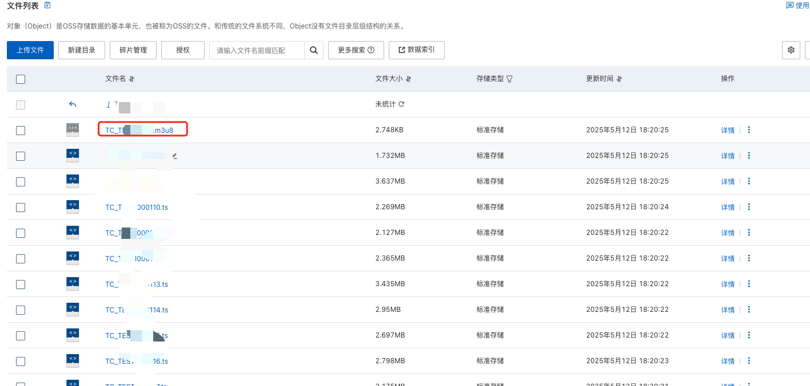

## 视频分片处理

### 前端 mp4 视频改成 [m3u8](https://so.csdn.net/so/search?q=m3u8&spm=1001.2101.3001.7020) 流模式

#### 背景

1、mp4 视频通常对应一个文件，播放时需要加载全部文件，消耗网络资源。如果用户从中间某个时间访问，也会从头开始下载，浪费服务器性能。

2、mp4 视频文件容易被用户下载到本地。有些版权方不希望普通用户下载到本地。

#### 解决思路

这个问题，很多[视频网站](https://so.csdn.net/so/search?q=视频网站&spm=1001.2101.3001.7020)已经给出了成熟方案，就是流模式加密形式。如果不是专业的视频网站，就不需要这么复杂的加密，直接转换成流模式即可满足需求。就是把 mp4 转换成 m3u8 视频流，然后分片下载并播放。


#### 手动处理步骤

1、使用ffmpeg 转换视频

```bash
$ brew install ffmpeg
```

2、 如果没有brew ，手动安装brew(如果不好使用，需要科学上网)

```bash
$ ruby -e "$(curl -fsSL https://raw.githubusercontent.com/Homebrew/install/master/install)"  
```

3、测试ffmpeg 版本输出

```bash
$ ffmpeg -version
```

4、通过ffmpeg 将mp4 的视频修改为m3u8 的格式

```bash
$ ffmpeg -i demo.mp4 -codec: copy -start_number 0 -hls_time 10 -hls_list_size 0 -f hls output.m3u8
```

这一步转换+切片取决于 mp4 视频大小。建议测试使用一个小一点的 mp4 文件。

- -i xxx.mp4 指定输入文件的路径（避免中文路径）
- -c:v libx264 指定视频编码器为libx264（H.264）
- -crf 20 设置CRF（常量速率因子）的值。这是视频质量的控制，范围从0（无损）到51（最糟），通常使用18到28的值。
- -c:a aac 指定音频编码器为AAC。
- -strict experimental 允许使用实验性的编码器。
- -b:a 192k 设置音频比特率为192k。
- -codec: copy：复用编解码器，这意味着不重新编码视频和音频。
- -start_number 0：每个TS切片的起始编号从0开始。
- -hls_time 10：每个TS切片的持续时间为10秒。
- -hls_list_size 0：播放列表中的TS切片数量没有限制。
- -f hls：输出格式为HLS。
- output.m3u8：输出的M3U8播放列表文件名。
- -s（设置分辨率）
- -b:v（设置视频比特率）


5、 界面上使用需要注意修改source

原：

```bash
<source src="./mp4/demo.mp4" type="video/mp4"></source>
```

修改为：

```bash
<source src="./mp4/output.m3u8" type='application/x-mpegURL'></source>
```

6、将对应文件上传至oss 中



7、指定视频流就能正常访问了，示例代码如下：

```html
<!DOCTYPE html>
<html>
<head>
<meta charset=utf-8 />
<title>videojs-contrib-hls embed</title>
  
  <!--

  Uses the latest versions of video.js and videojs-contrib-hls.

  To use specific versions, please change the URLs to the form:

  <link href="https://unpkg.com/video.js@5.16.0/dist/video-js.css" rel="stylesheet">
  <script src="https://unpkg.com/video.js@5.16.0/dist/video.js"></script>
  <script src="https://unpkg.com/videojs-contrib-hls@4.1.1/dist/videojs-contrib-hls.js"></script>

  -->

  <link href="./video-js.css" rel="stylesheet">
    <script src="./video.js"></script>
  <script src="./videojs-contrib-hls.js"></script>

  
</head>
<body>
  <h1>Video.js Example Embed</h1>

  <video id="my_video_1" class="video-js vjs-default-skin" controls preload="auto" width="640" height="268" 
  data-setup='{}'>
    <source src="http://******/m3u8/1200MB5987/1200MB5987.m3u8" type="application/x-mpegURL">
  </video>
 
  
</body>
</html>

```

**此时可以直接复制.m3u8文件的地址访问即可播放，如果无法访问可以检查是否是以下原因造成**

- 1.m3u8链接无法播放，video.js提示无法访问对应资源，需要在阿里云oss上设置跨域。bucket空间—>基础设置—>跨域设置
- 2.ts文件的读写权限需要公共读不然video.js访问不到的，然后为了防止视频被恶意下载可以设置防盗链
- 3.同一个视频的m3u8格式文件以及ts文件需要放在同一级目录。最好是一个视频的相关文件放入以文件名命名的路径下以示区别
- 4.bucket桶需要设置为空开读的权限
  

