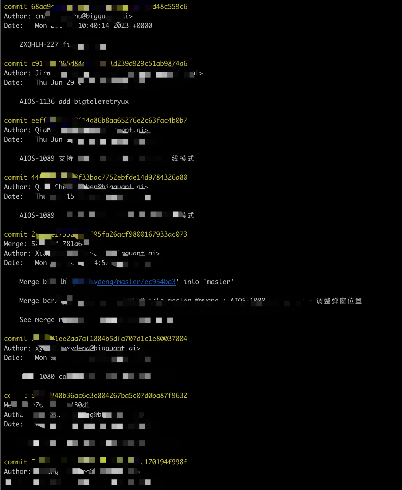

## git 按照历史提交新建分支

### 背景

- 代码过程中需要且分支
- 代码需要切分支修复bug

### 操作步骤

1、 将需要新开分支的代码仓库拉入本地

```bash
$ git clone --recursive <git url> && cd test
```

2、 查看commit 的log

```bash
$ git log 
```



3、 获取到需要创建分支的正确的commit 的ID, 并使用如下命令创建分支

```bash
$ git checkout -b <新分支名字> <commit id>
## 示例:
$ git checkout -b test c912f99965d84a1ea79d929c51ab9874a6
```

4、 push 仓库, 并创建新分支

```bash
$ git push --set-upstream origin test
```

