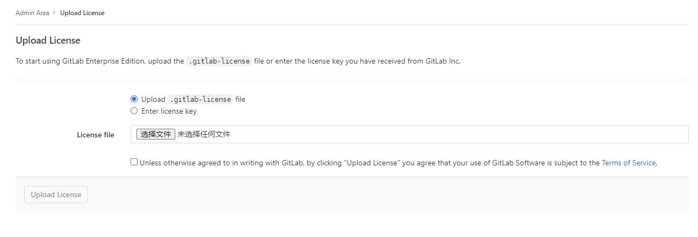

## gitlab-ee 破解

### 操作步骤

1、 参照之前步骤部署gitlab 

2、开始破解gitlab-ee， 启动一个ruby 运行环境执行以下代码；

```bash
$ docker run -it --rm ruby /bin/bash
```

3、修改gem 国内源， 并安装ruby 需要使用的插件

```bash
# 修改为国内源
$ gem sources --remove https://rubygems.org/
$ gem sources -a https://mirrors.aliyun.com/rubygems/
$ gem sources -l
# 安装必要插件
$ gem install gitlab-license
```


4、创建license.rb 文件， 里面存放如下代码

```ruby
require "openssl"
require "gitlab/license"
key_pair = OpenSSL::PKey::RSA.generate(2048)
File.open("license_key", "w") { |f| f.write(key_pair.to_pem) }
public_key = key_pair.public_key
File.open("license_key.pub", "w") { |f| f.write(public_key.to_pem) }
private_key = OpenSSL::PKey::RSA.new File.read("license_key")
Gitlab::License.encryption_key = private_key
license = Gitlab::License.new
license.licensee = {
"Name" => "gitlab",
"Company" => "gitlab",
"Email" => "admin@gitlab.com",
}
license.starts_at = Date.new(2024, 1, 1)
license.expires_at = Date.new(2099, 1, 1)
license.notify_admins_at = Date.new(2049, 12, 1)
license.notify_users_at = Date.new(2049, 12, 1)
license.block_changes_at = Date.new(2050, 1, 1)
license.restrictions = {
active_user_count: 10000,
}
puts "License:"
puts license
data = license.export
puts "Exported license:"
puts data
File.open("GitLabBV.gitlab-license", "w") { |f| f.write(data) }
public_key = OpenSSL::PKey::RSA.new File.read("license_key.pub")
Gitlab::License.encryption_key = public_key
data = File.read("GitLabBV.gitlab-license")
$license = Gitlab::License.import(data)
puts "Imported license:"
puts $license
unless $license
raise "The license is invalid."
end
if $license.restricted?(:active_user_count)
active_user_count = 10000
if active_user_count > $license.restrictions[:active_user_count]
    raise "The active user count exceeds the allowed amount!"
end
end
if $license.notify_admins?
puts "The license is due to expire on #{$license.expires_at}."
end
if $license.notify_users?
puts "The license is due to expire on #{$license.expires_at}."
end
module Gitlab
class GitAccess
    def check(cmd, changes = nil)
    if $license.block_changes?
        return build_status_object(false, "License expired")
    end
    end
end
end
puts "This instance of GitLab Enterprise Edition is licensed to:"
$license.licensee.each do |key, value|
puts "#{key}: #{value}"
end
if $license.expired?
puts "The license expired on #{$license.expires_at}"
elsif $license.will_expire?
puts "The license will expire on #{$license.expires_at}"
else
puts "The license will never expire."
end


```

5、在容器中执行ruby 脚本，来生成证书; 执行完成之后， 回在当前目录下生成3个文件`GitLabBV.gitlab-license` `license_key` `license_key.pub`

```bash
$ ruby license.rb
```

6、将生成的 license_key.pub 文件复制到到 gitlab 容器中的/opt/gitlab/embedded/service/gitlab-rails/.license_encryption_key.pub

7、重启gitlab， 并在界面上上传所生成的`GitLabBV.gitlab-license` 文件即可；



