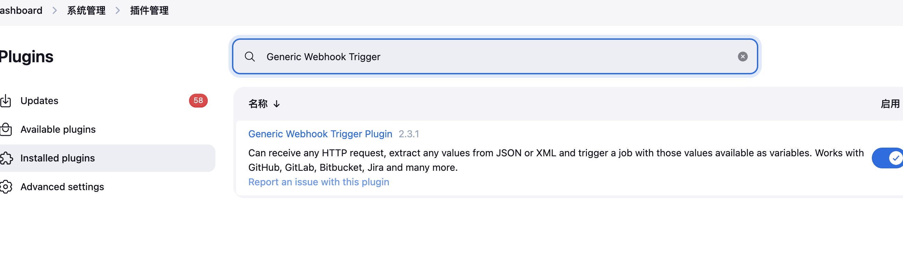
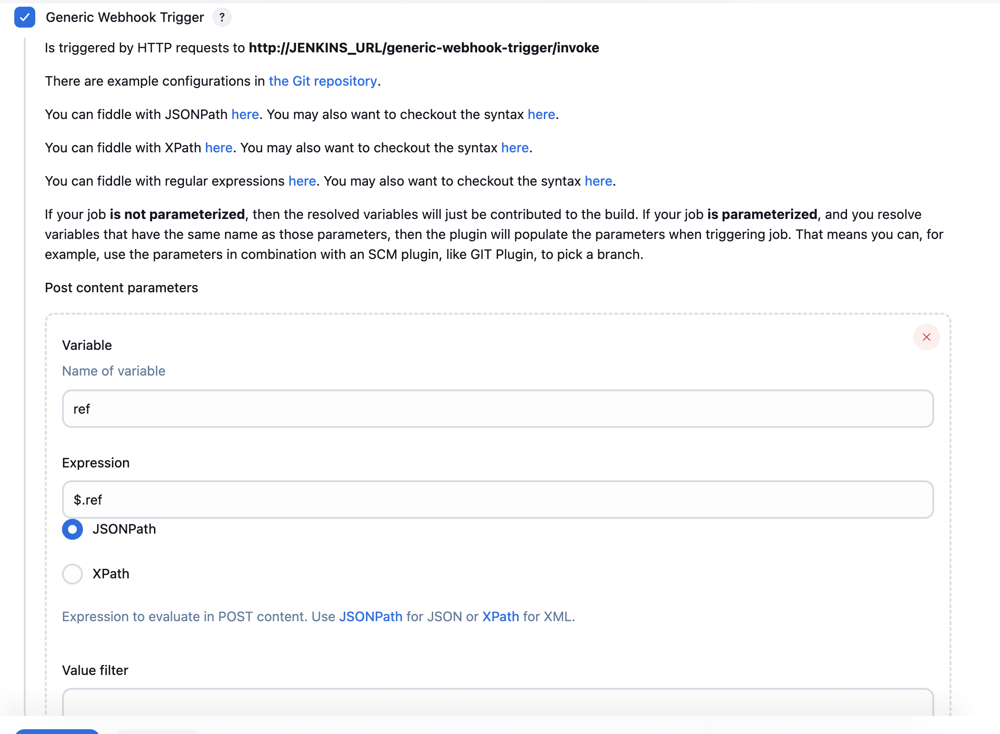
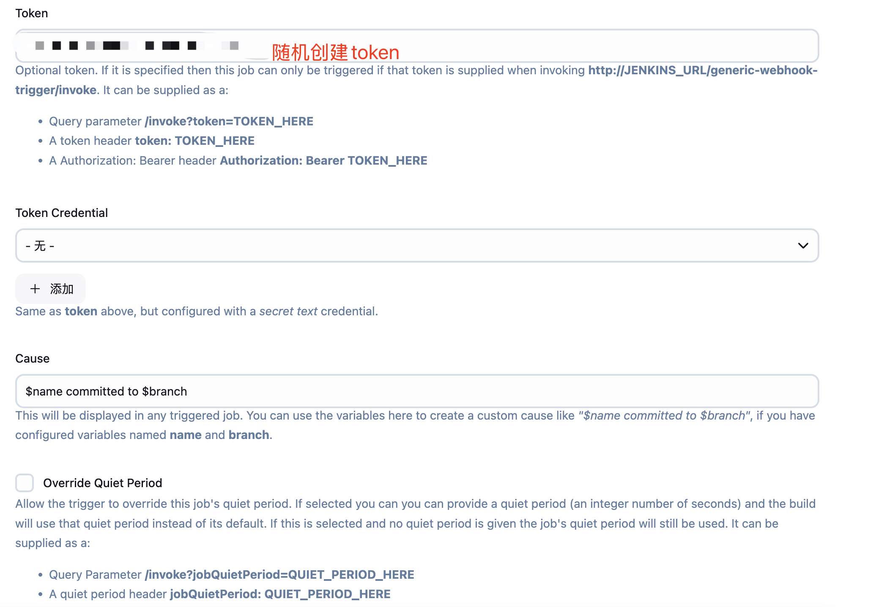
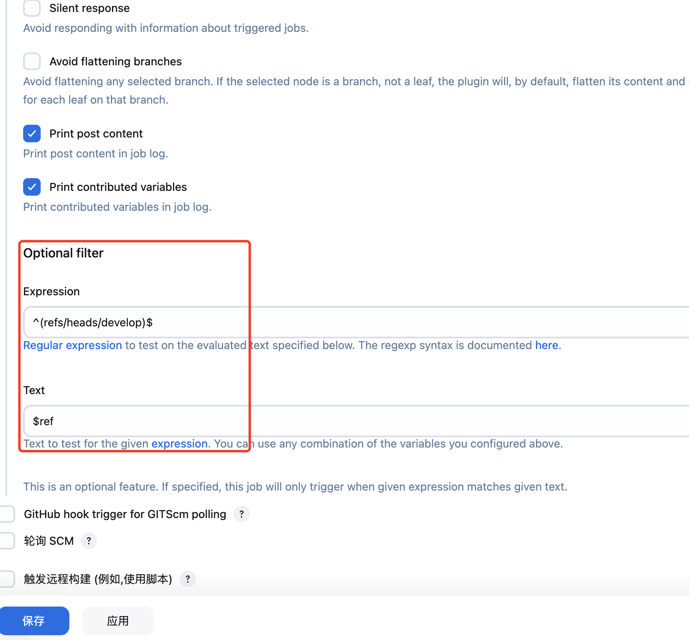
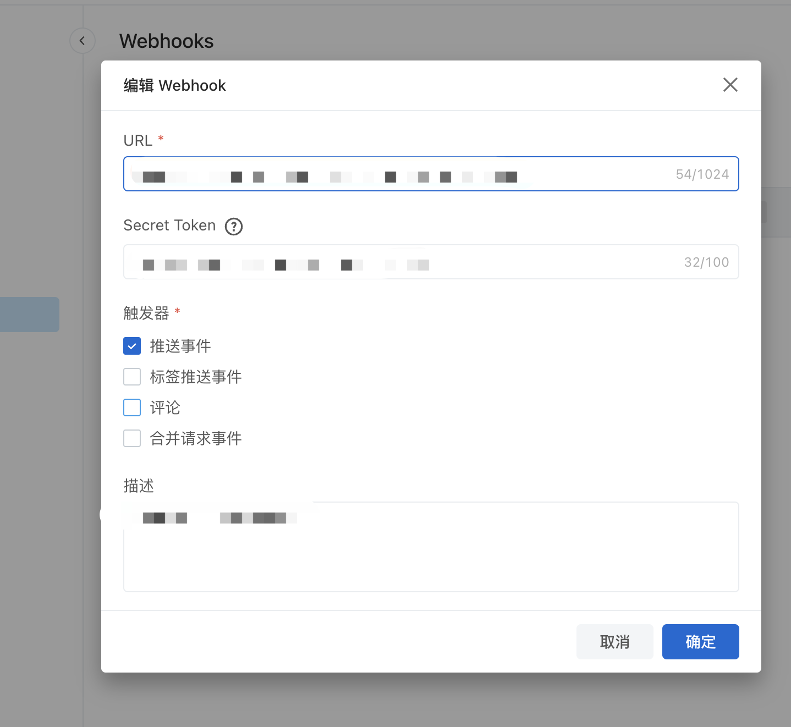

## 使用jenkins 编译android-sdk 包

### 1. 配置

jenkins 可以针对所有的服务进行打包，这里是需要针对内部的nginx 服务进行编译需求

资源配置：

- [Docker Pipeline](https://plugins.jenkins.io/docker-workflow) （jenkins 插件）
- thyrlian/android-sdk:10.0-01 （android 打包的镜像）
- Generic Webhook Trigger （jenkins 插件）

### 2.操作步骤

1、优先安装jenkins 插件，安装插件时要注意重启；

安装`Docker Pipeline `, 主要功能是启用容器环境来进行打包


安装`Generic Webhook Trigger`，主要用于使用 Generic Webhook 对云效进行代码拉取和云效触发流水线



2、开始配置流水线,这里主要讲`Generic Webhook Trigger` 的配置，实现功能是向某一个分支推送代码，就能拉取该分支代码并执行打包





ref 中查询对应的带有branch的配置的变量



3、配置云效的webhook 接口,配置了之后就可以通过出发webhook 来调用流水线了




### 配置流水线groovy

1、配置groovy 公共方法

```groovy
package utils

class Utilities implements Serializable {
    def script

    // Constructor to accept the Jenkins pipeline context
    Utilities(script) {
        this.script = script
    }
 		// 生成容器镜像名字
    def getImageName() {
        // 使用一次 shell 调用获取 UUID 和时间戳
        def uuid = getUuid()
        def timestamp = getTimestamp()
        
        return "${uuid}_${timestamp}"
    }
		// 获取随机UUID
    private String getUuid() {
        return script.sh(script: "cat /proc/sys/kernel/random/uuid | awk -F'-' '{print \$1}'", returnStdout: true).trim()
    }
		// 获取时间撮
    private String getTimestamp() {
        return script.sh(script: "date +'%Y%m%d%H%M%S'", returnStdout: true).trim()
    }
		//获取当前时期
    private String getDate() {
        return script.sh(script: "date +'%Y%m%d'", returnStdout: true).trim()
    }
		// 获取文件夹名
    def getAndroidDIRName(job_name) {
        def date = getDate()
        return "${job_name}/${date}"
    }

}
```

2、配置Pipeline 来调用流水线

```groovy
@Library("cmzhu") import utils.Utilities

def utils = new Utilities(this)

pipeline {
    agent {
        docker {
            image 'hub.test.com:8443/3rdimages/docker.io/thyrlian/android-sdk:10.0-01'
            args '-m 2048m  -v /data/gradle:/data/gradle:rw  -v /data/android-sdk:/opt/android-sdk/rw'
            
        }
    }

    environment {
        // 定义环境变量
        DOCKER_REGISTRY = ""  // Docker仓库地址
        GITLAB_CRED = ''  // Gitlab凭证ID
        GITLAB_URL = '' //云效下载地址
    }
    
    stages {
        stage('init_par') {
            steps {
                script {
                    env.androidDIRNAME = utils.getAndroidDIRName("${JOB_NAME}")
                    // env.IMAGE_TAG = utils.getImageName()
                    }
            }
        }

        stage("拉取代码") {
            steps{
            //deleteDir()
                checkout(
                    [
                        $class: 'GitSCM', branches: [[name: '*/develop']], 
                        extensions: [
                                        [$class: 'CloneOption', depth: 1,shallow: true,timeout: 2]
                                    ], 
                        userRemoteConfigs: [[credentialsId: "${GITLAB_CRED}", url: "${GITLAB_URL}"]]
                    ]
                )
            }
        }

        stage('构建Android 包') {
            steps {
                sh """
                    gradle clean assembleDebug
                    """
            }
        }
        stage('发布') {
            steps {
                script {
                    env.filename = sh(script: "ls app/build/outputs/apk/debug/*.apk| awk -F\"/\" '{print \$NF}'", returnStdout: true).trim()
                    sh """
                        mkdir -p /data/gradle/download/${env.androidDIRNAME} 
                        cp app/build/outputs/apk/debug/${env.filename} /data/gradle/download/${env.androidDIRNAME}/
                    """
                    }
            }
        }
    }


post {
        success {
            echo '部署成功!'
            sh """
               curl -X POST -H "Content-Type: application/json" -d '{"msg_type":"text","content":{"text":"${JOB_NAME}部署成功,下载地址：http://122.9.15.28:30080/download/${env.androidDIRNAME}/${env.filename}"}}'  https://open.feishu.cn/open-apis/bot/v2/hook/85337fb
            """
        }
        failure {
            echo '部署失败!'
             sh """
               curl -X POST -H "Content-Type: application/json" -d '{"msg_type":"text","content":{"text":"${JOB_NAME}部署失败"}}'  https://open.feishu.cn/open-apis/bot/v2/hook/85337fbf
            """
        }
    }
}
```

3、创建完成之后，就可以开始配置流水线进行调用了

