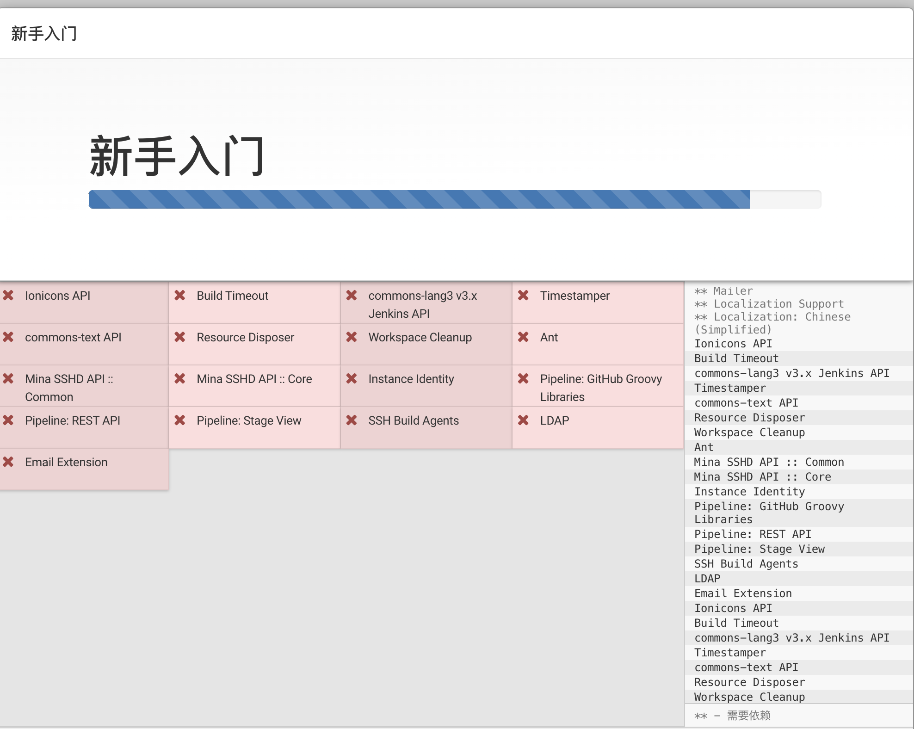

## 什么是Jenkins

文档参照: [https://www.jenkins.io/zh/doc/](https://www.jenkins.io/zh/doc/)

- Jenkins是一款开源 CI&CD 软件，用于自动化各种任务，包括构建、测试和部署软件。

- Jenkins 支持各种运行方式，可通过系统包、Docker 或者通过一个独立的 Java 程序。

## Jenkins 安装

最低推荐配置:

- 256MB可用内存
- 1GB可用磁盘空间(作为一个[Docker](https://www.jenkins.io/zh/doc/book/installing/#docker)容器运行jenkins的话推荐10GB)

为小团队推荐的硬件配置:

- 1GB+可用内存
- 50 GB+ 可用磁盘空间

软件配置:

- Java 8—无论是Java运行时环境（JRE）还是Java开发工具包（JDK）都可以。

**注意:** 如果将Jenkins作为Docker 容器运行，这不是必需的

### Docker 安装Jenkins 

Jenkins 镜像来源

- [https://hub.docker.com/r/jenkinsci/blueocean/](https://hub.docker.com/r/jenkinsci/blueocean/) (官方建议)

- [https://hub.docker.com/r/jenkins/jenkins/](https://hub.docker.com/r/jenkins/jenkins/)

> jenkinsci/blueocean每次发布Blue Ocean新版本时，都会发布新镜像。您可以在[标签](https://hub.docker.com/r/jenkinsci/blueocean/tags/) page页上看到以前发布的镜像版本列表 
>
> 在Docker Hub上可通过[`jenkins/jenkins`](https://hub.docker.com/r/jenkins/jenkins/)获取, 但是，这些不会随Blue Ocean的发布而提供，需要通过 Jenkins中的[**Manage Jenkins**](https://www.jenkins.io/zh/doc/book/managing) > [**Manage Plugins**](https://www.jenkins.io/zh/doc/book/managing/plugins)页面进行安装。 在[Blue Ocean入门](https://www.jenkins.io/zh/doc/book/blueocean/getting-started)中了解更多信息


使用 docker run 一个 临时测试用途的服务出来服务出来

```bash
$ docker run \
    -u root \
    --rm \
    -d \
    -p 8080:8080 \
    -p 50000:50000 \
    -v jenkins-data:/var/jenkins_home \
    -v /var/run/docker.sock:/var/run/docker.sock \
    jenkinsci/blueocean
```

使用ssh 正向代理可以暴露到本机

```bash
$ ssh -L 8080:127.0.0.1:8080 cmzhu@cmzhu.cn
```


在初始化时会有部分组件拉取失败, 可以重试重新拉取, 也可以选择继续之后, 在系统信息中手动拉取

