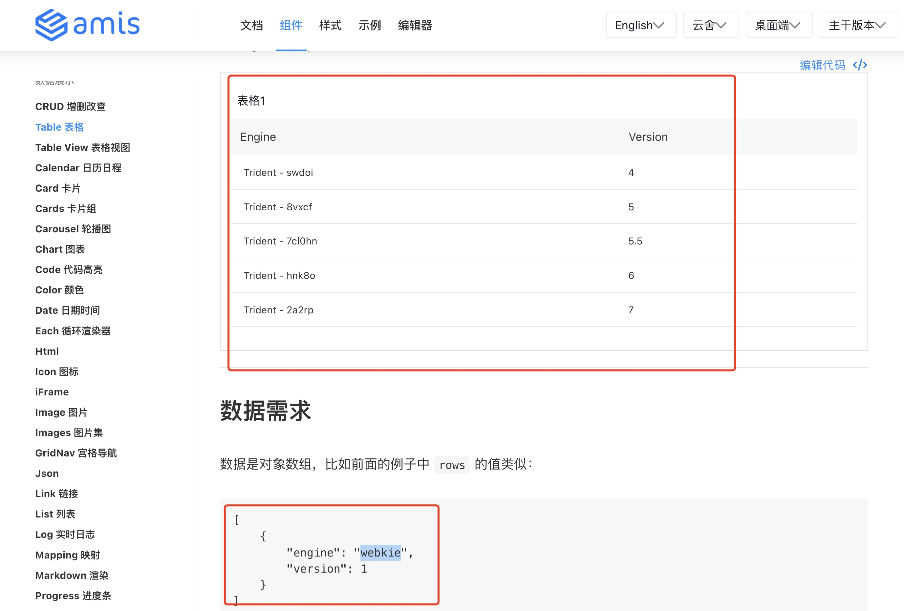

# fastapi 和amis 数据对接

## 介绍
本文档主要讲解怎样将fastapi 接口的数据和前端amis 的数据进行对接

## 具体方案
1、 这里以table 为例, 一般来说,在官方文档中如果有数据接入,会在文档中提示数据格式;

2、 如果没有提供相应的数据格式;

可以通过示例代码中的源码链接拼接,获得到需要的数据格式;如上图table 示例如下,根据下面链接也可以获取到数据源的数据格式

[amis https://aisuda.bce.baidu.com/amis/api/mock2/sample?perPage=5](https://aisuda.bce.baidu.com/amis/api/mock2/sample?perPage=5)
