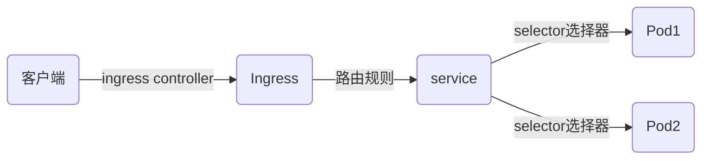
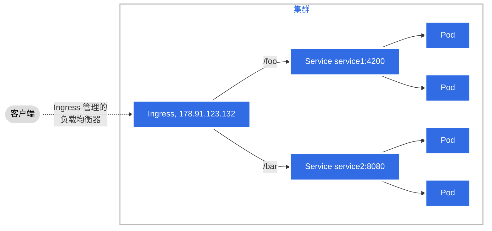
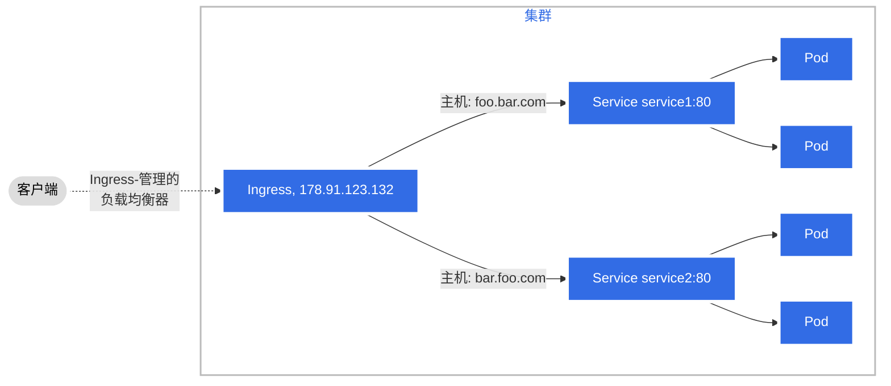

## ingresClass

Ingress 是对集群中服务的外部访问进行管理的 API 对象，典型的访问方式是 HTTP。

Ingress 可以提供负载均衡、SSL 终结和基于名称的虚拟托管。

### 专业名词

- 节点(Node):  k8s 中的一台工作的机器,存在于集群中
- 集群(Cluster): 一组运行容器化应用的Node; 应用用k8s 管理
- 边缘路由器(Edge Router): 在集群中强制执行防火墙策略的路由器, 可以是物理硬件
- 集群网络(Cluster Network): 一个逻辑的或者物理的网络相连, 由基于k8s 网络模型实现集群内网络通信
- 服务(Service): k8s 服务(service), 试用选择标签(selector) 来指定一组pod

#### ingress

ingress 是为集群外部访问集群内部服务提供 HTTP和HTTPS 路由, 流量由ingress 定义的规则来控制

简单的 ingres 工作原理示意:



通过一定配置, ingress 可为service 提供外部的访问URL, ingress controller 负责完成ingress 的功能, 具体实现会使用到某些中间件(类似nginx);

ingress 不会随意公开端口, 将 HTTP 和 HTTPS 以外的服务开放到 Internet 时，通常使用 [Service.Type=NodePort](https://kubernetes.io/zh-cn/docs/concepts/services-networking/service/#type-nodeport) 或 [Service.Type=LoadBalancer](https://kubernetes.io/zh-cn/docs/concepts/services-networking/service/#loadbalancer) 类型的 Service。

### 环境准备

1、 需要安装ingress controller, 才能满足使用 ingress 的基本要求

2、 部署一个 ingress controller, 例如 ingress-nginx

3、 ingress 应该遵循k8s 给定的参考规范, 实际上, 每一种ingress 都略有不同


### ingress 资源例子

ingress 资源配置例子:

```yaml
apiVersion: networking.k8s.io/v1
kind: Ingress
metadata:
  annotations:
    kubernetes.io/ingress.class: nginx
  name: emby
  namespace: cmzhu
spec:
  ingressClassName: nginx
  rules:
  - host: movie.cmzhu.cn
    http:
      paths:
      - backend:
          service:
            name: emby
            port:
              number: 8096
        path: /
        pathType: Prefix
  tls:
  - hosts:
    - movie.cmzhu.cn
    secretName: movietls
```

#### ingress 规则

每个 HTTP 规则都包含以下信息：

- 可选的 `host`。在此示例中，未指定 `host`，因此该规则基于所指定 IP 地址来匹配所有入站 HTTP 流量。 如果提供了 `host`（例如 `movie.cmzhu.cn`），则 `rules` 适用于所指定的主机。
- 路径列表（例如 `/`）。每个路径都有一个由 `service.name` 和 `service.port.name` 或 `service.port.number` 确定的关联后端。 主机和路径都必须与入站请求的内容相匹配，负载均衡器才会将流量引导到所引用的 Service，
- `backend`（后端）是 [Service 文档](https://kubernetes.io/zh-cn/docs/concepts/services-networking/service/)中所述的 Service 和端口名称的组合， 或者是通过 [CRD](https://kubernetes.io/zh-cn/docs/tasks/extend-kubernetes/custom-resources/custom-resource-definitions/) 方式来实现的[自定义资源后端](https://kubernetes.io/zh-cn/docs/concepts/services-networking/ingress/#resource-backend)。 对于发往 Ingress 的 HTTP（和 HTTPS）请求，如果与规则中的主机和路径匹配， 则会被发送到所列出的后端。

通常会在 Ingress 控制器中配置 `defaultBackend`（默认后端）， 以便为无法与规约中任何路径匹配的所有请求提供服务。

#### 默认后端

没有设置规则的 Ingress 将所有流量发送到同一个默认后端，而在这种情况下 `.spec.defaultBackend` 则是负责处理请求的那个默认后端。 `defaultBackend` 通常是 [Ingress 控制器](https://kubernetes.io/zh-cn/docs/concepts/services-networking/ingress-controllers)的配置选项， 而非在 Ingress 资源中设置。 如果未设置 `.spec.rules`，则必须设置 `.spec.defaultBackend`。 如果未设置 `defaultBackend`，那么如何处理与所有规则都不匹配的流量将交由 Ingress 控制器决定（请参考你的 Ingress 控制器的文档以了解它是如何处理这种情况的）。

如果 Ingress 对象中主机和路径都没有与 HTTP 请求匹配，则流量将被路由到默认后端。

#### 资源后端

`Resource` 后端是一个 ObjectRef 对象，指向同一名字空间中的另一个 Kubernetes 资源， 将其视为 Ingress 对象。 `Resource` 后端与 Service 后端是互斥的，在二者均被设置时会无法通过合法性检查。 `Resource` 后端的一种常见用法是将所有入站数据导向保存静态资产的对象存储后端。

```yaml
piVersion: networking.k8s.io/v1
kind: Ingress
metadata:
  name: ingress-resource-backend
spec:
  defaultBackend:
    resource:
      apiGroup: k8s.example.com
      kind: StorageBucket
      name: static-assets
  rules:
    - http:
        paths:
          - path: /icons
            pathType: ImplementationSpecific
            backend:
              resource:
                apiGroup: k8s.example.com
                kind: StorageBucket
                name: icon-assets
```

#### 路径类型

ingress 每一个路径都需要对应一种路径类型,路径类型有三种, 未明确路径类型, 无法通过k8s 合法性检查

- ImplementationSpecific: 对于这种路径类型，匹配方法取决于 IngressClass。 具体实现可以将其作为单独的 `pathType` 处理或者作与 `Prefix` 或 `Exact` 类型相同的处理。
- Exact : 精准匹配URL, 并区分大小写
- Prefix: 基于以 `/` 分隔的 URL 路径前缀匹配。匹配区分大小写， 并且对路径中各个元素逐个执行匹配操作。 路径元素指的是由 `/` 分隔符分隔的路径中的标签列表。 如果每个 *p* 都是请求路径 *p* 的元素前缀，则请求与路径 *p* 匹配。

> **说明：** 如果路径的最后一个元素是请求路径中最后一个元素的子字符串，则不会被视为匹配 （例如：`/foo/bar` 匹配 `/foo/bar/baz`, 但不匹配 `/foo/barbaz`）。

##### 例子

| 类型   | 路径                            | 请求路径        | 匹配与否？               |
| ------ | ------------------------------- | --------------- | ------------------------ |
| Prefix | `/`                             | （所有路径）    | 是                       |
| Exact  | `/foo`                          | `/foo`          | 是                       |
| Exact  | `/foo`                          | `/bar`          | 否                       |
| Exact  | `/foo`                          | `/foo/`         | 否                       |
| Exact  | `/foo/`                         | `/foo`          | 否                       |
| Prefix | `/foo`                          | `/foo`, `/foo/` | 是                       |
| Prefix | `/foo/`                         | `/foo`, `/foo/` | 是                       |
| Prefix | `/aaa/bb`                       | `/aaa/bbb`      | 否                       |
| Prefix | `/aaa/bbb`                      | `/aaa/bbb`      | 是                       |
| Prefix | `/aaa/bbb/`                     | `/aaa/bbb`      | 是，忽略尾部斜线         |
| Prefix | `/aaa/bbb`                      | `/aaa/bbb/`     | 是，匹配尾部斜线         |
| Prefix | `/aaa/bbb`                      | `/aaa/bbb/ccc`  | 是，匹配子路径           |
| Prefix | `/aaa/bbb`                      | `/aaa/bbbxyz`   | 否，字符串前缀不匹配     |
| Prefix | `/`, `/aaa`                     | `/aaa/ccc`      | 是，匹配 `/aaa` 前缀     |
| Prefix | `/`, `/aaa`, `/aaa/bbb`         | `/aaa/bbb`      | 是，匹配 `/aaa/bbb` 前缀 |
| Prefix | `/`, `/aaa`, `/aaa/bbb`         | `/ccc`          | 是，匹配 `/` 前缀        |
| Prefix | `/aaa`                          | `/ccc`          | 否，使用默认后端         |
| 混合   | `/foo` (Prefix), `/foo` (Exact) | `/foo`          | 是，优选 Exact 类型      |

##### 多重匹配

部分情况下, ingress 会有多条路径与同一个请求匹配, 这时应是匹配路径最长者优先, 如果仍然还有两条相同的匹配路径, 则精准路径类型优先于前缀路径类型

#### 主机名通配符

ingress 的主机名可以精准匹配也可以是通配符匹配, 例如movie.cnzhu.cn 可以使用 “*.cmzhu.cn” 来匹配, 精确匹配要求 HTTP `host` 头部字段与 `host` 字段值完全匹配。 通配符匹配则要求 HTTP `host` 头部字段与通配符规则中的后缀部分相同。

| 主机        | host 头部         | 匹配与否？                          |
| ----------- | ----------------- | ----------------------------------- |
| `*.foo.com` | `bar.foo.com`     | 基于相同的后缀匹配                  |
| `*.foo.com` | `baz.bar.foo.com` | 不匹配，通配符仅覆盖了一个 DNS 标签 |
| `*.foo.com` | `foo.com`         | 不匹配，通配符仅覆盖了一个 DNS 标签 |

```yaml
apiVersion: networking.k8s.io/v1
kind: Ingress
metadata:
  name: ingress-wildcard-host
spec:
  rules:
  - host: "movie.cmzhu.cn"
    http:
      paths:
      - pathType: Prefix
        path: "/"
        backend:
          service:
            name: emby
            port:
              number: 8086
  - host: "*.cmzhu.cn"
    http:
      paths:
      - pathType: Prefix
        path: "/"
        backend:
          service:
            name: wiki
            port:
              number: 80
```

### IngressClass

ingress 可以由不同的控制器来控制,  通常使用不同的配置, 每一个ingress 都需要指定一个ingressclass, 也就是一个对ingressclass 的引用;

```yaml
apiVersion: networking.k8s.io/v1
kind: IngressClass
metadata:
  name: external-lb
spec:
  controller: example.com/ingress-controller
  parameters:
    apiGroup: k8s.example.com
    kind: IngressParameters
    name: external-lb
```

 IngressClass 中的 `.spec.parameters` 字段可用于引用其他资源以提供与该 IngressClass 相关的配置。

参数（`parameters`）的具体类型取决于你在 IngressClass 的 `.spec.controller` 字段中指定的 Ingress 控制器。

#### ingressClass 的作用域

取决于你所使用的 Ingress 控制器，你可能可以使用集群作用域的参数或某个名字空间作用域的参数。

ingressclass 默认是作用在集群范围的

在配置了`.spec.parameters `, 字段未设置`.spec.parameters.scope` 的情况下, 或者`.spec.parameters.scope` 的值设置成了`Cluster`, 那么ingressClass 就是集群资源, 

```yaml
---
apiVersion: networking.k8s.io/v1
kind: IngressClass
metadata:
  name: external-lb-1
spec:
  controller: example.com/ingress-controller
  parameters:
    # 此 IngressClass 的配置定义在一个名为 “external-config-1” 的
    # ClusterIngressParameter（API 组为 k8s.example.net）资源中。
    # 这项定义告诉 Kubernetes 去寻找一个集群作用域的参数资源。
    scope: Cluster
    apiGroup: k8s.example.net
    kind: ClusterIngressParameter
    name: external-config-1
```

 

命名空间资源: ( `Kubernetes v1.23 [stable]`)

如果你设置了 `.spec.parameters` 字段且将 `.spec.parameters.scope` 字段设为了 `Namespace`, 那么ingressClass 就是属于命名空间资源, 这时 `.spec.parameters.namespace` 必须和此资源所处的名字空间相同。

配置案例:

```yaml
---
apiVersion: networking.k8s.io/v1
kind: IngressClass
metadata:
  name: external-lb-2
spec:
  controller: example.com/ingress-controller
  parameters:
    # 此 IngressClass 的配置定义在一个名为 “external-config” 的
    # IngressParameter（API 组为 k8s.example.com）资源中，
    # 该资源位于 “external-configuration” 名字空间中。
    scope: Namespace
    apiGroup: k8s.example.com
    kind: IngressParameter
    namespace: external-configuration
    name: external-config
```

#### 默认的ingressClass 

可以将一个ingressclass 设置为默认的ingressclass, 在注解中将 `ingressclass.kubernetes.io/is-default-class` 的值设置为 `true` ,就设置成功了, 会自动将未设置 ingressclassName 字段的ingress , 默认赋予该默认的ingressClass name

> **注意：**
>
> 如果集群中有多个 IngressClass 被标记为默认，准入控制器将阻止创建新的未指定 `ingressClassName` 的 Ingress 对象。 解决这个问题需要确保集群中最多只能有一个 IngressClass 被标记为默认。

有一些 Ingress 控制器不需要定义默认的 `IngressClass`。比如：Ingress-NGINX 控制器可以通过[参数](https://kubernetes.github.io/ingress-nginx/#what-is-the-flag-watch-ingress-without-class) `--watch-ingress-without-class` 来配置。 不过仍然[推荐](https://kubernetes.github.io/ingress-nginx/#i-have-only-one-instance-of-the-ingresss-nginx-controller-in-my-cluster-what-should-i-do) 设置默认的 `IngressClass`。

```yaml
apiVersion: networking.k8s.io/v1
kind: IngressClass
metadata:
  labels:
    app.kubernetes.io/component: controller
  name: nginx-example
  annotations:
    ingressclass.kubernetes.io/is-default-class: "true"
spec:
  controller: k8s.io/ingress-nginx
```


### ingress 类型

### 由单个 Service 来支持的 Ingress

现有的 Kubernetes 概念允许你暴露单个 Service（参见[替代方案](https://kubernetes.io/zh-cn/docs/concepts/services-networking/ingress/#alternatives)）。 你也可以使用 Ingress 并设置无规则的**默认后端**来完成这类操作。

```yaml
apiVersion: networking.k8s.io/v1
kind: Ingress
metadata:
  name: test-ingress
spec:
  defaultBackend:
    service:
      name: test
      port:
        number: 80
```

#### 简单扇出

一个扇出（Fanout）配置根据请求的 HTTP URI 将来自同一 IP 地址的流量路由到多个 Service。 Ingress 允许你将负载均衡器的数量降至最低。例如，这样的设置：



例子:

```yaml
apiVersion: networking.k8s.io/v1
kind: Ingress
metadata:
  name: simple-fanout-example
spec:
  rules:
  - host: foo.bar.com
    http:
      paths:
      - path: /foo
        pathType: Prefix
        backend:
          service:
            name: service1
            port:
              number: 4200
      - path: /bar
        pathType: Prefix
        backend:
          service:
            name: service2
            port:
              number: 8080
```

#### 基于名称的虚拟主机服务

基于名称的虚拟主机支持将针对多个主机名的 HTTP 流量路由到同一 IP 地址上。




```yaml
apiVersion: networking.k8s.io/v1
kind: Ingress
metadata:
  name: name-virtual-host-ingress
spec:
  rules:
  - host: foo.bar.com
    http:
      paths:
      - pathType: Prefix
        path: "/"
        backend:
          service:
            name: service1
            port:
              number: 80
  - host: bar.foo.com
    http:
      paths:
      - pathType: Prefix
        path: "/"
        backend:
          service:
            name: service2
            port:
              number: 80

```

### tls

创建带证书的secret

```yaml
apiVersion: v1
kind: Secret
metadata:
  name: testsecret-tls
  namespace: default
data:
  tls.crt: base64 编码的证书
  tls.key: base64 编码的私钥
type: kubernetes.io/tls
```

ingress 指定该证书

```yaml
apiVersion: networking.k8s.io/v1
kind: Ingress
metadata:
  name: tls-example-ingress
spec:
  tls:
  - hosts:
      - https-example.foo.com
    secretName: testsecret-tls
  rules:
  - host: https-example.foo.com
    http:
      paths:
      - path: /
        pathType: Prefix
        backend:
          service:
            name: service1
            port:
              number: 80
```

> **说明：**
>
> 各种 Ingress 控制器在所支持的 TLS 特性上参差不齐。请参阅与 [nginx](https://kubernetes.github.io/ingress-nginx/user-guide/tls/)、 [GCE](https://git.k8s.io/ingress-gce/README.md#frontend-https) 或者任何其他平台特定的 Ingress 控制器有关的文档，以了解 TLS 如何在你的环境中工作。