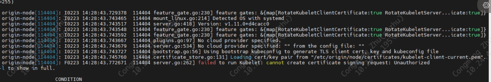

## openshift 节点重启之后证书错误

## 问题

```text
# 现象
origin-node[114404]: I0223 14:28:43.743727  114404 bootstrap.go:56] Using bootstrap kubeconfig to generate TLS client cert, key and kubeconfig file
origin-node[114404]: I0223 14:28:43.745760  114404 certificate_store.go:131] Loading cert/key pair from "/etc/origin/node/certificates/kubelet-client-current.pem".
origin-node[114404]: F0223 14:28:43.772671  114404 server.go:262] cannot create certificate signing request: Unauthorized

```



执行`oc get csr` 会发现有大量如下的csr 在pending

```bash
$ oc get csr
csr-24rlr 21h system:node:osn4.acsu.buffalo.edu Pending
csr-25b9b 21h system:node:osn1.acsu.buffalo.edu Pending
csr-2cmmj 17h system:node:osn2.acsu.buffalo.edu Pending
csr-2jkb2 17h system:node:osn4.acsu.buffalo.edu Pending
csr-2m6gj 20h system:node:osn4.acsu.buffalo.edu Pending
csr-2pkbm 21h system:node:osn2.acsu.buffalo.edu Pending
csr-2wxzk 23h system:node:osn3.acsu.buffalo.edu Pending
```

### 解决

这个问题需要重新替换一下bootstrap.kubeconfig 文件就能解决这个问题;

```bash
mv /etc/origin/node/bootstrap.kubeconfig /etc/origin/node/bootstrap.kubeconfig.bak
cp /etc/origin/master/admin.kubeconfig  /etc/origin/node/bootstrap.kubeconfig
systemctl restart origin-node
```


