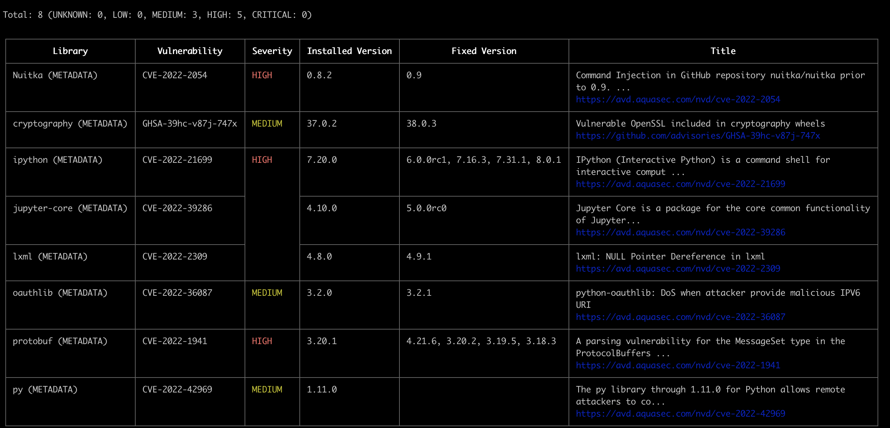

# trivy


## 下载

二进制下载,下载后解压直接运行即可

https://github.com/aquasecurity/trivy/releases/tag/v0.34.0

## image

```bash
trivy image <dockerhub.cmzhu.cn:5000/aipaas-devops/userbox-config-manager:master_2d24c53_221101162110>
```


扫描镜像漏洞




这里讲解几个比较重要的用法

指定查看漏洞的安全等级

```bash
trivy image \
			--severity [HIGH,CRITICAL] \
			<dockerhub.cmzhu.cn:5000/aipaas-devops/userbox-config-manager:master_2d24c53_221101162110>
```


忽略还未修复的漏洞

```bash
trivy image \ 
      --ignore-unfixed \
      <dockerhub.cmzhu.cn:5000/aipaas-devops/userbox-config-manager:master_2d24c53_221101162110>
```


使用json格式导出镜像详细信息到result.json 

```bash
trivy image \
      --format json \
      output result.json \
      <dockerhub.cmzhu.cn:5000/aipaas-devops/userbox-config-manager:master_2d24c53_221101162110>
```

## k8s

扫描资源

```bash
trivy k8s deployment/orion
```

