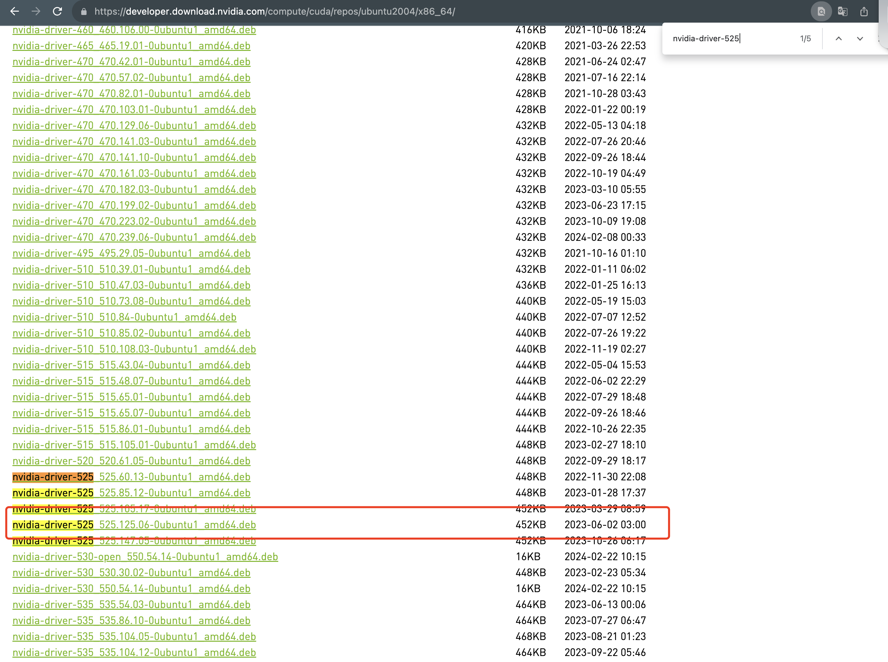

## nvidia gpu 监控


文档参考: [https://github.com/a0s/nvidia-smi-exporter](https://github.com/a0s/nvidia-smi-exporter)


编译nvidia-smi-exportor, 并且将指标暴露出来

### 基础环境

- os: Debian GNU/Linux 12 \n \l
- Nvidia version: 525.125.06
- Cuda version: 12.0
- Gpu: 1050ti

### 编译镜像

1、 从github 的[仓库]( https://github.com/a0s/nvidia-smi-exporter) 克隆下来, 并进入到相应的目录中

```bash
$ git clone https://github.com/a0s/nvidia-smi-exporter.git && cd nvidia-smi-exporter
```

2、 根据实际情况调整Dockerfile 的配置

主要修改了: 

- ARG NVIDIA_PUB_KEY , 因为github 仓库中的地址无法使用, 故重新找到pub-key
- 添加 BULLSEYE_REPO, 解决安装libnvidia-compute-525 时需要依赖libgcc-s1 ( >= 4.2) 问题

```dockerfile
FROM ruby:3.0.6-buster

ENV LANG C.UTF-8
ENV DEBIAN_FRONTEND noninteractive

ARG NVIDIA_PUB_KEY="https://developer.download.nvidia.com/compute/cuda/repos/ubuntu2004/x86_64/3bf863cc.pub"
ARG NVIDIA_REPO="deb https://developer.download.nvidia.com/compute/cuda/repos/ubuntu2004/x86_64 /"
ARG NVIDIA_VERSION="460.32.03-0ubuntu1"
ARG BULLSEYE_REPO="deb http://ftp.de.debian.org/debian bullseye main"
WORKDIR /app
COPY . /app

RUN \
    apt-get update \
    && apt-get install -y --no-install-recommends build-essential wget \
    && wget -qO - ${NVIDIA_PUB_KEY} | apt-key add - \
    && echo ${NVIDIA_REPO} > /etc/apt/sources.list.d/cuda.list \
    && echo "${BULLSEYE_REPO}" > /etc/apt/sources.list.d/bullseye.list\ # 添加
    && apt-get update \
    && apt-get -y  install libgcc-s1\  # 添加
    && apt-get install -y --no-install-recommends libnvidia-compute-525=${NVIDIA_VERSION} nvidia-utils-525=${NVIDIA_VERSION} \
    && rm -rf /var/lib/apt/lists/* \
    && bundle install --deployment --without test

CMD ["bundle", "exec", "ruby", "app/application.rb", "1>&2"]
```


3、 根据对应的Dockerfile 打包镜像, NVIDIA_VERSION 如何找? 

官方提供方案是`dpkg --list | grep nvidia-driver-460`, 但我的cuda版本是525.125.06, 很明显不合适

```bash
$ dpkg --list | grep nvidia-driver-460

```

于是我使用[nvidia-driver](https://developer.download.nvidia.com/compute/cuda/repos/ubuntu2004/x86_64/) 来查找对应的版本, 于是结果为下图所示:

寻找最接近驱动版本的作为tag 然后来执行打包镜像, 最后打包完成;

```bash
$ docker build . --tag nvidia-smi-exporter --build-arg NVIDIA_VERSION=525.125.06-0ubuntu1
```

### 测试

1、 先将对应的磁盘和存储挂载

```bash
$ docker run  --rm   --device /dev/nvidiactl:/dev/nvidiactl   --device /dev/nvidia0:/dev/nvidia0     -p 9454:9454 nvidia-smi-exporter
```

2、 查询对应的端口并查看监控状况

```bash
$ curl 127.0.0.1:9454/metrics
nvidia_smi_attached_gpus 1
nvidia_smi_display_mode{uuid="bf48099e-08b7-ed09-5927-f2564b25cf5e"} 0
nvidia_smi_display_active{uuid="bf48099e-08b7-ed09-5927-f2564b25cf5e"} 0
nvidia_smi_persistence_mode{uuid="bf48099e-08b7-ed09-5927-f2564b25cf5e"} 0
nvidia_smi_accounting_mode{uuid="bf48099e-08b7-ed09-5927-f2564b25cf5e"} 0
nvidia_smi_accounting_mode_buffer_size{uuid="bf48099e-08b7-ed09-5927-f2564b25cf5e"} 4000
nvidia_smi_minor_number{uuid="bf48099e-08b7-ed09-5927-f2564b25cf5e"} 0
nvidia_smi_multigpu_board{uuid="bf48099e-08b7-ed09-5927-f2564b25cf5e"} 0
nvidia_smi_gpu_module_id{uuid="bf48099e-08b7-ed09-5927-f2564b25cf5e"} 1
nvidia_smi_pci_pci_gpu_link_info_pcie_gen_max_link_gen{uuid="bf48099e-08b7-ed09-5927-f2564b25cf5e"} 3
nvidia_smi_pci_pci_gpu_link_info_pcie_gen_current_link_gen{uuid="bf48099e-08b7-ed09-5927-f2564b25cf5e"} 1
nvidia_smi_pci_pci_gpu_link_info_pcie_gen_device_current_link_gen{uuid="bf48099e-08b7-ed09-5927-f2564b25cf5e"} 1
nvidia_smi_pci_pci_gpu_link_info_pcie_gen_max_device_link_gen{uuid="bf48099e-08b7-ed09-5927-f2564b25cf5e"} 3
nvidia_smi_pci_pci_gpu_link_info_pcie_gen_max_host_link_gen{uuid="bf48099e-08b7-ed09-5927-f2564b25cf5e"} 3
nvidia_smi_pci_pci_gpu_link_info_link_widths_max_link_width{uuid="bf48099e-08b7-ed09-5927-f2564b25cf5e"} 16
nvidia_smi_pci_pci_gpu_link_info_link_widths_current_link_width{uuid="bf48099e-08b7-ed09-5927-f2564b25cf5e"} 16
nvidia_smi_pci_replay_counter{uuid="bf48099e-08b7-ed09-5927-f2564b25cf5e"} 0
nvidia_smi_pci_replay_rollover_counter{uuid="bf48099e-08b7-ed09-5927-f2564b25cf5e"} 0
nvidia_smi_pci_tx_util_bytes_per_second{uuid="bf48099e-08b7-ed09-5927-f2564b25cf5e"} 0
nvidia_smi_pci_rx_util_bytes_per_second{uuid="bf48099e-08b7-ed09-5927-f2564b25cf5e"} 0
nvidia_smi_performance_state{uuid="bf48099e-08b7-ed09-5927-f2564b25cf5e"} 8
nvidia_smi_clocks_throttle_reasons_clocks_throttle_reason_gpu_idle{uuid="bf48099e-08b7-ed09-5927-f2564b25cf5e"} 1
nvidia_smi_clocks_throttle_reasons_clocks_throttle_reason_applications_clocks_setting{uuid="bf48099e-08b7-ed09-5927-f2564b25cf5e"} 0
nvidia_smi_clocks_throttle_reasons_clocks_throttle_reason_sw_power_cap{uuid="bf48099e-08b7-ed09-5927-f2564b25cf5e"} 0
nvidia_smi_clocks_throttle_reasons_clocks_throttle_reason_hw_slowdown{uuid="bf48099e-08b7-ed09-5927-f2564b25cf5e"} 0
nvidia_smi_clocks_throttle_reasons_clocks_throttle_reason_hw_thermal_slowdown{uuid="bf48099e-08b7-ed09-5927-f2564b25cf5e"} 0
nvidia_smi_clocks_throttle_reasons_clocks_throttle_reason_hw_power_brake_slowdown{uuid="bf48099e-08b7-ed09-5927-f2564b25cf5e"} 0
nvidia_smi_clocks_throttle_reasons_clocks_throttle_reason_sync_boost{uuid="bf48099e-08b7-ed09-5927-f2564b25cf5e"} 0
nvidia_smi_clocks_throttle_reasons_clocks_throttle_reason_sw_thermal_slowdown{uuid="bf48099e-08b7-ed09-5927-f2564b25cf5e"} 0
nvidia_smi_clocks_throttle_reasons_clocks_throttle_reason_display_clocks_setting{uuid="bf48099e-08b7-ed09-5927-f2564b25cf5e"} 0
nvidia_smi_fb_memory_usage_total_bytes{uuid="bf48099e-08b7-ed09-5927-f2564b25cf5e"} 4294967296
nvidia_smi_fb_memory_usage_reserved_bytes{uuid="bf48099e-08b7-ed09-5927-f2564b25cf5e"} 59768832
nvidia_smi_fb_memory_usage_used_bytes{uuid="bf48099e-08b7-ed09-5927-f2564b25cf5e"} 1048576
nvidia_smi_fb_memory_usage_free_bytes{uuid="bf48099e-08b7-ed09-5927-f2564b25cf5e"} 4232052736
nvidia_smi_bar1_memory_usage_total_bytes{uuid="bf48099e-08b7-ed09-5927-f2564b25cf5e"} 268435456
nvidia_smi_bar1_memory_usage_used_bytes{uuid="bf48099e-08b7-ed09-5927-f2564b25cf5e"} 4194304
nvidia_smi_bar1_memory_usage_free_bytes{uuid="bf48099e-08b7-ed09-5927-f2564b25cf5e"} 264241152
nvidia_smi_compute_mode{uuid="bf48099e-08b7-ed09-5927-f2564b25cf5e"} 0
nvidia_smi_utilization_gpu_util_ratio{uuid="bf48099e-08b7-ed09-5927-f2564b25cf5e"} 0.0
nvidia_smi_utilization_memory_util_ratio{uuid="bf48099e-08b7-ed09-5927-f2564b25cf5e"} 0.0
nvidia_smi_utilization_encoder_util_ratio{uuid="bf48099e-08b7-ed09-5927-f2564b25cf5e"} 0.0
nvidia_smi_utilization_decoder_util_ratio{uuid="bf48099e-08b7-ed09-5927-f2564b25cf5e"} 0.0
nvidia_smi_encoder_stats_session_count{uuid="bf48099e-08b7-ed09-5927-f2564b25cf5e"} 0
nvidia_smi_encoder_stats_average_fps{uuid="bf48099e-08b7-ed09-5927-f2564b25cf5e"} 0
nvidia_smi_encoder_stats_average_latency{uuid="bf48099e-08b7-ed09-5927-f2564b25cf5e"} 0
nvidia_smi_fbc_stats_session_count{uuid="bf48099e-08b7-ed09-5927-f2564b25cf5e"} 0
nvidia_smi_fbc_stats_average_fps{uuid="bf48099e-08b7-ed09-5927-f2564b25cf5e"} 0
nvidia_smi_fbc_stats_average_latency{uuid="bf48099e-08b7-ed09-5927-f2564b25cf5e"} 0
nvidia_smi_temperature_gpu_temp_celsius{uuid="bf48099e-08b7-ed09-5927-f2564b25cf5e"} 28.0
nvidia_smi_temperature_gpu_temp_max_threshold_celsius{uuid="bf48099e-08b7-ed09-5927-f2564b25cf5e"} 102.0
nvidia_smi_temperature_gpu_temp_slow_threshold_celsius{uuid="bf48099e-08b7-ed09-5927-f2564b25cf5e"} 97.0
nvidia_smi_temperature_gpu_temp_max_gpu_threshold_celsius{uuid="bf48099e-08b7-ed09-5927-f2564b25cf5e"} 94.0
nvidia_smi_power_readings_power_state{uuid="bf48099e-08b7-ed09-5927-f2564b25cf5e"} 8
nvidia_smi_clocks_graphics_clock_hz{uuid="bf48099e-08b7-ed09-5927-f2564b25cf5e"} 139000000.0
nvidia_smi_clocks_sm_clock_hz{uuid="bf48099e-08b7-ed09-5927-f2564b25cf5e"} 139000000.0
nvidia_smi_clocks_mem_clock_hz{uuid="bf48099e-08b7-ed09-5927-f2564b25cf5e"} 405000000.0
nvidia_smi_clocks_video_clock_hz{uuid="bf48099e-08b7-ed09-5927-f2564b25cf5e"} 544000000.0
nvidia_smi_max_clocks_graphics_clock_hz{uuid="bf48099e-08b7-ed09-5927-f2564b25cf5e"} 1911000000.0
nvidia_smi_max_clocks_sm_clock_hz{uuid="bf48099e-08b7-ed09-5927-f2564b25cf5e"} 1911000000.0
nvidia_smi_max_clocks_mem_clock_hz{uuid="bf48099e-08b7-ed09-5927-f2564b25cf5e"} 3504000000.0
nvidia_smi_max_clocks_video_clock_hz{uuid="bf48099e-08b7-ed09-5927-f2564b25cf5e"} 1708000000.0
```

