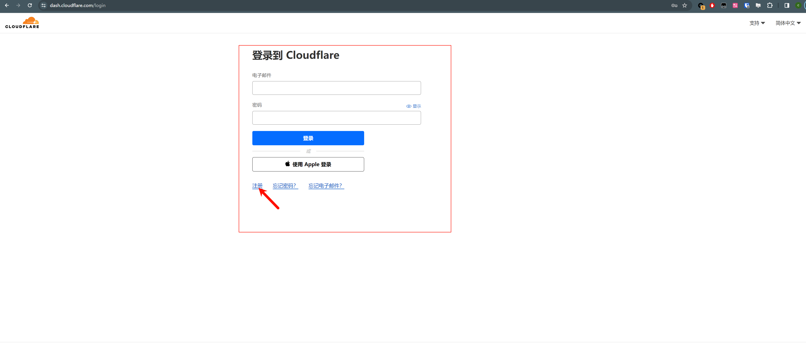
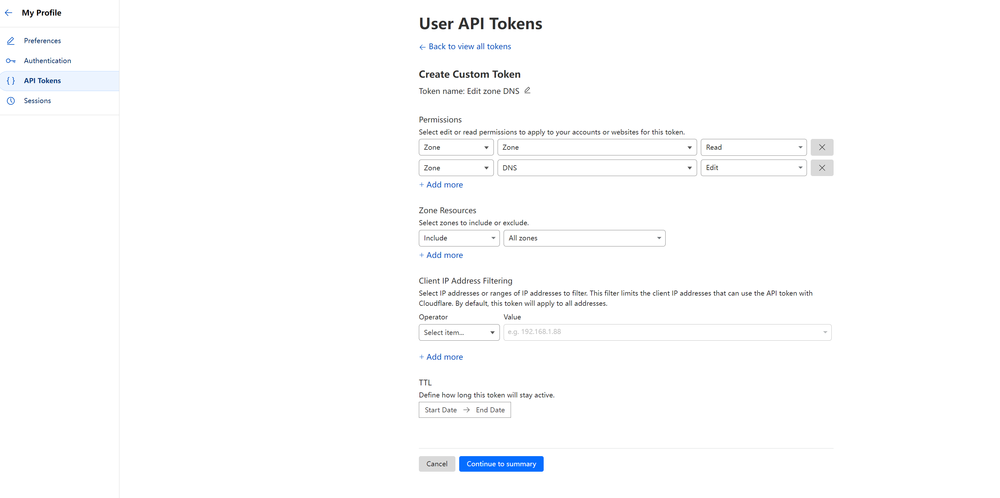

## Cert Manager

### 安装

#### helm 安装 Cert-Manager

1、 本地添加Cert Manager 的helm 仓库

```bash
$ helm repo add jetstack https://charts.jetstack.io
```

2、更新helm 的镜像包

```bash
$ helm repo update
```

3、使用以下命令安装cert-manager

```bash
$ helm upgrade --install \
    cert-manager jetstack/cert-manager \
    --namespace cert-manager \
    --create-namespace \
    --version v1.14.4 \
    # --set installCRDs=true
    --set prometheus.enabled=false \  # Example: disabling prometheus using a Helm parameter
    --set webhook.timeoutSeconds=4   # Example: changing the webhook timeout using a Helm parameter
```

4、安装完成之后， 检查后台服务是否完全运行

```bash
$ kubectl  get pod
NAME                                       READY   STATUS    RESTARTS   AGE
cert-manager-855c8c76b7-lkml4              1/1     Running   0          34m
cert-manager-cainjector-5c7ffd6486-h5bw6   1/1     Running   0          20h
cert-manager-webhook-677ffc4bcb-7qrkw      1/1     Running   0          20h
```

如此，cert-manager 就完全安装完成了

### cert-manager 使用 cloudflare

1、 先注册和登录到[cloudflare](https://dash.cloudflare.com/) 网站; 可以使用google 邮箱或者qq 邮箱注册登录



2、需要将对应需要使用到的域名加入到cloudflare 中； 这里以cmzhu.cn 为例子

3、创建对用域名的[api-token](https://cert-manager.io/docs/configuration/acme/dns01/cloudflare/), 并对该token  设置 对应的权限；拷贝对应的api-key 并保存， 配置如下：

- Permissions:
  - `Zone - DNS - Edit`
  - `Zone - Zone - Read`
- Zone Resources:
  - `Include - All Zones`




4、 cloudflare 准备完成， 开始配置cert-manager

### 配置cert-manager 的issurer

1、 如果需要通过cert-manager 自动更新证书， 需要使用cert-manager 的Issuer;

vim clusterissuer.yaml

```yaml
apiVersion: cert-manager.io/v1
kind: ClusterIssuer
metadata:
  name: letsencrypt-prod
spec:
  acme:
    email: zhucongming20@gmail.com
    server: https://acme-v02.api.letsencrypt.org/directory
    privateKeySecretRef:
      name: letsencrypt-prod
    solvers:
    - dns01:
        cloudflare:
          apiTokenSecretRef:
            name: cloudflare-api-token
            key: api-token
```

2、 创建包含cloudflare api-key 的secret

vim cloudflare-api-token-secret.yaml

```yaml
apiVersion: v1
kind: Secret
metadata:
  name: cloudflare-api-token
  namespace: cert-manager
stringData:
  api-token: < cloudflare 的api-key>
type: Opaque
```

3、在需要使用cert-manager 的ingress 中添加如下annations： 

​	cert-manager.io/cluster-issuer: letsencrypt-prod

vim emby.yaml

```yaml
apiVersion: networking.k8s.io/v1
kind: Ingress
metadata:
  annotations:
    cert-manager.io/cluster-issuer: letsencrypt-prod
    kubernetes.io/ingress.class: nginx
  name: emby
  namespace: cmzhu
spec:
  ingressClassName: nginx
  rules:
  - host: < host >  
    http:
      paths:
      - backend:
          service:
            name: emby
            port:
              number: 8096
        path: /
        pathType: Prefix
  tls:
  - hosts:
    - < host > 
    secretName: emby-tls-hsnft
```


4、 在等待一段时间后， 会默认创建一个带有证书信息的secret ， 名字为在ingress 中配置的tls 信息一致

> 注意： 如果证书的secret 名字不一致，表示证书生成失败了， 需要检查cert-manager 的具体报错

```bash
 $ kubectl get secret -n cmzhu emby-tls-hsnft
NAME             TYPE                DATA   AGE
emby-tls-hsnft   kubernetes.io/tls   2      49m
```


### 参考资料

[https://cert-manager.io/docs/usage/certificate/](https://cert-manager.io/docs/usage/certificate/)

[https://cert-manager.io/docs/configuration/acme/dns01/cloudflare/](https://cert-manager.io/docs/configuration/acme/dns01/cloudflare/)

[https://juejin.cn/post/7310109331504185356](https://juejin.cn/post/7310109331504185356)


