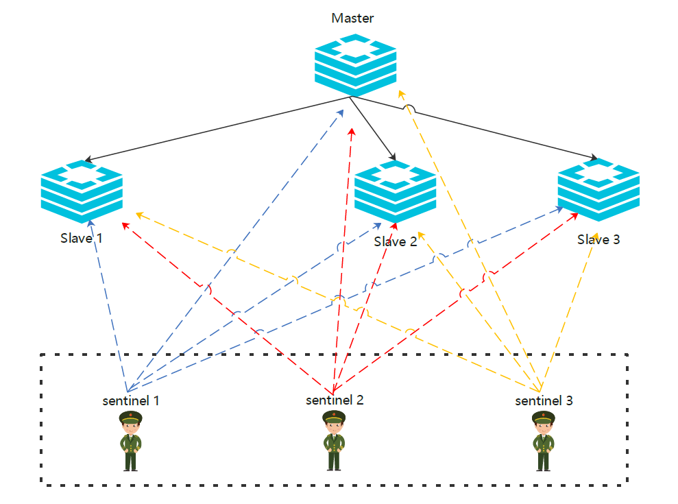

## redis 哨兵模式

文档参考[https://xie.infoq.cn/article/6c3500c66c3cdee3d72b88780](https://xie.infoq.cn/article/6c3500c66c3cdee3d72b88780)




示例: 

以下是通过docker-compose 搭建的redis 哨兵模式集群; 可用作参考

详细目录结构

```bash
$ tree
.
├── docker-compose.yaml
├── redis0
│   ├── conf
│   │   └── redis.conf
│   └── data
│       ├── appendonly.aof
│       └── dump.rdb
├── redis1
│   ├── conf
│   │   └── redis.conf
│   └── data
│       ├── appendonly.aof
│       └── dump.rdb
├── redis2
│   ├── conf
│   │   └── redis.conf
│   └── data
│       ├── appendonly.aof
│       └── dump.rdb
└── sentinel
    ├── conf
    │   └── sentinel.conf
    └── data

12 directories, 11 files
```


docker-compose.yaml

```yaml
version: '3'
services:
  redis0:
    image: dockerhub.cmzhu.cn:5000/vendor/redis:6.2.5
    container_name: redis0
    restart: always
    volumes:
      - ./redis0/data:/data
      - ./redis0/conf:/etc/redis
    command:
      /usr/local/bin/redis-server /etc/redis/redis.conf
    networks:
      cmzhu:
        aliases:
          - redis0
  redis1:
    image: dockerhub.cmzhu.cn:5000/vendor/redis:6.2.5
    container_name: redis1
    restart: always
    volumes:
      - ./redis1/data:/data
      - ./redis1/conf:/etc/redis
    command:
      /usr/local/bin/redis-server /etc/redis/redis.conf
    depends_on:
      - redis0
    networks:
      cmzhu:
        aliases:
          - redis1
  redis2:
    image: dockerhub.cmzhu.cn:5000/vendor/redis:6.2.5
    container_name: redis2
    restart: always
    volumes:
      - ./redis2/data:/data
      - ./redis2/conf:/etc/redis
    command:
      /usr/local/bin/redis-server /etc/redis/redis.conf
    depends_on:
      - redis0
    networks:
      cmzhu:
        aliases:
          - redis2
  sentinel:
    image: dockerhub.cmzhu.cn:5000/vendor/redis:6.2.5
    container_name: sentinel
    restart: always
    volumes:
      - ./sentinel/data:/data
      - ./sentinel/conf:/etc/redis
    ports:
      - 26379:26379
    command:
       sleep 1d
    depends_on:
      - redis0
      - redis1
      - redis2
    networks:
      cmzhu:
        aliases:
          - sentinel
networks:
  cmzhu:
    driver: bridge
```

redis0/conf/redis.conf

```bash
$ cat redis0/conf/redis.conf
save ""
dir /data
port 6379
bind 0.0.0.0
appendonly yes
maxmemory-policy volatile-lru
```

redis1/conf/redis.conf

```bash
$ cat redis1/conf/redis.conf
save ""
dir "/data"
port 6379
bind 0.0.0.0
appendonly yes
maxmemory-policy volatile-lru
replicaof 172.18.0.3 6379

# Generated by CONFIG REWRITE
user default on nopass sanitize-payload ~* &* +@all
```

redis2/conf/redis.conf

```bash
$ cat redis2/conf/redis.conf
save ""
dir "/data"
port 6379
bind 0.0.0.0
appendonly yes
maxmemory-policy volatile-lru

# Generated by CONFIG REWRITE
user default on nopass sanitize-payload ~* &* +@all
```

sentinel/conf/sentinel.conf

```bash
$ cat sentinel/conf/sentinel.conf
port 26379
bind 0.0.0.0
daemonize yes
protected-mode no

sentinel monitor mymaster 172.18.0.3 6379 1
sentinel auth-pass mymaster password123
# Generated by CONFIG REWRITE
pidfile "/var/run/redis.pid"
user default on nopass sanitize-payload ~* &* +@all
dir "/data"
sentinel myid 75afbc1c551459055deb1f875cb2f0258957f605
sentinel config-epoch mymaster 1
sentinel leader-epoch mymaster 1
sentinel current-epoch 1
sentinel known-replica mymaster 172.18.0.2 6379
sentinel known-replica mymaster 172.18.0.4 6379
```

