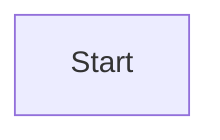

```flow
st=>start: 开始框
op=>operation: 开发人员master分支开发
cond=>condition: 是否向release分支合并代码
sub1=>subroutine: 镜像打包基础registry.cn-hangzhou.aliyuncs.com/bamboo1573/backtrace:release_latest
io=>inputoutput: 继续开发
e=>end: 结束框

feat01

st(right)->op(right)->cond
cond(no)->io->op
cond(yes)->sub1(right)->e
```

