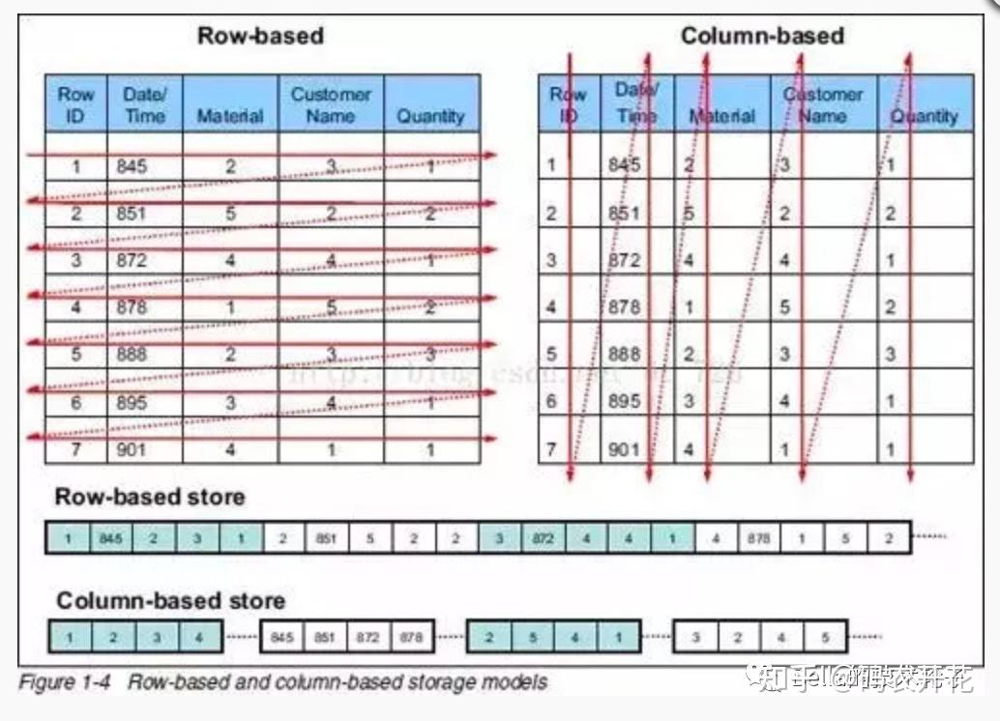
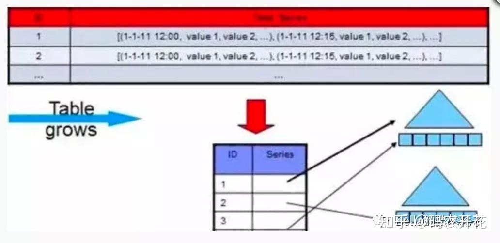
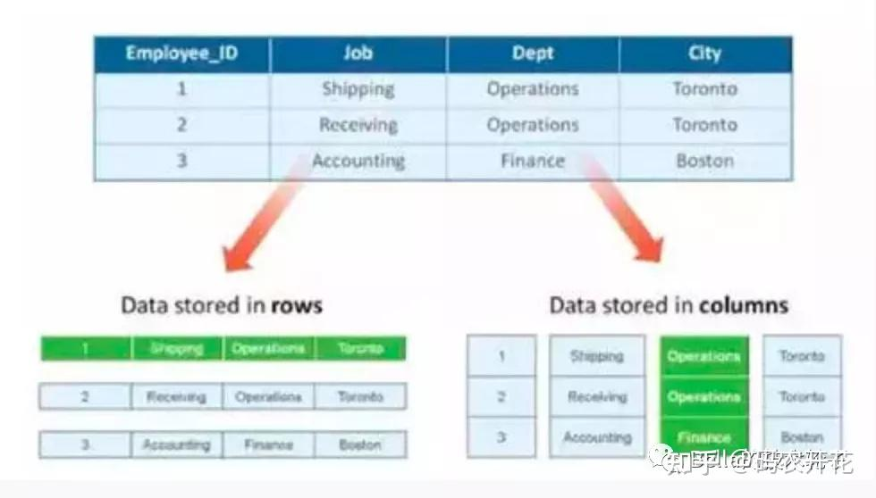
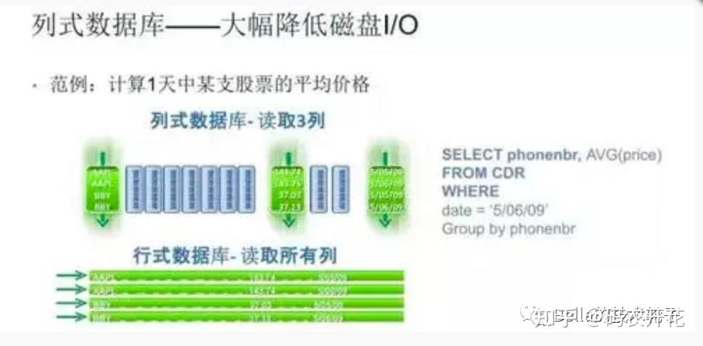

## 列式存储和行式存储

### 1.1 简介

#### 1.1.1 背景

当今数据存储方案大概可分为两大类， 联机事务处理（OLTP）和联机分析处理（OLAP）

**OLTP 和OLAP 区别**

OLTP 是关系型数据库主要的应用，用来执行一些基本的事务操作，日常的事务处理例如： 数据库的增、删、改、查等；

OLAP 是分布式数据库的主要应用，对数据实时性要求不高，但处理的数据量非常大，通常用于复杂的报表系统上

#### 1.1.2 行式存储和列式存储

传统的关系存储采用行式存储法（Row-based） ，一行的数据存储在连续存储介质中，以连续的存储形式存在

列式存储（Column-based） 是相对于行式存储而言的，新的HBase + ，GP+ 等分布式数据库均采用列式存储，主要是一列中的数据存在存储介质中以连续的存储形式存在

##### 1.1.2.1行式存储的适用场景

- 适用于大量增删改查的操作
- 需要在行中选取所有属性的查询操作
- 需要频繁查询或者更新操作，操作与索引和行的大小相关

> 实操中会发现： 行数据库在读取数据时，会有固定缺陷，比如查询的目标即使只有少数几项，但因为这些数据深埋在各行数据单元中，而刚刚每行又特别大，这样每次查询必须读取一行的完整记录，这样会大大降低查询效率；
>
> 行式数据库给出的方案时加索引，在OLTP 类型应用中，通过索引或者分表的手段，可以简化查询效率

##### 1.1.2.2 列式存储的适用场景

针对海量数据的OLAP 应用，行式数据库就会力不从心，，行式数据库建立索引和雾化视图，需要花费大量的时间和资源，得不偿失。无法从根本上解决查询性能和维护成本的问题，也不适用于数据仓库等应用场景因此后续出现了基于列式存储的数据库

对于数据仓库和分布式数据库来说，大部分情况下它会从各个数据源汇总数据，然后进行分析和反馈。其操作大多是围绕同一列属性的数据进行的 ，而当查询某属性的数据记录时，列式数据库只需返回与列属性相关的值。

在大数据量查询场景中，列式数据库可在内存中高效组装各列的值，最终形成关系记录集，因此可以显著减少IO消耗，并降低查询响应时间。非常适合数据仓库和分布式的应用。

- 查询过程中，可针对各列的运算并发执行([SMP](https://zhida.zhihu.com/search?content_id=172311287&content_type=Article&match_order=1&q=SMP&zhida_source=entity))，最后在内存中聚合完整记录集，最大可能降低查询响应时间;
- 可在数据列中高效查找数据，无需维护索引(任何列都能作为索引)，查询过程中能够尽量减少无关IO，避免全表扫描;
- 因为各列独立存储，且数据类型已知，可以针对该列的数据类型、数据量大小等因素动态选择压缩算法，以提高物理存储利用率;如果某一行的某一列没有数据，那在列存储时，就可以不存储该列的值，这将比行式存储更节省空间。

不适用的场景：

- 数据需要频繁更新的交易场景
- 表中列属性比较少的小量数据库场景
- 不适合做含有删除和更新的实时操作