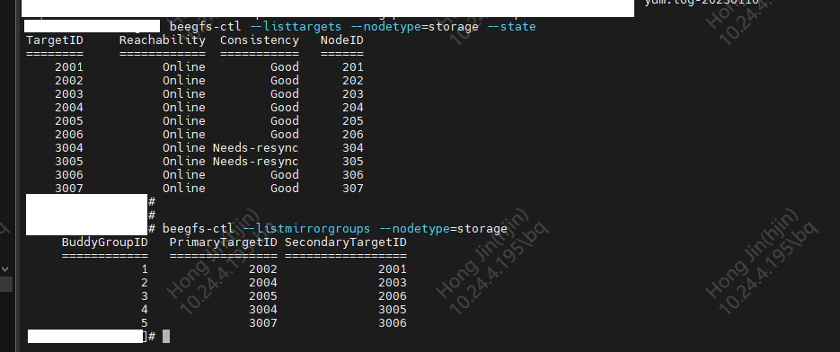

## beegfs 日常维护内容

### storage 数据脑裂问题

**问题描述**

数据存在部分异常, 导致做了BuddyMirror  的Target 出现脑裂的现象, 直观表现是同一个Storage Pool 的两个Target 都在 Needs-resync 状态;

```bash
$ beegfs-ctl --listtargets --nodetype=storage --state
```




**解决思路**

解决上述问题详细命令如下:

```bash

# 将配置某一个storage 的Target 设置为GOOD;
$ beegfs-ctl --setstate --nodetype=storage --targetid=3004 --state=good --force
# 上一步设置 Good 后，就开始 resync 了
$ beegfs-ctl --startresync --targetid=3005 --nodetype=storage
$ beegfs-ctl --startresync --nodetype=storage --targetid=3005 --timestamp=0 --restart 
```

**发散**

如果beegfs-storage 节点出现问题时, 可以查看相关命令示例, 

```bash
$ beegfs-ctl --startresync --nodetype=storage --help
...
USAGE:
 This mode starts a resync of a storage target or metadata node from its buddy.

 Example: Resync target with ID "10" from its buddy using the resync timestamp
          saved on the server
  # beegfs-ctl --startresync --nodetype=storage --targetid=10

 Example: Resync the changes in buddy group with ID 2 of the last 5 days
  # beegfs-ctl --startresync --nodetype=storage --mirrorgroupid=2 --timespan=5d

 Example: Resync the changes in buddy group with ID 2 of the last 36 hours
  # beegfs-ctl --startresync --nodetype=storage --mirrorgroupid=2 --timespan=36h

 Example: Perform a full resync of target with ID 5
  # beegfs-ctl --startresync --nodetype=storage --targetid=5 --timestamp=0
```


对于beegfs-meta节点出现该问题; 也可以按照类似的方案操作

```bash
$ beegfs-ctl --setstate --nodetype=meta --nodeid=<nodeid> --state=good --force

# 上一步设置 Good 后，就开始 resync 了
$ beegfs-ctl --startresync --nodeid=<nodeid> --nodetype=meta
$ beegfs-ctl --startresync --nodetype=meta --targetid=X --timestamp=0 --restart 
```

