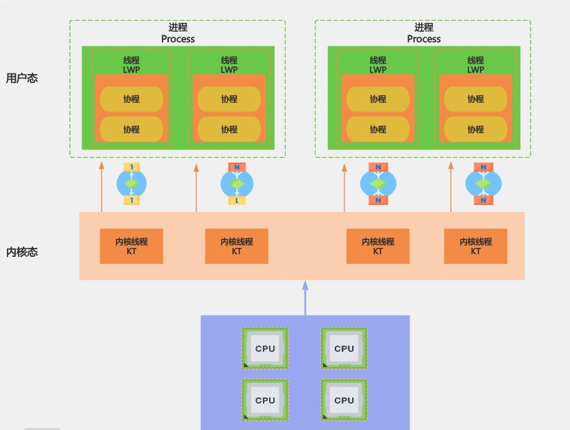

## 什么是Linux内核？

Linux 内核是承载物理硬件和用户之间通信的核心接口，主要满足

- **内存管理**：追踪记录有多少内存存储了什么以及存储在哪里
- **进程管理**： 确定哪些进程可以使用中央处理器（CPU）、何时使用以及持续多长 
- **设备驱动程序管理**： 充当硬件与进程之间的调解程序/解释程序
- **系统调用和安全防护**： 从流程接受服务请求

> 正常来说， 内核对于用户是不可见的，内核工作在**内核空间** ，并从中分配内存和跟踪所有内容的存储位置。用户能见到的称为**用户空间**。用户空间通过系统调用接口和内核进行交互

### 内核所在操作系统的位置

为了具象的理解内核，可将Linux 计算机分成三成结构：

- **硬件层**： 物理机， 内存 RAM、处理器CPU、输入输出设备（I/O）、存储网络
- **Linux 内核层**： 操作系统核心程序，工作在内存中，用于提示CPU 需要执行哪些操作
- **用户进程**： 用户管理程序，存在于用户空间，用户进程就是直接说的进程，内核允许进程和服务器之间通信称为**进程间通信或者IPC**

系统执行的代码通过两种模式在CPU 上运行， 内核模式和用户模式，在内核模式下是不受限制的访问硬件，用户模式则会限制SCI 对CPU 和内存的访问，内存也存在类似的分割情况