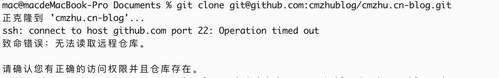

## `ssh`实验

### 背景

日常在使用网络时, 需要有时候去访问远端服务器的某一个服务端口(例子:`8080`),但是因为一些原因, 你所访问的机器之间只开通了`ssh`, 不能直接访问相应的`8080`端口

或者在访问时需要代理两台不同的机器给访问权限; 既如此, 就需要使用到`ssh `的端口映射技术

### `ssh` 本地端口转发

ssh 正向端口转发的含义是, 本机访问不了远端机器的某一端口(例子:	`9090`) , 就通过访问一个跳板机这样来转发, 这样来访问指定端口

1、例子: A 需要访问`cmzhu.cn` 的9090 端口, 但是现在直接使用`telnet`,发现该端口不通, 这个时候就需要走一层跳板机来转发

```bash
### 实现方案
ssh -p 11022 -L 9090:127.0.0.1:9090 cmzhu@cmzhu.cn 
### telnet
➜  ~ telnet 127.0.0.1 9090
Trying 127.0.0.1...
Connected to localhost.
Escape character is '^]'.
```

 通过`127.0.0.1:9090` 就可以访问到 cmzhu.cn:9090 的服务

>  如果本机上出现多个IP, 但上面的方法有一个弊端, 就是这样执行后,就只有本机能够访问到端口;


通过如下方法, 其他节点可以通过访问本机的其他IP 来访问到9090 这个服务:

```bash
ssh -p 11022 -L 10.24.100.230:9090:127.0.0.1:9090 cmzhu@cmzhu.cn 
```

也可以通过 匹配, 实现能通过本机上所有的IP 访问;

```bash
ssh -p 11022 -L :9090:127.0.0.1:9090 cmzhu@cmzhu.cn 
或者
ssh -p 11022 -L *:9090:127.0.0.1:9090 cmzhu@cmzhu.cn 
或者
ssh -p 11022 -L 0.0.0.0:9090:127.0.0.1:9090 cmzhu@cmzhu.cn 
```

> [本机的IP]:通过本机访问的`port`:远端`IP`:需要跳转到的`port`
>
> 远端`IP` 可以是 `localhost` , 并不是指我使用ssh 的主机本机, 而是指被登录的机器的` localhost`(这里指的cmzhu.cn 这台机器)

```bash
ssh -p 11022 -L 0.0.0.0:9090:192.168.101.77:32400 cmzhu@cmzhu.cn 
```

这个表示通过访问本机的9090 端口, 可以直接访问到远端 `192.168.101.77` 的`32400` 端口

### `ssh`远端端口转发

与本地端口转发的流动方向相反，远程端口转发是将对于远程主机B指定端口Y的访问请求转发给主机A，交由主机A对另一指定主机C的指定端口Z发起访问。

> 远程转发是指把登录主机所在网络中某个端口通过本地主机端口转发到远程主机上。

```bash
ssh -R [登录主机:]登录主机端口:本地网络主机:本地网络主机端口 username@hostname
```

例子:将本地网络 `10.24.2.1:9090` 端口 , 转发到远程机器`cmzhu.cn: 10090`上访问

```bash
ssh -R 0.0.0.0:10090:10.24.2.1:9090 cmzhu@cmzhu.cn
```

执行上述命令后, 就可以通过访问`cmzhu.cn:10090` 来访问`10.24.2.1:9090` 端口

### ssh 配置文件

ssh 可以从以下三处获取配置文件

- 命令行选项
- 用户配置文件 (~/.ssh/config)
- 系统配置文件 (/etc/ssh/ssh_config)

```bash
$ cat ~/.ssh/config
Host *
    User root
    Port 22

Host cmzhu
    HostName 192.168.101.70
    User cmzhu
    Port 22
    IdentityFile ~/.ssh/id_rsa

Host gitlab
    HostName 192.168.101.71
    User root
    Port 22
    IdentityFile ~/.ssh/id_rsa
    
```

如果github 访问异常， 也可以修改配置



```bash
Host github.com
    Hostname ssh.github.com
    PreferredAuthentications publickey
    IdentityFile ~/.ssh/id_rsa
    Port 443

Host gitlab.com
    Hostname altssh.gitlab.com
    Port 443
    PreferredAuthentications publickey
    IdentityFile ~/.ssh/id_rsa
```


