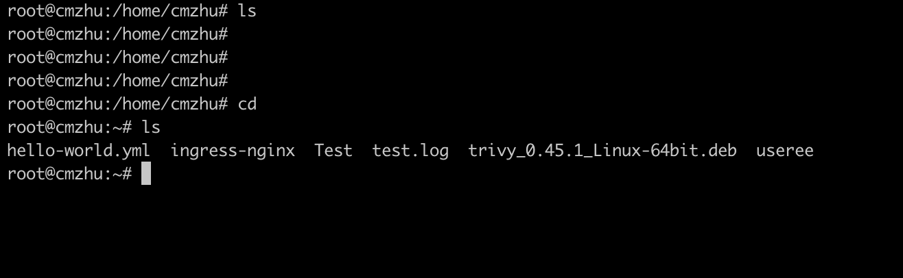

## bash 界面没有颜色配置

Bash 界面的配置上有些初始化系统会出现没有颜色的 `Bash` 页面, 不适合运维使用, 使用以下命令可以改善



打开 ~/.bashrc 并将下面命令写入文件, 执行source ~/.bashrc

颜色主题1:

```bash
PS1='\[\033[01;32m\]\u@\h\[\033[00m\]:\[\033[01;34m\]\w\[\033[00m\]\$ '
```

颜色主题2: 

```bash
PS1='[\[\e[1;35;1m\]\t \[\e[1;32;1m\]\u@\H \[\e[1;33;1m\]\w] \n \$ \[\e[1;37;1m\]'
```


常用的ls 命令也有类似的问题, 这个也可通过一些命令改善, 

```bash
alias ll="ls -la --color"
alias ls="ls --color"
```

