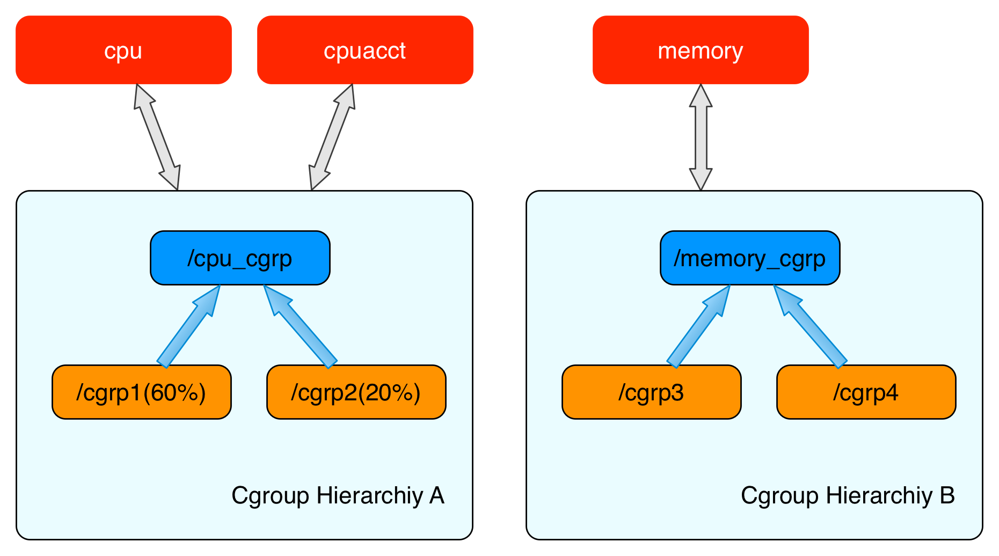

## Cgroups

Cgroups 是Linux 内核提供的可以限制单个进程和多个进程所使用资源的机制, 可以实现对内存、 CPU等资源, 实现精细化控制, 目前比较火的容器化技术(Docker、Containerd) 都是用到了该技术


### 概念和原理

#### Cgroups 子系统

Cgroups 的全称是Control Groups, Cgroups 为每种可以定制的资源提供了子系统; 典型的例子如下

- CPU 子系统, 主要限制进程的CPU 使用率
- CPUACCT 子系统, 主要获取Cgroups 中进程CPU 的是用报告
- CPUSET 子系统, 主要为Cgroups 中进程分配单独的CPU节点或者内存节点
- Menory 子系统, 主要限制进程的Menory是用量
- Blkio 子系统, 可以限制进程的块设备IO
- devices 子系统, 可以限制进程能够访问某些设备
- net_cls 子系统, 可以标记 Cgroups 中进程的网络数据包，然后可以使用 TC 模块（traffic control）对数据包进行控制
- freezer 子系统, 可以挂起或者恢复 Cgroups 中的进程
- ns 子系统, 可以使不同Cgroup 下的进程是用不同的Namespace

每一个子系统实现其功能, 都需要Linux 对应其功能的内核模块来完成资源的控制, 因此 Cgroups 是依赖内核版本的


#### Cgroups 层级结构(Hierarchy)

内核通过使用Cgroups 的结构体来对Cgroups 的一个或者多个Cgroups 子系统进行资源限制, 下图中(左)就是使用了CPU 子系统和CPUACCT 子系统,(右图) 仅仅使用了Memory 子系统,  因此可以看出 Cgroups 可以Attach 到多个子系统, 也可以Attach 到单个子系统;相反每一个Cgroups子系统 只能被Attach 到一个层级结构中



在Cgroups 层级结构中, 实现了对使用率的控制, (左图) 实现控制进程 /cgrp1 使用60% 的CPU时间片, /cgrp2 可以使用20% 的时间片 

#### Cgroups 与进程

上文讲内核使用 Cgroups 子系统对资源进行限制, 也提到 Cgroups 子系统 需要 Attach 到Cgroups 层级结构中来对进程实现资源控制, 本节写内核是如何与Cgroups 层级结构紧密联系起来的

在创建Cgroups 的层级结构的节点(结构体)之后, 可以将进程加入到某一个节点的控制列表中, 一个节点的控制列表中所有进程, 都会受到当前节点的资源限制, 同一个进程也可以加入到不同的 Cgroups 层级结构的不同节点中, 因为不同的 Cgroups 层级结构负责不同的系统资源, 所以进程 与Cgroups 结构体, 是一个一对多的关系;


上图能很好的展示进程与Cgroups 结构体的关系, 最下方的每一个P 代表进程, 每一个进程描述符都指向一个辅助数据结构`css_set` (全称: Cgroups Subsystem Set) , 加入到`css_set` 的进程会被加入到 `css_set` 的进程链表中, `css_set` 和进程的关系是属于一对多的关系;

`css_set`与Cgroups 节点 是多对多的关系;

### cgroups文件系统

Linux 使用了多种数据结构在内核中实现了 Cgroups 的配置，关联了进程和 Cgroups 节点，那么 Linux 又是如何让用户态的进程使用到 Cgroups 的功能呢？ 

Linux内核有一个很强大的模块叫 VFS (Virtual File System)。 VFS 能够把具体文件系统的细节隐藏起来，给用户态进程提供一个统一的文件系统 API 接口。 Cgroups 也是通过 VFS 把功能暴露给用户态的，Cgroups 与 VFS 之间的衔接部分称之为 Cgroups 文件系统。下面先介绍一下 VFS 的基础知识，然后再介绍下 Cgroups 文件系统的实现。

#### VFS

VFS 是一个内核抽象层，能够隐藏具体文件系统的实现细节，从而给用户态进程提供一套统一的 API 接口。VFS 使用了一种通用文件系统的设计，具体的文件系统只要实现了 VFS 的设计接口，就能够注册到 VFS 中，从而使内核可以读写这种文件系统。 这很像面向对象设计中的抽象类与子类之间的关系，抽象类负责对外接口的设计，子类负责具体的实现。其实，VFS本身就是用 c 语言实现的一套面向对象的接口。

##### 通用文件模型

VFS 通用文件模型中包含以下四种元数据结构：

1. 超级块对象(superblock object)，用于存放已经注册的文件系统的信息。比如ext2，ext3等这些基础的磁盘文件系统，还有用于读写socket的socket文件系统，以及当前的用于读写cgroups配置信息的 cgroups 文件系统等。
2. 索引节点对象(inode object)，用于存放具体文件的信息。对于一般的磁盘文件系统而言，inode 节点中一般会存放文件在硬盘中的存储块等信息；对于socket文件系统，inode会存放socket的相关属性，而对于cgroups这样的特殊文件系统，inode会存放与 cgroup 节点相关的属性信息。这里面比较重要的一个部分是一个叫做 inode_operations 的结构体，这个结构体定义了在具体文件系统中创建文件，删除文件等的具体实现。
3. 文件对象(file object)，一个文件对象表示进程内打开的一个文件，文件对象是存放在进程的文件描述符表里面的。同样这个文件中比较重要的部分是一个叫 file_operations 的结构体，这个结构体描述了具体的文件系统的读写实现。当进程在某一个文件描述符上调用读写操作时，实际调用的是 file_operations 中定义的方法。 对于普通的磁盘文件系统，file_operations 中定义的就是普通的块设备读写操作；对于socket文件系统，file_operations 中定义的就是 socket 对应的 send/recv 等操作；而对于cgroups这样的特殊文件系统，file_operations 中定义的就是操作 cgroup 结构体等具体的实现。
4. 目录项对象(dentry object)，在每个文件系统中，内核在查找某一个路径中的文件时，会为内核路径上的每一个分量都生成一个目录项对象，通过目录项对象能够找到对应的 inode 对象，目录项对象一般会被缓存，从而提高内核查找速度。

##### Cgroups文件系统的实现

基于 VFS 实现的文件系统,都必须实现 VFS 通用文件模型定义的这些对象，并实现这些对象中定义的部分函数。cgroup 文件系统也不例外,下面来看一下 cgroups 中这些对象的定义。

首先看一下 cgroups 文件系统类型的结构体：

```
static struct file_system_type cgroup_fs_type = {
        .name = "cgroup",
        .mount = cgroup_mount,
        .kill_sb = cgroup_kill_sb,
};
```

这里面两个函数分别代表安装和卸载某一个 cgroup 文件系统所需要执行的函数。每次把某一个 cgroups 子系统安装到某一个装载点的时候，cgroup_mount 方法就会被调用，这个方法会生成一个 cgroups_root（cgroups层级结构的根）并封装成超级快对象。

然后看一下 cgroups 超级块对象定义的操作：

```
static const struct super_operations cgroup_ops = {
        .statfs = simple_statfs,
        .drop_inode = generic_delete_inode,
        .show_options = cgroup_show_options,
        .remount_fs = cgroup_remount,
};
```

这里只有部分函数的实现，这是因为对于特定的文件系统而言，所支持的操作可能仅是 super_operations 中所定义操作的一个子集，比如说对于块设备上的文件对象，肯定是支持类似 fseek 的查找某个位置的操作，但是对于 socket 或者 cgroups 这样特殊的文件系统，就不支持这样的操作。

同样简单看下 cgroups 文件系统对 inode 对象和 file 对象定义的特殊实现函数：

```
static const struct inode_operations cgroup_dir_inode_operations = {
        .lookup = cgroup_lookup,
        .mkdir = cgroup_mkdir,
        .rmdir = cgroup_rmdir,
        .rename = cgroup_rename,
};

static const struct file_operations cgroup_file_operations = {
        .read = cgroup_file_read,
        .write = cgroup_file_write,
        .llseek = generic_file_llseek,
        .open = cgroup_file_open,
        .release = cgroup_file_release,
};
```

本文并不去研究这些函数的代码实现是什么样的，但是从这些代码可以推断出，cgroups 通过实现 VFS 的通用文件系统模型，把维护 cgroups 层级结构的细节，隐藏在 cgroups 文件系统的这些实现函数中。

从另一个方面说，用户在用户态对 cgroups 文件系统的操作，通过 VFS 转化为对 cgroups 层级结构的维护。通过这样的方式，内核把 cgroups 的功能暴露给了用户态的进程。

### cgroups使用方法

#### cgroups文件系统挂载

Linux中，用户可以使用mount命令挂载 cgroups 文件系统，格式为: `mount -t cgroup -o subsystems name /cgroup/name`，其中 subsystems 表示需要挂载的 cgroups 子系统， /cgroup/name 表示挂载点，如上文所提，这条命令同时在内核中创建了一个cgroups 层级结构。

```bash
$ mount -t cgroup -o subsystems name /cgroup/name
```

比如挂载 cpuset, cpu, cpuacct, memory 4个subsystem到/cgroup/cpu_and_mem 目录下，就可以使用 

````
$ mount -t cgroup -o remount,cpu,cpuset,memory cpu_and_mem /cgroup/cpu_and_mem
````

在centos下面，在使用安装了cgroups模块之后，在 /etc/cgconfig.conf 文件中会自动生成 cgroups 子系统的挂载点:

安装命令:

```bash
$ yum install libcgroup
```

```c
mount {
    cpuset  = /cgroup/cpuset;
    cpu = /cgroup/cpu;
    cpuacct = /cgroup/cpuacct;
    memory  = /cgroup/memory;
    devices = /cgroup/devices;
    freezer = /cgroup/freezer;
    net_cls = /cgroup/net_cls;
    blkio   = /cgroup/blkio;
}
```

上面的每一条配置都等价于展开的 mount 命令，例如

```bash
mount -t cgroup -o cpuset cpuset /cgroup/cpuset
```

这样系统启动之后会自动把这些子系统挂载到相应的挂载点上。

#### 子节点和进程

挂载某一个 Cgroups 子系统到挂载点之后，就可以通过在挂载点下面建立文件夹或者使用cgcreate命令的方法创建 Cgroups 层级结构中的节点。比如通过命令`cgcreate -t cmzhu:cmzhu -g cpu:test`就可以在 CPU 子系统下建立一个名为 test 的节点。结果如下所示：

```bash
$ ls
cgroup.event_control  cgroup.procs  cpu.cfs_period_us  cpu.cfs_quota_us  cpu.rt_period_us   cpu.rt_runtime_us  cpu.shares  cpu.stat  lxc  notify_on_release  release_agent  tasks  test
```

然后可以通过写入需要的值到 test 下面的不同文件，来配置需要限制的资源。每个子系统下面都可以进行多种不同的配置，需要配置的参数各不相同，详细的参数设置需要参考 cgroups 手册。使用 cgset 命令也可以设置 cgroups 子系统的参数，

格式为

```bash
$ cgset -r parameter=value path_to_cgroup
```

删除Cgroups 节点:

```bash
## 删除 test 节点
$ cgdelete -r cpu:test
```

把进程加入到 cgroups 子节点也有多种方法，可以直接把 pid 写入到子节点下面的 task 文件中。也可以通过 cgclassify 添加进程

例子: 

```bash
$ cgclassify -g subsystems:path_to_cgroup pidlist
```

也可以直接使用 cgexec, 直接在某一个 cgroups 下直接启用进程

```bash
$ cgexec -g subsystems:path_to_cgroup command arguments
```

