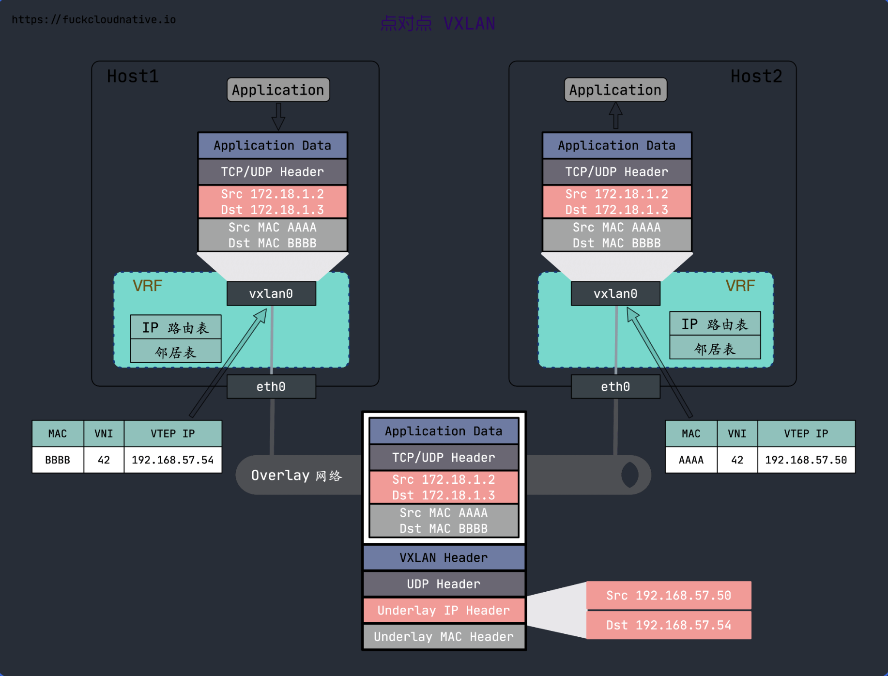

## VXLAN

### 什么是overlay 网络?

Overlay网络是一种在现有网络基础设施上构建的虚拟网络，它允许在网络上运行分布式应用。Overlay网络的主要优点是它可以提供更高的抽象级别，使得应用程序开发者可以专注于应用程序的逻辑，而不必关心底层网络的复杂性。

Overlay网络通常使用虚拟网络设备（如VXLAN或NVGRE）来实现。这些设备可以在现有的网络基础设施上创建一个虚拟的、封装的网络，使得应用程序可以在这个网络上运行，而无需关心底层网络的具体细节。

Overlay网络的主要应用场景包括云计算、容器网络、虚拟化网络、数据中心网络等。在这些场景中，Overlay网络可以提供更高的网络性能、更好的网络隔离、更灵活的网络配置等。

以下是一个简单的Overlay网络的例子：

1. 应用程序在Overlay网络上运行。
2. 当应用程序需要发送数据时，它会将数据封装在一个Overlay包中，然后通过Overlay网络发送出去。
3. 在接收端，Overlay设备会解封Overlay包，然后将数据传递给应用程序。

Overlay网络的关键技术包括**数据包封装和解封**、**网络地址转换（NAT）**、**路由**等。

### 什么是VXLAN?

VXLAN 是一种网络虚拟化技术, 通过对数据包的封装,并发送到目标网络, 实现跨物理网络边界的数据包网络传输;

工作原理如下:

- 当一个数据包从一个网络到另一个网络时, 首先会封装一个VXLAN 的头部, 这个头部中包含目标网络的标识符(VNI) 和其他信息;
- 这个数据包发送到目标网络时, VXLAN 设备会解包; 并将这个数据包发送到指定的虚拟网络
- 在虚拟网络中, 数据包被解封, 并发送到目标主机

### 如何使用Linux 搭建VXLAN 网络

`Linux` 支持`VXLAN`, 可以按照步骤使用`Linux` 搭建 `VXLAN` 网络的`Overlay` 网络; 

#### 点对点之间的 VXLAN

 

图片来自https://icloudnative.io/

按照实验步骤, 为不影响主机的网络环境, 使用 Linux 的 `VRF` 来隔离 root network namespace 的路由;

>  VRF: Virtual Routing and Forwarding）是由路由表和一组网络设备组成的路由实例，你可以理解为轻量级的 `network namespace`，只虚拟了三层的网络协议栈，而 `network namespace` 虚拟了整个网络协议栈.
>
> 
>
> 注意: 
>
> Linux Kernel 版本大于 `4.3` 才支持 VRF，建议做本文实验的同学先升级内核。