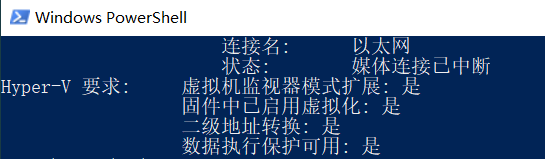

## windows 家庭版如何启动Hyper-V

Hyper-V 在windows 专业版中是已经存在的， 但是在家庭版中没有Hyper-V 的安装路径选项， 这时可以按照此文档来解决


### 安装步骤

1、 检查电脑是否支持安装hyper-v

```powershell
$ systeminfo 
```

可以看到出现了很多处理器的信息，最末尾有个 Hyper-V 要求，如果四个全是 “是”，则表示支持 Hyper-V 功能。



2、确认完成之后直接创建一个为bat 后缀的文档

hyper-v.bat

```powershell
pushd "%~dp0"
 
dir /b %SystemRoot%\servicing\Packages\*Hyper-V*.mum >hyper-v.txt
 
for /f %%i in ('findstr /i . hyper-v.txt 2^>nul') do dism /online /norestart /add-package:"%SystemRoot%\servicing\Packages\%%i"
 
del hyper-v.txt
 
Dism /online /enable-feature /featurename:Microsoft-Hyper-V-All /LimitAccess /ALL
```

3、 保存完成之后右键使用管理员运行， 然后等待下载完成电脑重启即可， 此时hyper-v 已经安装到windows 家庭版上面了