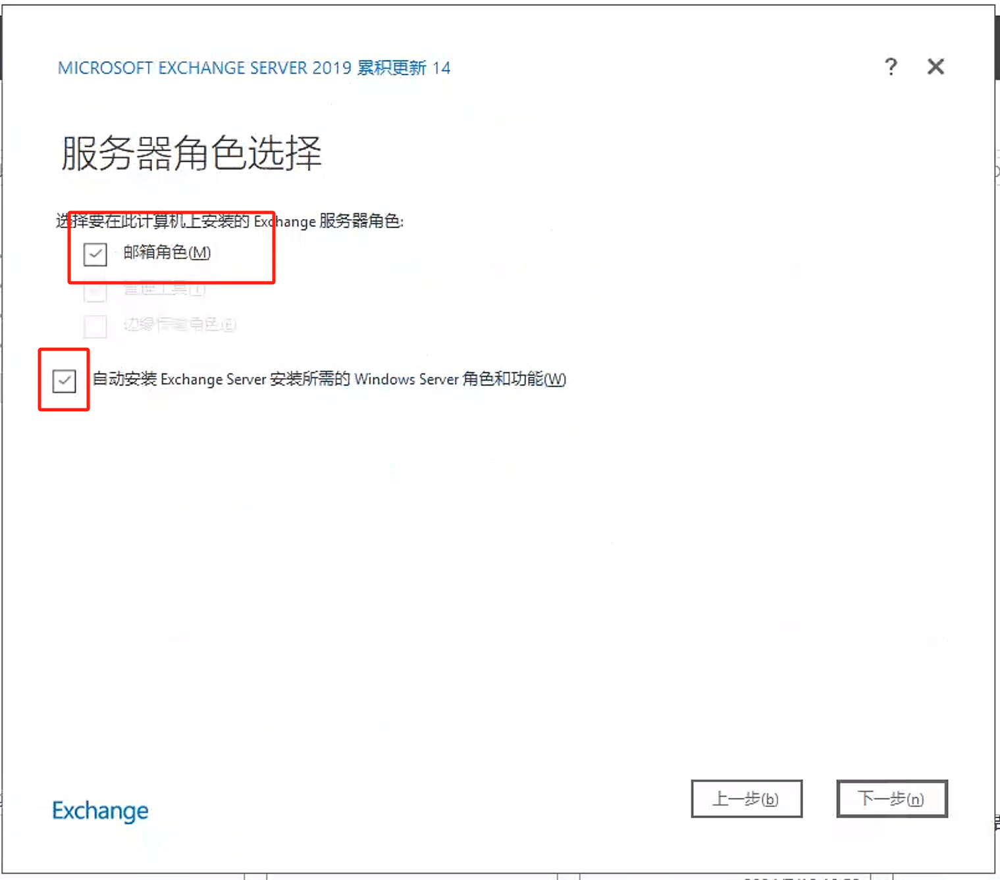
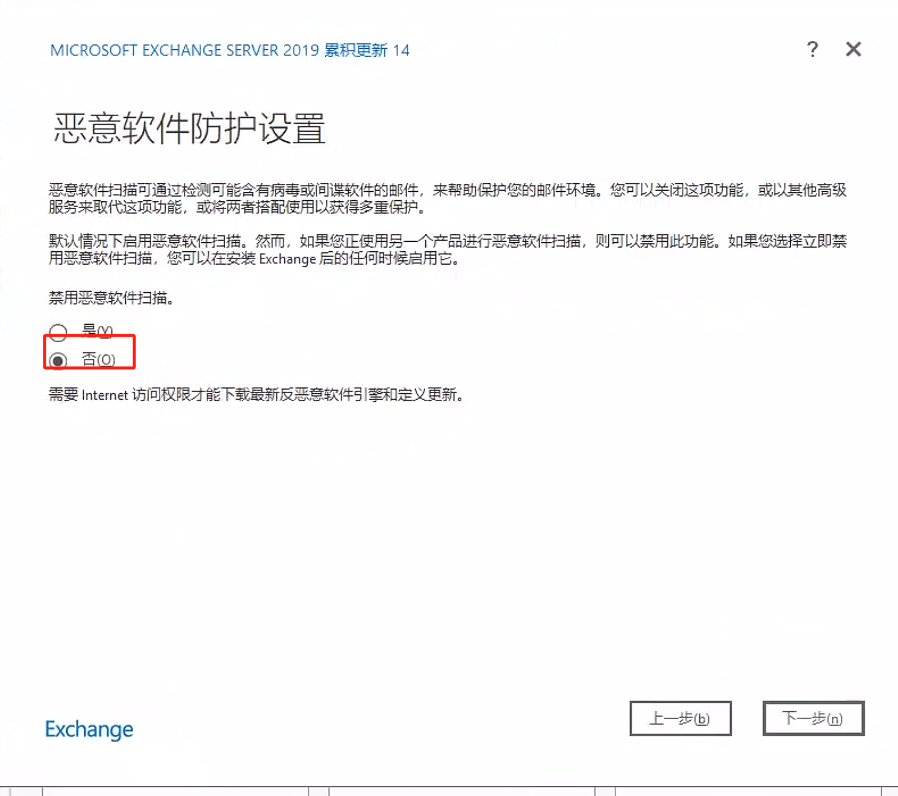

## 域控安装Exchange 服务器

用途： 用于提供对域控账户进行密码修改的一种方式， 主要针对未使用专业版操作系统的用户

- 操作系统版本 win server 2019 

### 安装步骤

文档参考： [https://www.xiaobei.us/archives/775.html](https://www.xiaobei.us/archives/775.html)


1、先将服务器加入到域控， 并使用域控管理员账号登录， 以及将域控管理员加入到本地管理员列表中；


2、安装依赖软件，切换域管理员或拥有Exchange管理权限的用户登录并安装必备组件（此次实验环境用域管理员登录）

安装net framework 4.8 下载链接: [https://go.microsoft.com/fwlink/?linkid=2088631](https://go.microsoft.com/fwlink/?linkid=2088631) 

安装完成之后会重启


3、安装必要的插件

```powershell
Install-WindowsFeature Server-Media-Foundation, NET-Framework-45-Features, RPC-over-HTTP-proxy, RSAT-Clustering, RSAT-Clustering-CmdInterface, RSAT-Clustering-Mgmt, RSAT-Clustering-PowerShell, WAS-Process-Model, Web-Asp-Net45, Web-Basic-Auth, Web-Client-Auth, Web-Digest-Auth, Web-Dir-Browsing, Web-Dyn-Compression, Web-Http-Errors, Web-Http-Logging, Web-Http-Redirect, Web-Http-Tracing, Web-ISAPI-Ext, Web-ISAPI-Filter, Web-Lgcy-Mgmt-Console, Web-Metabase, Web-Mgmt-Console, Web-Mgmt-Service, Web-Net-Ext45, Web-Request-Monitor, Web-Server, Web-Stat-Compression, Web-Static-Content, Web-Windows-Auth, Web-WMI, Windows-Identity-Foundation, RSAT-ADDS
```

4、安装[Visual C++ Redistributable Package for Visual Studio 2012](https://www.microsoft.com/download/details.aspx?id=30679)

5、安装 [Visual C++ Redistributable Package for Visual Studio 2013](https://support.microsoft.com/help/4032938/update-for-visual-c-2013-redistributable-package)

7、安装[Unified Communications Managed API 4.0](https://www.microsoft.com/download/details.aspx?id=34992)

8、安装[https://download.microsoft.com/download/1/2/8/128E2E22-C1B9-44A4-BE2A-5859ED1D4592/rewrite_amd64_en-US.msi](https://download.microsoft.com/download/1/2/8/128E2E22-C1B9-44A4-BE2A-5859ED1D4592/rewrite_amd64_en-US.msi)

 安装完上述依赖之后， 重启服务器

#### 开始安装Exchange

1、下载安装包

[https://download.microsoft.com/download/b/f/7/bf7700c9-c2fd-40be-82cc-7c5330b5f981/ExchangeServer2019-x64-CU14.ISO](https://download.microsoft.com/download/b/f/7/bf7700c9-c2fd-40be-82cc-7c5330b5f981/ExchangeServer2019-x64-CU14.ISO)

注意选择现在不更新


2、选择不使用推荐安装







3、点击安装等待即可， 注意安装步骤共有14 步， 预计安装时长2 小时，具体跟实际机器性能相关


