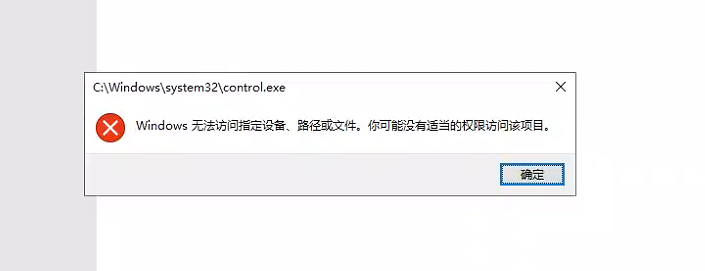
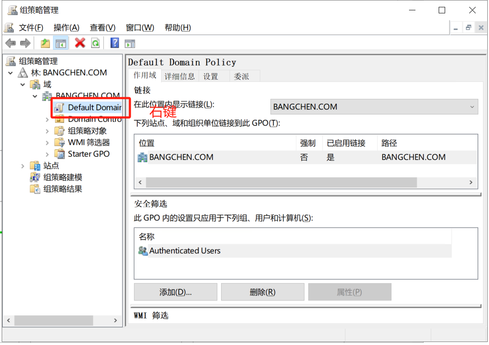
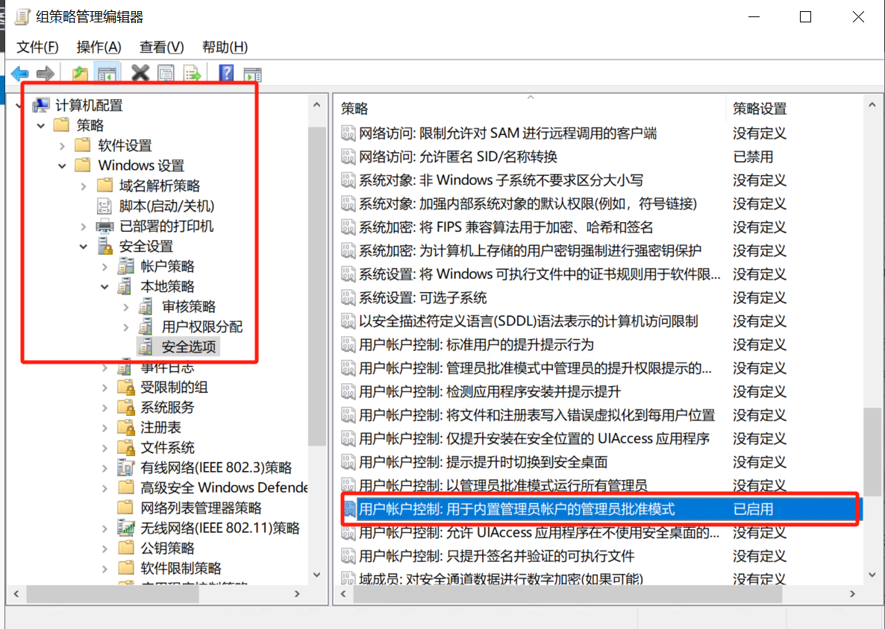

## 01_域控管理员账号登录,权限不足问题

### 问题描述

1、 打开网络适配器时发现权限不足

AD域安装后无法打开网络适配器，提示无法访问指定设备,路径或文件,你可能没有。。。

### 问题解决

解决方案： 

启用“用户账户控制：用于内置管理员账户的管理员批准模式” 配置，然后重启域控服务器即可解决

1、进入域控服务器， 点击组策略管理， 依次进入如下目录， 右键`Default Domain`

2、右键编辑之后， 进入该目录位置， 并启用如图中的配置 

3、 重启域控服务器