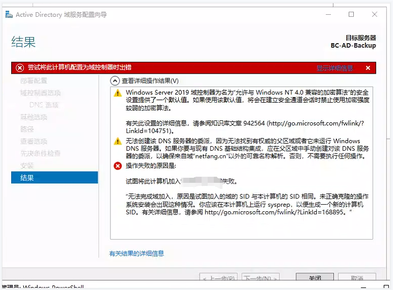
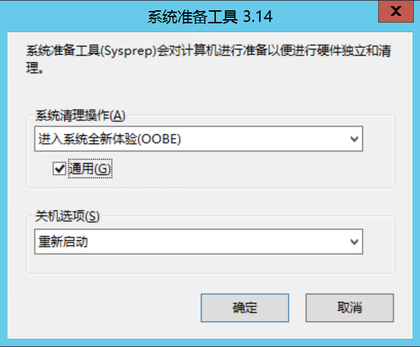

## windows 加入备域时， 报错SID 一致

### 详情

1、 备域服务器在加入域时报错如下

### 问题原因

1、搭建备域控服务器时使用的同一个虚拟机备份进行复制的

### 解决思路

1、修改域控服务器的备域的sid

### 解决方案

1、运行 C 盘目录下的 `windows/System32/Sysprep/Sysprep.exe` 软件， 并且勾选通用选项重启即可

