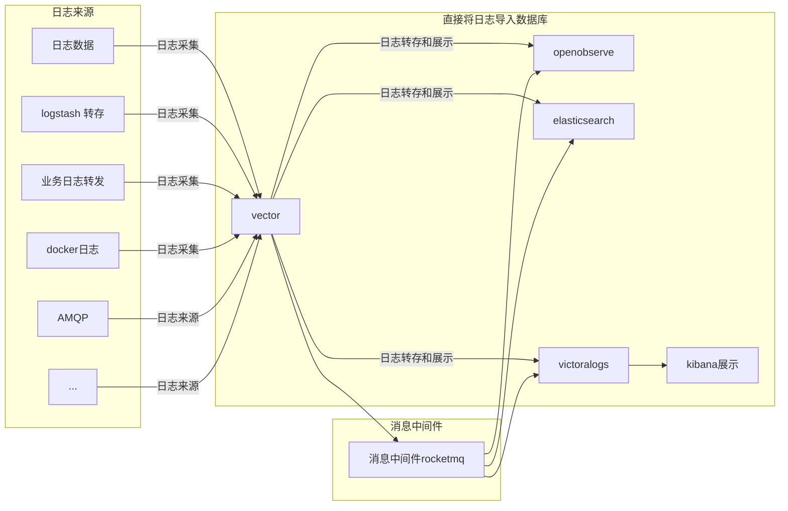

## 20240823_日志分享

### 日志用途？ 

日志架构是指用于收集、存储、处理和分析系统或应用程序日志数据的整体设计和实施方案。有效的日志架构可以帮助开发人员和运维团队监控系统健康、排查故障、进行性能分析和安全审计；

日志可从各种方面出现，例如：

> - 应用程序日志
>   - 应用程序运行日志
>   - 框架和库日志
> - 操作系统日志
> - 网络设备日志
> - 日志代理
>   - Fluentd
>   - Logstash
>   - Filebeat
> - 容器和微服务
> - 用户操作日志

### 日志基本架构

#### ELK （ElasticSearch + Logstash + Kibana） 

ELK 架构是一个流行的开源日志管理和分析解决方案，由三个主要组件组成：Elasticsearch、Logstash 和 Kibana。它们协同工作，使用户能够收集、存储、搜索和可视化大量日志数据。

优势： 

- 当多个企业App的日志汇聚到一个ELK实例时，ELK表现最好
  - Elasticsearch 提供了快速的全文搜索和复杂查询能力，能够实时处理大规模日志数据
  - Logstash 支持多种输入插件，可以从不同来源（如文件、数据库、消息队列等）收集数据，并使用过滤器对数据进行清洗和转换
  - Elasticsearch 支持集群架构，可以水平扩展以处理更大的数据集和更高的查询负载
  - ELK 生态系统有许多插件可供使用，提供额外的功能和集成选项

- 它为这个单一实例提供了令人难以置信的洞察力，同时还消除了登录到许多其他日志数据源的需要
- Elastic 提供多种语言客户端，包括 Ruby、 Python、 PHP、Perl、.NET、Java、JavaScript 和其他编程语言

劣势：

- 学习成本高
  - 在某些情况下，ELK 的配置和管理可能较为复杂，特别是对于新手用户
  - 需要定期维护和监控 Elasticsearch 集群，确保性能和可用性，可能增加运维成本
  - 默认情况下，ELK 的安全性配置相对较弱（如没有用户认证），需要额外配置以确保数据的安全性
  - ELK系统相对复杂，需要掌握ES的数据建模、Logstash的数据收集和处理、Kibana的数据可视化等多方面的知识。对于初学者来说，学习成本较高。

- 资源消耗大
  - ELK 堆栈可能对系统资源（CPU、内存、存储）有较高的要求，尤其是在处理大规模数据时

- 实时性有限
  - 虽然ELK支持实时索引和搜索，但在处理海量数据时，实时性可能会受到一定影响。此外，ELK的实时性还受到[网络](https://cloud.baidu.com/product/et.html)延迟、硬件性能等多种因素的影响


##### ELK 简单架构

架构图（图片来自[阿里云](https://developer.aliyun.com/article/256431)）：


**ElasticSearch**[参考](https://www.elastic.co/cn/elasticsearch)

Elasticsearch 是一个基于 Lucene 的分布式搜索引擎，提供实时的搜索和分析功能，作为 ELK 的核心组件，Elasticsearch 用于存储从 Logstash 收集的日志数据，并为 Kibana 提供查询接口

功能：

- 存储和索引日志数据，使其可以快速查询
- 支持强大的全文搜索和聚合功能
- 能够处理大规模的数据集，支持水平扩展

Elasticsearch 是一个分布式、RESTful 风格的搜索和数据分析引擎，能够解决不断涌现出的各种用例。作为 Elastic Stack 的核心，Elasticsearch 会集中存储您的数据，让您飞快完成搜索，微调相关性，进行强大的分析，并轻松缩放规模

工作原理 ： 

> coordinating node: 协调节点
>
> round-robin: 随机轮询算法
>
> primary shard： 主分片
>
> replica shard： 副本分片节点

1、写入数据

为了支持对海量数据的存储和查询，Elasticsearch引入分片的概念，一个索引被分成多个分片，每个分片可以有一个主分片和多个副本分片，每个分片副本都是一个具有完整功能的实例。分片可以分配在不同的服务器上，同一个分片的不同副本不能分配在相同的服务器上

在写入数据的过程中， 一般会经过如下步骤：

- 客户端选择一个 node 发送请求过去，这个 node 就是 `coordinating node` （协调节点），ES 集群中所有的节点都可作为协调节点
- 判断索引是否存在， 如果不存在，需要创建索引
- `coordinating node` 对 document 进行**路由**，将请求转发给对应的 primary shard（主分片）
- 写请求只能在 `primary shard` 处理请求，然后将数据同步到 `replica node` 
- `coordinating node` 如果发现 `primary node` 和所有 `replica node` 都搞定之后，就返回响应结果给客户端


2、读取数据

> doc id ： 文档id， Elasticsearch 数据底层存储是按照文档的方式进行存储， 底层是json格式数据
>
> shard：分片，  由primary shard和replica shard 可组成一个数据复制组， 查询并不是只在primary shard 处理， 而是可以在所有的Shard 中进行处理

可以通过 `doc id` 来查询，会根据 `doc id` 进行 hash，判断出来当时把 `doc id` 分配到了哪个 shard 上面去，从那个 shard 去查询。

- 客户端发送请求到**任意**一个 node，成为 `coordinate node` （协调节点），ES 集群中所有的节点都可作为协调节点
- `coordinate node` 对 `doc id` 进行哈希路由，将请求转发到对应的 node，并由node中的Primary shard，此时会使用 `round-robin` **随机轮询算法** 或者**ARS** 等负载均衡算法，在 `primary shard` 以及其所有 replica 中从优选择一个，让读请求负载均衡
- 接收请求的 node 返回 document 给 `coordinate node` 
- `coordinate node` 返回 document 给客户端。

3、es 搜索数据功能

es 最强大的是做全文检索，就是比如你有三条数据：

```
java真好玩儿啊
java好难学啊
j2ee特别牛
```


你根据 `java` 关键词来搜索，将包含 `java` 的 `document` 给搜索出来。es 就会给你返回：java 真好玩儿啊，java 好难学啊

- 客户端发送请求到一个 `coordinate node` 
- 协调节点将搜索请求转发到**所有**的 shard 对应的 `primary shard` 或 `replica shard` ，都可以
- query phase：每个 shard 将自己的搜索结果（其实就是一些 `doc id` ）返回给协调节点，由协调节点进行数据的合并、排序、分页等操作，产出最终结果
- fetch phase：接着由协调节点根据 `doc id` 去各个节点上**拉取实际**的 `document` 数据，最终返回给客户端

##### Logstash [参考](https://www.elastic.co/cn/logstash)

>  将非结构化的日志数据处理成满足存储结构的日志数据

Logstash 能够动态地采集、转换和传输数据，不受格式或复杂度的影响。利用 Grok 从非结构化数据中派生出结构，从 IP 地址解码出地理坐标，匿名化或排除敏感字段，并简化整体处理过程


内部架构如下：


filter 层 logstash 提供了大量的[插件](https://www.elastic.co/guide/en/logstash/current/filter-plugins.html)，以此提供不同的功能；

简单的logstash 实例如下：

原始日志文件：

```txt
2023-10-01 10:00:00 INFO User logged in
2023-10-01 10:05:00 ERROR Failed to load resource
2023-10-01 10:10:00 INFO User logged out
2023-10-01 10:15:00 WARN Disk space is low
2023-10-01 10:20:00 INFO User performed action A
2023-10-01 10:25:00 ERROR Connection timeout
```

配置：

```bash
input {
  file {
    path => "/path/to/your/logs.txt"  # 替换为你的日志文件路径
    start_position => "beginning"      # 从文件开头读取
    sincedb_path => "/dev/null"        # 不记录读取位置
  }
}

filter {
  # 可以在这里添加过滤器，例如解析日志格式
  grok {
    match => { "message" => "%{TIMESTAMP_ISO8601:timestamp} %{LOGLEVEL:loglevel} %{GREEDYDATA:message}" }
  }
}

output {
  stdout { 
    codec => rubydebug  # 以 Ruby 格式输出到控制台
  }
}
```

针对文件的返回结果

```json
{
       "message" => "User logged in",
      "@version" => "1",
    "@timestamp" => "2023-10-01T10:00:00.000Z",
       "loglevel" => "INFO",
      "timestamp" => "2023-10-01 10:00:00"
}
{
       "message" => "Failed to load resource",
      "@version" => "1",
    "@timestamp" => "2023-10-01T10:05:00.000Z",
       "loglevel" => "ERROR",
      "timestamp" => "2023-10-01 10:05:00"
}
{
       "message" => "User logged out",
      "@version" => "1",
    "@timestamp" => "2023-10-01T10:10:00.000Z",
       "loglevel" => "INFO",
      "timestamp" => "2023-10-01 10:10:00"
}
```

###### Kibana[参考](https://www.elastic.co/cn/kibana#%E5%8D%B3%E5%B8%AD%E5%88%86%E6%9E%90)

使用 Kibana 进行数据分析后，您能够更快地解决问题，并从多个用例和团队中收获大量洞察。发现洞察以调查威胁、监测系统、评估搜索性能，并采取行动；所有这些都在一个由 Elasticsearch 提供支持的平台上完成，能获得 Elasticsearch 在速度、可扩展性和相关性方面的优势


##### 采集

- vector
- fluent
- logstash
- rsyslog
- 。。。

### 简单的日志架构




####  Vector +  OpenObserve

Vector 类似于Logstash 功能， 为数据提供日志采集和处理的工作，将日志改造成结构化的流数据；openobserve 提供流数据存储和数据查询 的功能，能满足当前的日志查询需求；

#### Vector [参考](https://vector.dev/docs/about/what-is-vector/) 

Vector 是一种高性能可观测性数据管道，使组织能够控制其可观测性数据。[收集](https://vector.dev/docs/reference/configuration/sources/)、[转换](https://vector.dev/docs/reference/configuration/transforms/)您的所有日志、指标和[跟踪](https://vector.dev/docs/reference/configuration/sinks/)并将其路由到您今天需要的任何供应商以及您明天可能需要的任何其他供应商。 Vector 可在您需要的地方（而不是在供应商最方便的地方）实现显着的成本降低、新颖的数据丰富和数据安全。开源，比任何替代方案快 10 倍

1、Vector 数据来源[https://vector.dev/docs/reference/configuration/sources/](https://vector.dev/docs/reference/configuration/sources/)


常用的来源有：

- file： 直接读取文件内容
- syslog
- docker logs
- kubernetes logs

2、格式转换支持如下的配置，将非结构化数据转换成结构化数据[https://vector.dev/docs/reference/configuration/transforms/](https://vector.dev/docs/reference/configuration/transforms/)


3、日志目标方向，Vector 兼容大部分主流日志存储方案和日志代理方案


常用的有：

- ElasticSearch
- Openobserve
- File
- Console
- Loki
- Kafka

公司示例配置

```yaml
api:
  enabled: true
  address: 0.0.0.0:8686
sources:
  demo_logs:
    type: demo_logs
    interval: 1
    format: json
  cmzhu_log_file_source:
    type: "file"
    include:
      - "/var/lib/service/logs/auto-testing-platform-error.log" # supports globbing
    ignore_older_secs: 8640

transforms:

# 用于合并没有日期的行，将没有日期的行合并到上一个有日期的行，合并为同一条数据
  cmzhu_log_file_transform_reduce:
    inputs:
      - cmzhu_log_file_source
    type: reduce
    starts_when: match(string!(.message), r'^[0-9]{4}-[0-9]{2}-[0-9]{2}')
# 这里的配置可能需要根据你的需求进行调整
    expire_after_ms: 10000 # 10秒后，如果没有新的日志行，事件会过期
    flush_period_ms: 10000 # 强制每10秒将当前事件输出
    max_events: 500 # 最多合并500个事件
    merge_strategies:
      message: "concat_newline"
 # 处理日期， 将tampstamp 配置修改为日志文件的日期
  cmzhu_log_file_transform_remap:
    inputs:
      - cmzhu_log_file_transform_reduce
    type: remap
    source: |
      match = parse_regex!(.message, r'(?P<date>\d{4}-\d{2}-\d{2} \d{2}:\d{2}:\d{2})')
      # 提取日期字符串并将其转换为 timestamp
      .timestamp = parse_timestamp!(match.date, format: "%Y-%m-%d %H:%M:%S")
      .timestamp_end = parse_timestamp!(match.date, format: "%Y-%m-%d %H:%M:%S")

sinks:
  console:
    inputs:
      - cmzhu_log_file_transform_remap
    target: stdout
    type: console
    encoding:
      codec: json

  openobserve_log_sink:
    type: "http"
    inputs:
      - cmzhu_log_file_transform_remap
    uri: "http://127.0.0.1:5080/api/default/openobserve_log/_json"
    method: "post"
    auth:
      strategy: "basic"
      user: "root@example.com"
      password: "Complexpass#123"
    encoding:
      codec: json
    compression: "gzip"
    healthcheck:
      enabled: false
```


#### OpenObserve

1、和主流ElasticSearch 的实验性能对比

openobserve 和ElasticSearch 性能对比（图片来源：[https://openobserve.ai/docs/#project-status-features-and-roadmap](https://openobserve.ai/docs/#project-status-features-and-roadmap)）


|                         | ElasticSearch | OpenObserve |
| ----------------------- | ------------- | ----------- |
| 原始采集数据（MB）      | 185493        | 185493      |
| Documents               | 173384804     | 173834714   |
| 存储数据（MB）          | 52152         | 3891        |
| 压缩率                  | 3.56          | 47.67       |
| 对比ES 的压缩率         | 1             | 14          |
| 一个节点的存储花费（$） | 4             | 0.087       |
| 三个节点的集群存储花费  | 12.2232       | 0.087       |
| 对比ES 的存储优势倍率   | 1             | 140         |


openobserve 的优势：

- HA模式下对于ES 的成本优势： 与elastic 相比低140 倍
- 允许水平扩展： 无状态节点架构允许 OpenObserve 水平扩展，而无需担心数据复制或损坏的挑战。
- 管理成本低
- Rust 开发： 该平台的内置 GUI 消除了对 Kibana 等其他组件的需求，并且得益于 Rust，具有出色的性能，并且没有 JVM 的挑战

2、日志流存储方案[参考](https://openobserve.ai/docs/storage/#openstack-swift)

在OpenObserve 中， 主要有两种数据需要被存储

- 摄取的日志流数据
- 摄取的日志流数据的元数据

元数据比较简单， 分`Local mode` 和`Cluster mode`，公司使用默认的`Local mode`

其中 `Local mode` 存储在本地的sqlite中， `Cluster mode` 主要存储有 Etcd/Mysql/Postgres , 官方推荐优先级为 Etcd -> Mysql -> Postgres (低-> 高)

日志数据流的存储可以存储在磁盘、S3、MinIO等或者其他兼容S3 存储的对象存储上

3、界面使用文档[参考](https://openobserve.ai/docs/user-guide/logs/log-search/)

#### vector + victoralogs + openobserve/kibana

victoralogs与其他项目对比：https://slashdot.org/software/comparison/VMware-Aria-Operations-for-Logs-vs-VictoriaLogs/

参考文档:[https://docs.victoriametrics.com/victorialogs/](https://docs.victoriametrics.com/victorialogs/)


