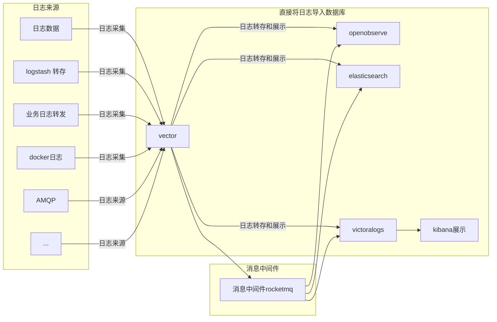

## 20240823_日志分享

### 日志用途？ 

日志是记录系统中各种问题信息的关键，也是一种常见的海量数据。日志平台主要提供日志采集、消费、分析、存储、索引和查询的一站式日志服务。主要为了解决日志分散不方便查看、日志搜索操作复杂且效率低、业务异常无法及时发现等等问题。

### 日志基本架构

#### ELK （ElasticSearch + Logstash + Kibana） 

优势： 

- 当多个企业App的日志汇聚到一个ELK实例时，ELK表现最好
- 它为这个单一实例提供了令人难以置信的洞察力，同时还消除了登录到许多其他日志数据源的需要
- 现场快速安装
- 可垂直和水平展开的秤
- Elastic 提供多种语言客户端，包括 Ruby、 Python、 PHP、Perl、.NET、Java、JavaScript 和其他编程语言
- 提供多种编程和脚本语言的库

劣势：

- 学习成本高：ELK系统相对复杂，需要掌握ES的数据建模、Logstash的数据收集和处理、Kibana的数据可视化等多方面的知识。对于初学者来说，学习成本较高。
- 资源消耗大：ELK在处理大量日志数据时，对硬件资源的需求较高，如CPU、内存和[存储](https://cloud.baidu.com/product/bos.html)等。这可能会增加企业的运营成本。
- 实时性有限：虽然ELK支持实时索引和搜索，但在处理海量数据时，实时性可能会受到一定影响。此外，ELK的实时性还受到[网络](https://cloud.baidu.com/product/et.html)延迟、硬件性能等多种因素的影响

##### ELK 简单架构

架构图（图片来自[阿里云](https://developer.aliyun.com/article/256431)）：


**ElasticSearch**[参考](https://www.elastic.co/cn/elasticsearch)

Elasticsearch 是一个分布式、RESTful 风格的搜索和数据分析引擎，能够解决不断涌现出的各种用例。作为 Elastic Stack 的核心，Elasticsearch 会集中存储您的数据，让您飞快完成搜索，微调相关性，进行强大的分析，并轻松缩放规模


工作原理 ： 

> coordinating node: 协调节点
>
> round-robin: 随机轮询算法

1、写入数据

- 客户端选择一个 node 发送请求过去，这个 node 就是 `coordinating node` （协调节点）。
- `coordinating node` 对 document 进行**路由**，将请求转发给对应的 node（有 primary shard）。
- 实际的 node 上的 `primary shard` 处理请求，然后将数据同步到 `replica node` 。
- `coordinating node` 如果发现 `primary node` 和所有 `replica node` 都搞定之后，就返回响应结果给客户端。


2、读取数据

可以通过 `doc id` 来查询，会根据 `doc id` 进行 hash，判断出来当时把 `doc id` 分配到了哪个 shard 上面去，从那个 shard 去查询。

- 客户端发送请求到**任意**一个 node，成为 `coordinate node` 。
- `coordinate node` 对 `doc id` 进行哈希路由，将请求转发到对应的 node，此时会使用 `round-robin` **随机轮询算法**，在 `primary shard` 以及其所有 replica 中随机选择一个，让读请求负载均衡。
- 接收请求的 node 返回 document 给 `coordinate node` 。
- `coordinate node` 返回 document 给客户端。

3、es 搜索数据功能

es 最强大的是做全文检索，就是比如你有三条数据：

```
java真好玩儿啊
java好难学啊
j2ee特别牛
```


你根据 `java` 关键词来搜索，将包含 `java` 的 `document` 给搜索出来。es 就会给你返回：java 真好玩儿啊，java 好难学啊

- 客户端发送请求到一个 `coordinate node` 
- 协调节点将搜索请求转发到**所有**的 shard 对应的 `primary shard` 或 `replica shard` ，都可以
- query phase：每个 shard 将自己的搜索结果（其实就是一些 `doc id` ）返回给协调节点，由协调节点进行数据的合并、排序、分页等操作，产出最终结果
- fetch phase：接着由协调节点根据 `doc id` 去各个节点上**拉取实际**的 `document` 数据，最终返回给客户端

##### Logstash [参考](https://www.elastic.co/cn/logstash)

>  将非结构化的日志数据处理成满足存储结构的日志数据

Logstash 能够动态地采集、转换和传输数据，不受格式或复杂度的影响。利用 Grok 从非结构化数据中派生出结构，从 IP 地址解码出地理坐标，匿名化或排除敏感字段，并简化整体处理过程


内部架构如下：


filter 层 logstash 提供了大量的[插件](https://www.elastic.co/guide/en/logstash/current/filter-plugins.html)

简单的logstash 实例如下：

原始日志文件：

```txt
2023-10-01 10:00:00 INFO User logged in
2023-10-01 10:05:00 ERROR Failed to load resource
2023-10-01 10:10:00 INFO User logged out
2023-10-01 10:15:00 WARN Disk space is low
2023-10-01 10:20:00 INFO User performed action A
2023-10-01 10:25:00 ERROR Connection timeout
```

配置：

```bash
input {
  file {
    path => "/path/to/your/logs.txt"  # 替换为你的日志文件路径
    start_position => "beginning"      # 从文件开头读取
    sincedb_path => "/dev/null"        # 不记录读取位置
  }
}

filter {
  # 可以在这里添加过滤器，例如解析日志格式
  grok {
    match => { "message" => "%{TIMESTAMP_ISO8601:timestamp} %{LOGLEVEL:loglevel} %{GREEDYDATA:message}" }
  }
}

output {
  stdout { 
    codec => rubydebug  # 以 Ruby 格式输出到控制台
  }
}
```

针对文件的返回结果

```json
{
       "message" => "User logged in",
      "@version" => "1",
    "@timestamp" => "2023-10-01T10:00:00.000Z",
       "loglevel" => "INFO",
      "timestamp" => "2023-10-01 10:00:00"
}
{
       "message" => "Failed to load resource",
      "@version" => "1",
    "@timestamp" => "2023-10-01T10:05:00.000Z",
       "loglevel" => "ERROR",
      "timestamp" => "2023-10-01 10:05:00"
}
{
       "message" => "User logged out",
      "@version" => "1",
    "@timestamp" => "2023-10-01T10:10:00.000Z",
       "loglevel" => "INFO",
      "timestamp" => "2023-10-01 10:10:00"
}
```

###### Kibana[参考](https://www.elastic.co/cn/kibana#%E5%8D%B3%E5%B8%AD%E5%88%86%E6%9E%90)

使用 Kibana 进行数据分析后，您能够更快地解决问题，并从多个用例和团队中收获大量洞察。发现洞察以调查威胁、监测系统、评估搜索性能，并采取行动；所有这些都在一个由 Elasticsearch 提供支持的平台上完成，能获得 Elasticsearch 在速度、可扩展性和相关性方面的优势


##### 采集

- vector
- fluent
- logstash
- rsyslog
- 。。。

### 小型公司常用的日志架构




1、 vector+ openobserve

openobserve 和Elastic 性能对比


openobserve 的优势：

- 成本低： 与elastic 相比低140 倍
- 允许水平扩展： 无状态节点架构允许 OpenObserve 水平扩展，而无需担心数据复制或损坏的挑战。
- 管理成本低
- Rust 开发： 该平台的内置 GUI 消除了对 Kibana 等其他组件的需求，并且得益于 Rust，具有出色的性能，并且没有 JVM 的挑战

vector： 除数据采集外， 可兼任简单日志数据处理， 允许多种日志数据来源

参考文档：[https://vector.dev/docs/reference/configuration/](https://vector.dev/docs/reference/configuration/)

2、vector + victoralogs + openobserve/kibana

victoralogs与其他项目对比：https://slashdot.org/software/comparison/VMware-Aria-Operations-for-Logs-vs-VictoriaLogs/

参考文档:[https://docs.victoriametrics.com/victorialogs/](https://docs.victoriametrics.com/victorialogs/)


