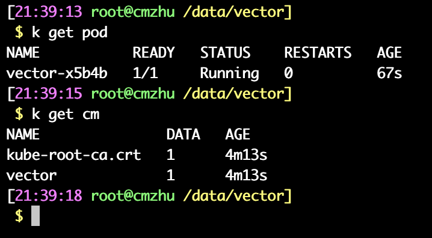

## Vector 文件采集

### 什么是Vector?

Vector 是一个高性能的可观测性数据管道，它使组织能够控制其可观测性数据。收集、转换所有日志、指标和跟踪并将其路由到您今天想要的任何供应商以及您明天可能需要的任何其他供应商。Vector 可在您需要的地方大幅降低成本、丰富新颖的数据和数据安全性，而不是在供应商最方便的地方。开源，速度比所有替代方案快 10 倍。

Vector 每月被下载数百万次，T-Mobile、Comcast、Zendesk 和 Discord 等公司依赖它来拥有他们的可观测性数据。


### 部署Vector

#### helm 部署

1、 使用helm 部署, 首先拉取helm charts 的内容

```bash
$ helm repo add vector https://helm.vector.dev
$ helm update

```

2、 拉取部署时需要使用的values.yaml 文件

```bash
$ helm show values vector/vector > values.yaml
```

3、 修改对应的values.yaml 文件

```bash
$ cat <<-'VALUES' > values.yaml
role: Agent
resources: 
  requests:
    cpu: 200m
    memory: 256Mi
  limits:
    cpu: 200m
    memory: 256Mi
VALUES
```

4、安装vector

```bash
$ helm upgrade --install  vector vector/vector \
  --namespace vector \
  --create-namespace \
  -f values.yaml
```

5、 安装完成后验证

