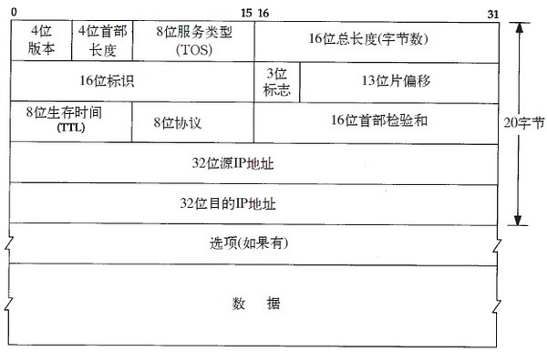

## TCP/IP 网络模型

### TCP/IP 网络模型

tcp/ip 网络模型是互联网模型的基础, 是一系列网络协议的总称, 这些协议一共划分成四层, 分别为 链路层, 网络层, 传输层和应用层;

- 链路层: 负责封装和解除报文, 也负责接受和发送 ARP/RARP 报文
- 网络层: 负责路由和将分组报文发送给目标主机或者目标网络
- 传输层: 负责将报文进行分组和重组, 并以TCP/UDP 协议形式封装报文
- 应用层: 负责向用户提供应用层序, 比如 HTTP, FTP, Telnet, DNS, SMTP 等

在网络通信协议中, 建立通信的双方必须在通信双方的对等层进行, 不能交错, 在整个数据传输的过程中, 数据在发送过程中经过各层都需要封装上该层的协议头和协议尾, 也就是要对该报文进行协议封装, 以标识对应层所用到的协议

### OSI 七层模型

理论上, 还有一个协议模型为OSI 七层模型

分别为: 物理层, 数据链路层, 网络层, 传输层, 会话层, 表示层和应用层; 这是一个理想模型, 由于其复杂性, 未被广泛应用

### 链路层

1、 以太网和 802 封装
以太网封装是以RFC894定义的 而802封装则是RFC1042定义的 主机需求RFC要求:

- （1）必须支持以太网封装
- （2）应该支持与RFC894混合的RFC1042封装
- （3）或许可以发送RFC1042封装的分组

2、 SLIP
适用于RS-232和高速调制解调器接入网络 

- （1）以0xC0结束 
- （2）对报文中的0xC0和ESC字符进行转义 缺点：没有办法通知本端IP到对端；没有类型字段；没有校验和

3、 CSLIP
将SLIP报文中的20字节IP首部和20字节TCP首部压缩为3或5字节

4、 PPP协议
修正了SLIP协议的缺陷，支持多种协议类型；带数据校验和；报文首部压缩；双方可以进行IP地址动态协商（使用IP协议）；链路控制协议可以对多个链路选项进行设置

5、 环回接口
用于同一台主机上的程序通过TCP／IP通信

- 传给环回的数据均作为输入
- 传给该主机IP地址的数据也是送到环回接口
- 广播和多播数据先复制一份到环回接口，再送到以太网上

6、MTU
对数据帧长度的最大限制，如果数据分组长度大于这个数值，需要在IP层对其分片

> 注意：发往以太网的数据要考虑路径MTU

### IP 网络协议

IP是TCP/IP中最为核心的协议，所有的TCP、UDP、ICMP等协议均以IP数据报的格式传输。IP协议提供不可靠、无连接的服务，它不保证数据报一定可以送达目的，也不保证数据报的先后次序
IP首部格式为

> 注：网络字节序：32bit传输的次序为0-7bit, 8-15bit, 16-23bit, 24-31bit（即big endian字节序）

### IP路由

IP路由选择是逐跳进行的。IP并不知道到达任何目的的完整路径（当然，除了那些与主机直接相连的）。所有的IP路由选择只为数据报传输提供下一站路由器的I P地址。它假定下一站路由器比发送数据报的主机更接近目的，而且下一站路由器与该主机是直接相连的。

IP路由选择主要完成以下这些功能：

- 1) 搜索路由表，寻找能与目的IP地址完全匹配的表目（网络号和主机号都要匹配）。如果找到，则把报文发送给该表目指定的下一站路由器或直接连接的网络接口（取决于标志字段的值）
- 2) 搜索路由表，寻找能与目的网络号相匹配的表目。如果找到，则把报文发送给该表目指定的下一站路由器或直接连接的网络接口（取决于标志字段的值）。目的网络上的所有主机都可以通过这个表目来处置。例如，一个以太网上的所有主机都是通过这种表目进行寻径的。这种搜索网络的匹配方法必须考虑可能的子网掩码。关于这一点我们在下一节中进行讨论
- 3) 搜索路由表，寻找标为“默认”的表目。如果找到，则把报文发送给该表目指定的下一站路由器。

如果上面这些步骤都没有成功，那么该数据报就不能被传送。如果不能传送的数据报来自本机，那么一般会向生成数据报的应用程序返回一个“主机不可达”或“网络不可达”的错误。

IP路由选择是通过逐跳来实现的。数据报在各站的传输过程中目的IP地址始终不变，但是封装和目的链路层地址在每一站都可以改变。大多数的主机和许多路由器对于非本地网络的数据报都使用默认的下一站路由器。

IP路由选择机制的两个特征：

- 1）完整主机地址匹配在网络号匹配之前执行
- 2）为网络指定路由，而不必为每个主机指定路由

### IP地址和MAC地址分类

按IP地址范围划分

A类：地址范围1.0.0.1-126.255.255.255，A类IP地址的子网掩码为255.0.0.0，每个网络支持的最大主机数为256的3次方-2=16777214台。
B类：地址范围128.0.0.1-191.255.255.255，B类IP地址的子网掩码为255.255.0.0，每个网络支持的最大主机数为256的2次方-2=65534台
C类：地址范围192.0.1.1-223.255.255.255，C类IP地址的子网掩码为255.255.255.0，每个网络支持的最大主机数为256-2=254台
D类：以1110开始的地址，多播地址
E类：以11110开始的地址，保留地址
按照通讯模式划分

单播：目标是特定的主机，比如192.168.0.3
广播：目标IP地址的主机部分全为1，并且目的MAC地址为FF-FF-FF-FF-FF-FF。比如B类网络172.16.0.0的默认子网掩码为255.255.0.0，广播地址为172.16.255.255。
多播：目标为一组主机，IP地址范围为224.0.0.0～239.255.255.255。多播MAC地址以十六进制值01-00-5E打头，余下的6个十六进制位根据IP多播组地址的最后23位转换得到。
单播是对特定的主机进行数据传送。如给某一个主机发送IP数据包，链路层头部是非常具体的目的地址，对于以太网来 说，就是网卡的MAC地址。广播和多播仅应用于UDP，它们对需将报文同时传往多个接收者的应用来说十分重要。

广播是针对某一个网络上的所有主机发包，这个网络可能是网络，可能是子网，还可能是所有的子网。如果是网络，例如A类网址的广播就是 netid.255.255.255，如果是子网，则是netid.netid.subnetid.255；如果是所有的子网（B类IP）则是则是 netid.netid.255.255。广播所用的MAC地址FF-FF-FF-FF-FF-FF。网络内所有的主机都会收到这个广播数据，网卡只要把 MAC地址为FF-FF-FF-FF-FF-FF的数据交给内核就可以了。一般说来ARP，或者路由协议RIP应该是以广播的形式播发的。
多播就是给一组特定的主机（多播组）发送数据，这样，数据的播发范围会小一些。多播的MAC地址是最高字节的低位为一，例 如01-00-00-00-00-00。多播组的地址是D类IP，规定是224.0.0.0-239.255.255.255。与IP多播相对应的以太网地址范围从0 1 : 0 0 : 5 e : 0 0 : 0 0 : 0 0到01: 00: 5e: 7f: ff: ff。通过将其低位23 bit映射到相应以太网地址中便可实现多播组地址到以太网地址的转换。由于地址映射是不唯一的，因此要其他的协议实现额外的数据报过滤。
