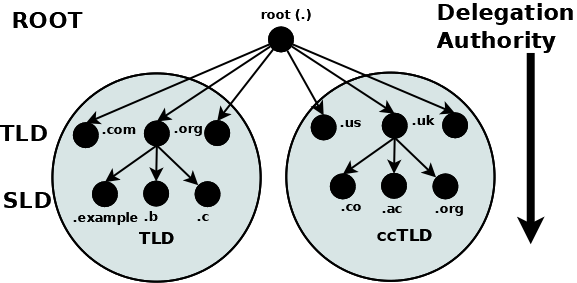
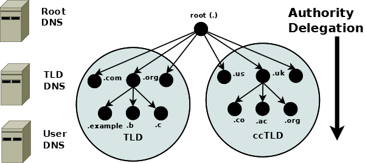

## DNS 简介和配置

DNS代表域名系统（Domain Name System）.它是一种分布式的命名系统，用于将人类可读的域名（如example.com）转换为计算机可理解的IP地址（如192.0.2.1）

在互联网上，每个设备都需要一个唯一的IP地址来进行通信。然而，IP地址是一串数字，对于人类来说不太直观和易记。这就是DNS的作用，它充当了一个类似电话簿的系统，将域名与相应的IP地址进行映射

当您在浏览器中输入一个域名时，例如www.example.com，您的计算机会向DNS服务器发送一个查询，询问与该域名对应的IP地址。DNS服务器会查找其数据库中的记录，并将相应的IP地址返回给您的计算机。然后，您的计算机可以使用该IP地址与目标服务器建立连接，以获取所需的网页内容

DNS还支持其他类型的记录，例如MX记录用于电子邮件服务器的寻址，CNAME记录用于域名的别名，TXT记录用于存储文本信息等。

总之，DNS是一个关键的互联网基础设施，它通过将域名转换为IP地址，使得我们可以轻松地访问网站、发送电子邮件和进行其他网络通信。


### DNS 分类

1. 递归DNS服务器（Resolver）：递归DNS服务器是最常用的DNS服务器类型。当用户的设备发送DNS查询请求时，递归DNS服务器负责从根域名服务器开始逐级向下查询，直到找到目标域名对应的IP地址，并将结果返回给用户的设备。递归DNS服务器通常由互联网服务提供商（ISP）或其他网络服务提供商管理。
2. 权威DNS服务器（Authoritative DNS Server）：权威DNS服务器存储着特定域名的DNS记录，其中包括域名和相应的IP地址。当递归DNS服务器发起查询时，授权DNS服务器负责提供与特定域名相关的DNS信息。授权DNS服务器由域名所有者或托管提供商管理。
3. 根域名服务器（Root Name Server）：根域名服务器是DNS层次结构中的最高级别，它存储着顶级域名（如.com、.org、.net等）的DNS记录。根域名服务器的主要作用是指示递归DNS服务器向哪个顶级域名服务器发起查询。全球共有13组根域名服务器，由不同的组织和机构维护。
4. 顶级域名服务器（Top-Level Domain Name Server）：顶级域名服务器存储着特定顶级域名（如.com、.org、.net等）下的DNS记录。它们负责管理该顶级域名下的授权DNS服务器的信息，并提供与该顶级域名相关的DNS查询响应。
5. 本地DNS服务器（Local DNS Server）：本地DNS服务器通常由网络服务提供商（ISP）或组织内部维护，用于为局域网中的设备提供DNS解析服务。它们会缓存最近的DNS查询结果，以提高查询性能，并且可以处理局域网内的DNS查询请求
6. 迭代DNS服务器（Iterative DNS Server）：迭代DNS服务器是指在递归查询过程中向下级DNS服务器发起查询，并依次获取更具体的DNS信息。递归DNS服务器通过与迭代DNS服务器的交互，逐级获取所需的DNS信息

### 搭建DNS 服务器

#### 什么是BIND(The Berkeley Internet Name Domain )?

文档参考[https://bind9.readthedocs.io/en/v9.18.21/chapter1.html](https://bind9.readthedocs.io/en/v9.18.21/chapter1.html)

BIND 软件为Linux 操作系统实现了DNS 服务器;

#### DNS 基础

DNS命名系统被组织成一个由多个级别组成的树状结构，因此它自然而然地创建了一个分布式系统。树中的每个节点都有一个标签，用于定义其权限域（其地区或区域）。树中最顶层的节点是根域;它委托给下一级域，通常称为顶级域 （TLD）。它们又委托给二级域 （SLD），依此类推。顶级域名 （TLD） 包括一组特殊的顶级域名，称为国家代码顶级域名 （ccTLD），其中每个国家/地区都被分配了一个来自 ISO 3166 的唯一双字符国家代码作为其域名。委派和授权的概念在 DNS 树（DNS 层次结构）中向动，如下所示：




域是树中节点的标签。域名唯一标识 DNS 树中的任何节点，并通过组合所有域标签（每个标签在其父区域或权限域中都是唯一的）来从左到右写入，并用一个点分隔每个组件，直到根域。在上图中，以下是所有域名：

```bash
example.org
b.org
c.org
co.uk
ac.uk
org.uk

```

根具有唯一的标签"."，当它写为域名时，通常会省略，但当它写为完全限定域名时下面表示一致

```bash
example.org.
example.org
```

#### 权威和委托

每个域（节点）都已从其父域委派了权限。委派的权限包括特定的职责，以确保其委派的每个域在其区域或权限域中都具有唯一的名称或标签，并且维护其委派域的权威列表。这些职责还包括操作两个（或更多）名称服务器（可能承包给第三方）的操作要求，这些服务器将在区域文件中包含其权限区域内所有域标签的权威数据。同样，树结构确保了 DNS 命名空间是自然分布的。



