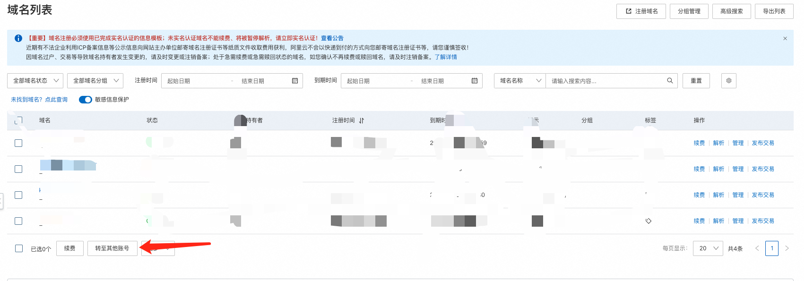

## 域名转移方案

特殊情况下需要进行域名厂商转移，现在来配置一下域名厂商转移的方案

1、同厂商转移

- Aliyun -> aliyun
- godaddy -> godaddy 
- 华为云（国际站） -> 华为云（国际站）

> 注意： 
>
> 华为云国际站没有域名服务，只有域名解析服务，因此不能直接将域名从中国站转移至国际站

- AWS Route 53 -> AWS Route 53

2、不同厂商转移

- 华为云 -> 至Aliyun

- ...

不同的转移方式有不同的转移步骤

首先是同厂商转移

华为云，阿里云都支持不同账号域名转移，可以直接选择转移即可；

AWS 将解析服务和域名服务分开了，迁移时不仅要先迁移域名，还要迁移解析；

