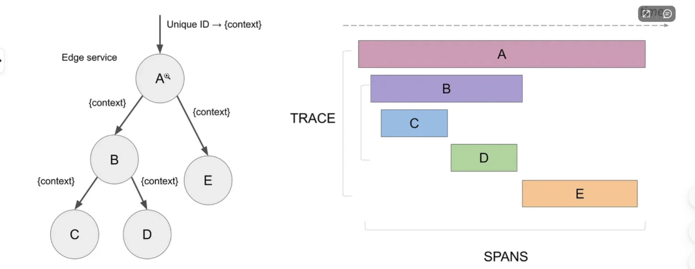
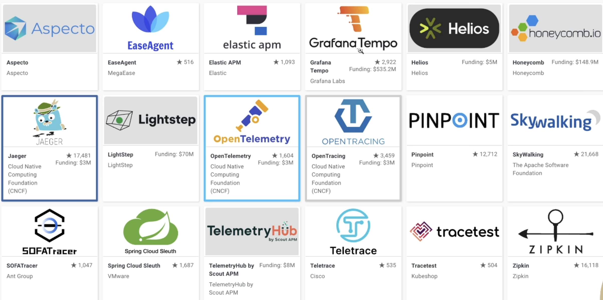

## opentelemetry 学习

在发生一次请求时, 会在后台调用一个或者多个微服务的请求; 相应的排查路径也会复杂, 这时链路追踪起到重要的作用

> 分布式追踪可以帮助在整个请求调用的过程中服务之间的交互, 并了解整个请求的生命周期, 帮助我们发现请求中的瓶颈,错误和性能问题;




### 如何实现链路追踪

- 埋点
- 收集和处理
- 存储数据 用于查询

可以使用开源项目`Opentelemetry` 



### k8s 使用opentelemetry

文档来自: [https://opentelemetry.io/docs/kubernetes/getting-started/](https://opentelemetry.io/docs/kubernetes/getting-started/)

> OTLP: Opentelemetry 规范的数据采集和存储的格式, 便于后期对埋点和监控日志数据的存储和查询

文档将引导使用Opentelemetry 监控 Kubernetes 集群的最快的方式, 主要专注于收集kubernetes 集群, 节点pod 和容器的指标和日志, 并使集群能够发出OTLP 数据服务

#### 案例

案例将使用kind 机群来对整个Opentelemetry 的安装和学习做一次实验

假如已经安装了kind

```bash
$ kind create cluster

$  kubectl get node
NAME                 STATUS   ROLES           AGE   VERSION
kind-control-plane   Ready    control-plane   71m   v1.25.3
```

2、 使用helm 安装opentelemetry

```bash
$ helm repo add open-telemetry https://open-telemetry.github.io/opentelemetry-helm-charts
"open-telemetry" has been added to your repositories
```

3、 部署DaemonSet 采集器

收集 Kubernetes 遥测数据的第一步是部署 OpenTelemetry Collector 的守护程序实例，以收集与这些节点上运行的节点和工作负载相关的遥测数据。守护程序集用于保证收集器的此实例安装在所有节点上。守护进程集中收集器的每个实例将仅从运行它的节点收集数据。

采集器包含以下组件:

- OTLP Receiver：收集应用程序跟踪、指标和日志。
- Kubernetes Attributes Processor：将 Kubernetes 元数据添加到传入的应用程序遥测数据。
- Kubeletstats Receiver：从 kubelet 上的 API 服务器中提取节点、Pod 和容器指标。
- Filelog Receiver：收集写入 stdout/stderr 的 Kubernetes 日志和应用程序日志。

##### OTLP Receiver

OTLP 接收器是以 OTLP 格式收集跟踪、指标和日志的最佳解决方案。如果以另一种格式发出应用程序遥测数据，则收集器很有可能具有接收器，但在本教程中，我们将假定遥测数据采用 OTLP 格式。

尽管不是必需的，但对于在节点上运行的应用程序来说，通常的做法是将其跟踪、指标和日志发送到在同一节点上运行的收集器。这样可以使网络交互变得简单，并允许使用 `k8sattributes` 处理器轻松关联 Kubernetes 元数据。

##### Kubernetes Attributes Processor

Kubernetes 属性处理器是强烈建议用于从 Kubernetes Pod 接收遥测数据的任何收集器组件。此处理器会自动发现 Kubernetes Pod，提取其元数据（如 Pod 名称或节点名称），并将提取的元数据作为资源属性添加到 span、指标和日志中。由于 Kubernetes 属性处理器将 Kubernetes 上下文添加到遥测数据中，因此允许将应用程序的跟踪、指标和日志信号与 Kubernetes 遥测数据（例如 Pod 指标和跟踪）相关联

##### Kubeletstats Receiver

Kubeletstats 接收器是收集节点指标的接收器。它将收集容器内存使用率、Pod CPU 使用率和节点网络错误等指标。所有遥测数据都包括 Kubernetes 元数据，例如 Pod 名称或节点名称。由于我们使用的是 Kubernetes 属性处理器，因此我们将能够将应用程序跟踪、指标和日志与 Kubeletstats Receiver 生成的指标相关联。

##### Filelog Receiver