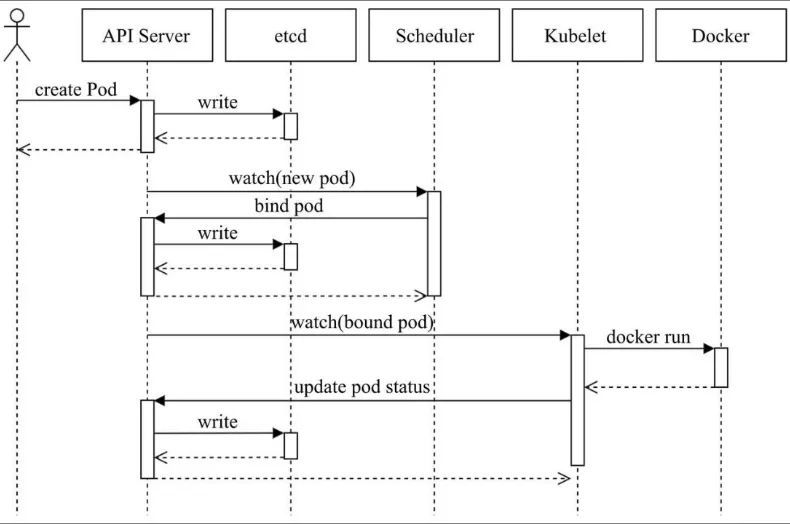

## linux

### linux系统启动流程

- 第一步：开机自检，加载BIOS
- 第二步：读取 MBR
- 第三步：Boot Loader　grub引导菜单
- 第四步：加载kernel内核
- 第五步：init进程依据inittab文件夹来设定运行级别
- 第六步：init进程执行rc.sysinit
- 第七步：启动内核模块
- 第八步：执行不同运行级别的脚本程序
- 第九步：执行/etc/rc.d/rc.local

### 简述lvm，如何给使用lvm的/分区扩容

PV - 物理卷：物理卷在逻辑卷管理中处于最底层，它可以是实际物理硬盘上的分区，也可以是整个物理硬盘，也可以是raid设备。

VG - 卷组：卷组建立在物理卷之上，一个卷组中至少要包括一个物理卷，在卷组建立之后可动态添加物理卷到卷组中。一个逻辑卷管理系统工程中可以只有一个卷组，也可以拥有多个卷组。

LV - 逻辑卷：逻辑卷建立在卷组之上，卷组中的未分配空间可以用于建立新的逻辑卷，逻辑卷建立后可以动态地扩展和缩小空间。系统中的多个逻辑卷可以属于同一个卷组，也可以属于不同的多个卷组。

## DevOps

### 列举一些最常用的DevOps工具

- Ansible –配置管理和应用程序部署工具
- Chef –配置管理和应用程序部署工具
- Docker –容器化工具
- Git –版本控制系统（VCS）工具
- Jenkins –持续集成（CI）工具
- Jira –敏捷的团队协作工具
- Nagios –连续监控工具
- Puppet –配置管理和应用程序部署工具

### Puppet有什么了解

这是一个配置管理工具，用于自动执行管理任务。Puppet利用主从结构，其中两个实体通过加密通道进行通信。

系统管理员需要执行许多重复性任务，尤其是安装和配置服务器。编写脚本来自动执行此类任务是一种选择，但是当基础结构很大时，它变得很忙。为此，配置管理是一个不错的解决方法。

Puppet帮助配置，部署和管理服务器。这不仅使此类冗余任务变得更加容易，而且节省了总工作时间的很大一部分。成熟的配置管理工具：

- 持续检查主机所需的配置是否到位。如果更改，配置将自动还原
- 为每个主机定义不同的配置
- 对机器进行动态缩放（上下缩放）
- 提供对所有已配置计算机的控制，以便可以将集中更改自动传播到所有这些计算机

### ansible 有哪些模块

file shell cmd yum copy

## 网络

### LVS 工作模式

- dr：直接路由模式，请求由 LVS 接受，由真实提供服务的服务器直接返回给用户，返回的时候不经过 LVS。（性能最高）
- tun：隧道模式，客户端将访问vip报文发送给LVS服务器。LVS服务器将请求报文重新封装，发送给后端真实服务器。后端真实服务器将请求报文解封，在确认自身有vip之后进行请求处理。后端真实服务器在处理完数据请求后，直接响应客户端。
- nat：网络报的进出都要经过 LVS 的处理。LVS 需要作为 RS 的网关。当包到达 LVS 时，LVS 做目标地址转换（DNAT），将目标 IP 改为 RS 的 IP。RS 接收到包以后，仿佛是客户端直接发给它的一样。RS 处理完，返回响应时，源 IP 是 RS IP，目标 IP 是客户端的 IP。这时 RS 的包通过网关（LVS）中转，LVS 会做源地址转换（SNAT），将包的源地址改为 VIP，这样，这个包对客户端看起来就仿佛是 LVS 直接返回给它的。客户端无法感知到后端 RS 的存在。
- fullnat模式：fullnat模式和nat模式相似，但是与nat不同的是nat模式只做了两次地址转换，fullnat模式却做了四次。

## Nginx

### 正向代理和反向代理的概念

### nginx反向代理时，如何使后端获取真正的访问来源ip

Proxy_set_header、proxy_protocol

### nginx负载均衡算法有哪些

- rr 轮训
- weight 加权轮训
- ip_hash 静态调度算法
- fair 动态调度算法
- url_hash url哈希
- leat_conn 最小连接数

## kubernetes

### k8s的集群组件有哪些？功能是什么

### K8s架构的组成是什么

主节点（Master）和多个计算节点（Node）

- 主节点主要用于暴露API，调度部署和节点的管理；
- 计算节点运行一个容器运行环境，一般是docker环境（类似docker环境的还有rkt），同时运行一个K8s的代理（kubelet）用于和master通信。计算节点也会运行一些额外的组件，像记录日志，节点监控，服务发现等等。计算节点是k8s集群中真正工作的节点。

### 如何修改副本数，如何滚动更新和回滚，如何查看pod的详细信息，如何进入pod交互

### etcd数据如何备份

```bash
## 副本数
$ kubectl scale --replicas=0 deployment xxx
## 滚动更新
$ kubectl rollout restart  deployment xxx
## pod 详细信息
$ kubectl describe pod xxx
## 如何进入POD
$ kubectl exec -it xxx -- bash
```


### k8s控制器有哪些

- 副本集（ReplicaSet）
- 部署（Deployment）
- 状态集（StatefulSet）
- Daemon集（DaemonSet）
- 一次任务（Job）
- 计划任务（CronJob）
- 有状态集（StatefulSet）

### pod创建过程是什么

[](https://github.com/LiaoSirui/blog.liaosirui.com/blob/master/备考/面试/.assets/运维研发面试题/ee731aa4j00re9ueo0012c000ly00ekm.jpg)

- 客户端提交Pod的配置信息（可以是yaml文件定义好的信息）到kube-apiserver；
- Apiserver收到指令后，通知给controller-manager创建一个资源对象；
- Controller-manager通过api-server将pod的配置信息存储到ETCD数据中心中；
- Kube-scheduler检测到pod信息会开始调度预选，会先过滤掉不符合Pod资源配置要求的节点，然后开始调度调优，主要是挑选出更适合运行pod的节点，然后将pod的资源配置单发送到node节点上的kubelet组件上。
- Kubelet根据scheduler发来的资源配置单运行pod，运行成功后，将pod的运行信息返回给scheduler，scheduler将返回的pod运行状况的信息存储到etcd数据中心。

### pod重启策略有哪些

- Always ：容器失效时，kubelet 自动重启该容器；
- OnFailure ：容器终止运行且退出码不为0时重启；
- Never ：不论状态为何， kubelet 都不重启该容器

### pod的生命周期有哪些状态？

- Pending：表示pod已经被同意创建，正在等待kube-scheduler选择合适的节点创建，一般是在准备镜像；
- Running：表示pod中所有的容器已经被创建，并且至少有一个容器正在运行或者是正在启动或者是正在重启；
- Succeeded：表示所有容器已经成功终止，并且不会再启动；
- Failed：表示pod中所有容器都是非0（不正常）状态退出；
- Unknown：表示无法读取Pod状态，通常是kube-controller-manager无法与Pod通信。

### 简述Kubernetes中什么是静态Pod？

静态pod是由kubelet进行管理的仅存在于特定Node的Pod上

### 资源探针有哪些

- ExecAction：在容器中执行一个命令，并根据其返回的状态码进行诊断的操作称为Exec探测，状态码为0表示成功，否则即为不健康状态。
- TCPSocketAction：通过与容器的某TCP端口尝试建立连接进行诊断，端口能够成功打开即为正常，否则为不健康状态。
- HTTPGetAction：通过向容器IP地址的某指定端口的指定path发起HTTP GET请求进行诊断，响应码为2xx或3xx时即为成功，否则为失败

### kubeconfig文件包含什么内容，用途是什么

包含集群参数（CA证书、API Server地址），客户端参数（上面生成的证书和私钥），集群context 信息（集群名称、用户名）

### Headless Service

在某些应用场景中，若需要人为指定负载均衡器，不使用Service提供的默认负载均衡的功能，或者应用程序希望知道属于同组服务的其他实例。Kubernetes提供了Headless Service来实现这种功能，即不为Service设置ClusterIP（入口IP地址），仅通过Label Selector将后端的Pod列表返回给调用的客户端。

### ipvs为啥比iptables效率高

IPVS模式与iptables同样基于Netfilter，但是ipvs采用的hash表，iptables采用一条条的规则列表。iptables又是为了防火墙设计的，集群数量越多iptables规则就越多，而iptables规则是从上到下匹配，所以效率就越是低下。因此当service数量达到一定规模时，hash查表的速度优势就会显现出来，从而提高service的服务性能

### 简述Kubernetes Scheduler作用及实现原理？

在整个调度过程中涉及三个对象，分别是待调度Pod列表、可用Node列表，以及调度算法和策略。

Kubernetes Scheduler通过调度算法调度为待调度Pod列表中的每个Pod从Node列表中选择一个最适合的Node来实现Pod的调度。随后，目标节点上的kubelet通过API Server监听到Kubernetes Scheduler产生的Pod绑定事件，然后获取对应的Pod清单，下载Image镜像并启动容器。

Kubernetes Scheduler根据如下两种调度算法将 Pod 绑定到最合适的工作节点：

- 预选（Predicates）：输入是所有节点，输出是满足预选条件的节点。kube-scheduler根据预选策略过滤掉不满足策略的Nodes。如果某节点的资源不足或者不满足预选策略的条件则无法通过预选。如“Node的label必须与Pod的Selector一致”。
- 优选（Priorities）：输入是预选阶段筛选出的节点，优选会根据优先策略为通过预选的Nodes进行打分排名，选择得分最高的Node。例如，资源越富裕、负载越小的Node可能具有越高的排名。

### 简述Kubernetes准入机制？

准入控制（AdmissionControl）准入控制本质上为一段准入代码，在对kubernetes api的请求过程中，顺序为：先经过认证 & 授权，然后执行准入操作，最后对目标对象进行操作。常用组件（控制代码）如下：

- AlwaysAdmit：允许所有请求
- AlwaysDeny：禁止所有请求，多用于测试环境。
- ServiceAccount：它将serviceAccounts实现了自动化，它会辅助serviceAccount做一些事情，比如如果pod没有serviceAccount属性，它会自动添加一个default，并确保pod的serviceAccount始终存在。
- LimitRanger：观察所有的请求，确保没有违反已经定义好的约束条件，这些条件定义在namespace中LimitRange对象中。
- NamespaceExists：观察所有的请求，如果请求尝试创建一个不存在的namespace，则这个请求被拒绝。

## Calico

### 简述Kubernetes Calico网络组件实现原理？

Calico是一个基于BGP的纯三层的网络方案，与OpenStack、Kubernetes、AWS、GCE等云平台都能够良好地集成。

Calico在每个计算节点都利用Linux Kernel实现了一个高效的vRouter来负责数据转发。每个vRouter都通过BGP协议把在本节点上运行的容器的路由信息向整个Calico网络广播，并自动设置到达其他节点的路由转发规则。

Calico保证所有容器之间的数据流量都是通过IP路由的方式完成互联互通的。Calico节点组网时可以直接利用数据中心的网络结构（L2或者L3），不需要额外的NAT、隧道或者Overlay Network，没有额外的封包解包，能够节约CPU运算，提高网络效率。

## Prometheus

### 指标类型有哪些？

- Counter（计数器）
- Guage（仪表盘）
- Histogram（直方图）
- Summary（摘要）

### 简述从添加节点监控到grafana成图的整个流程

- 被监控节点安装exporter
- prometheus服务端添加监控项
- 查看prometheus web界面——status——targets
- grafana创建图表

### 哪些 exporter

- node-exporter监控linux主机
- cAdvisor监控容器
- MySQLD Exporter监控mysql
- Blackbox Exporter网络探测
- Pushgateway采集自定义指标监控
- process exporter进程监控

## Cert Manager

HTTP-01 校验方式签发证书

若使用 HTTP-01 的校验方式，则需要用到 Ingress 来配合校验。cert-manager 会通过自动修改 Ingress 规则或自动新增 Ingress 来实现对外暴露校验所需的临时 HTTP 路径

DNS-01 校验方式签发证书

若使用 DNS-01 的校验方式，则需要选择 DNS 提供商。cert-manager 内置 DNS 提供商的支持，详细列表和用法请参见 [Supported DNS01 providers](https://cert-manager.io/docs/configuration/acme/dns01/#supported-dns01-providers)

## 日志

### 日志收集架构

Kubernetes 集群本身不提供日志收集的解决方案，一般来说有主要的 3 种方案来做日志收集：

- 在节点上运行一个 agent 来收集日志
- 在 Pod 中包含一个 sidecar 容器来收集应用日志
- 直接在应用程序中将日志信息推送到采集后端

## Docker

### dockerfile 有哪些关键字？用途是什么？

### docker 核心 namespace CGroups 联合文件系统功能是什么？

- namespace：资源隔离
- cgroup：资源控制
- 联合文件系统：支持对文件系统的修改作为一次提交来一层层的叠加，同时可以将不同目录挂载到同一个虚拟文件系统下

## MySQL